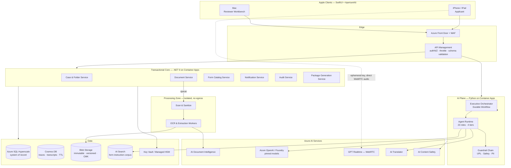

# 01 — Executive Summary

---

## 1.1 The proposition

Preparing a US immigration or government-agency application is an administrative problem that
behaves like a legal problem. A family-based adjustment-of-status package is commonly 300+ pages
across six forms, requiring roughly 900 discrete data points, each of which must be internally
consistent with every other, and each of which must be supported by evidence the applicant must
locate, translate, and organize. The information almost always already exists — in a passport, a
birth certificate, a tax transcript, a marriage licence, an old approval notice. It is simply
scattered, in the wrong languages, and in the wrong shape.

**Aperture turns that scattered evidence into a complete, consistent, reviewable application
package.** It does so on the device the applicant already has, in the language they actually speak,
with a human in the loop at every point where a judgment is made.

It does not tell anyone what to file, whether they qualify, or what will happen. That line is not a
disclaimer; it is the product's architecture.

---

## 1.2 Why now

| Force | What changed | Consequence for this product |
|---|---|---|
| Document understanding matured | Cloud document-AI now extracts structured fields from photographed identity documents at production accuracy, including non-Latin scripts | The single largest source of applicant error — transcription — becomes machine-assisted and verifiable |
| Speech became conversational | Low-latency speech-to-speech models sustain a natural interview in dozens of languages at ~100 ms turn latency | Interviewing a limited-English-proficiency, limited-literacy applicant is now possible without a scheduled human interpreter |
| Structured generation became reliable | Schema-constrained model output makes "fill this field from this evidence" a bounded, testable operation | Extraction can be made auditable rather than magical |
| Device capability | Modern iPhones perform document edge detection, perspective correction, and text detection on-device | Capture quality is fixed at capture time, not discovered as a failure hours later |
| Demand and supply gap | Legal services capacity is a fraction of demand; the resulting vacuum is filled by unregulated intermediaries | A tool that makes legitimate preparation cheap and correct is a direct substitute for the fraud |

---

## 1.3 What we are building

A native Apple-platform application backed by an Azure-hosted, agentic services platform.

**For the applicant (iPhone, iPad):** a guided path from "I have a shoebox of documents" to
"I have a package ready to file." Photograph documents; the platform classifies, reads, and
proposes values. Answer only the questions the selected forms actually require, by chat or by
voice, in your language. See exactly what is missing and why. Review every proposed value against
the document it came from. Get a filled, verified PDF package plus an evidence index.

**For the administrator / reviewer (Mac, iPad):** a throughput-oriented workbench. Queue of cases,
side-by-side document-and-form comparison, keyboard-driven acceptance and rejection of proposed
values, discrepancy triage, package approval with step-up authentication, and reporting.

**Underneath:** a 23-role AI agent framework — deliberately mostly *deterministic* — orchestrated by
a durable, replayable workflow engine, with a hard capability boundary between agents that read
untrusted content and agents that can change state. No model output reaches a government form
without a human accepting it.

---

## 1.4 The five governing constraints

1. **No legal advice, enforced in code.** Nine prohibited speech acts, a dedicated classifier on
   every generative egress path, a blocking test suite, and a Compliance veto over any change to
   that boundary. Voice is the one path where interception is corrective rather than preventive,
   and that residual is disclosed rather than glossed ([14 B-01](14-sme-review-and-signoff.md#b-01--the-voice-interview-cannot-be-guardrailed-the-way-the-deliverable-claims)). → [ADR-001](adr/ADR-001-scrivener-boundary.md)
2. **No automated filing.** The deliverable is a package handed to a human. → [ADR-002](adr/ADR-002-no-efiling.md)
3. **No automated approval.** A human, re-authenticated, approves every package. There is no code
   path from a model to an approval.
4. **Data minimization as architecture.** We hold what the selected forms require and nothing else,
   for as short a time as the user permits, under keys we can destroy. This is the primary
   mitigation for the program's top risk — compelled disclosure. → [C-09](00-design-authority-record.md#c-09--government-and-law-enforcement-data-requests-are-the-top-of-register-risk)
5. **Accessibility is acceptance criteria, not a workstream.** Our users are older, less literate,
   and on worse devices than the median. → [C-12](00-design-authority-record.md#c-12--accessibility-cannot-be-a-phase-2-item-for-this-population)

---

## 1.5 Scope

### In scope for MVP (Phase 1)

- iOS 18+ / iPadOS 18+ applicant app; macOS 15+ reviewer workbench.
- Four form packages: **I-130 + I-130A**, **I-485 + I-864**, **N-400**, **I-765**. (I-131 moved to Phase 2 in the [B-09](14-sme-review-and-signoff.md#b-09--phase-1-does-not-fit-in-phase-1) rebaseline.)
- Document ingest: PDF, DOC, DOCX, PNG, JPG/JPEG, HEIC, camera scan, photo library, Files.
- OCR + structured extraction with per-field source citation and confidence banding.
- Dynamic questionnaire generated from the *selected forms' own* required fields.
- AI chat interview (all MVP languages); AI voice interview (English + Spanish at MVP).
- Missing-items engine, notifications, completion counters.
- Human review workbench and approval workflow.
- Package generation: filled official AcroForm PDFs, cover index, evidence exhibits, filing
  checklist, fee sheet.
- Export to Files / Print / secure delivery link.
- Full audit log, consent ledger, data export and deletion.
- Single-tenant-per-organization pooled model with manual KYB onboarding.

### Explicitly out of scope for MVP

Asylum, VAWA, U/T visas, and removal defense ([C-04](00-design-authority-record.md#c-04--asylum-and-removal-defense-cases-must-be-out-of-scope-for-v1)) ·
E-filing ([C-02](00-design-authority-record.md#c-02--workflow-step-15-assumes-an-e-filing-capability-that-does-not-exist)) ·
Eligibility assessment or form recommendation ([C-01](00-design-authority-record.md#c-01--form-discovery-agent-as-briefed-is-unauthorized-practice-of-law)) ·
Payment of government fees · Attorney marketplace ([C-24](00-design-authority-record.md#c-24--rejected-add-a-lawyer-marketplace-to-monetize)) ·
Android and web clients · State/county forms · Biometric identity proofing ([C-13](00-design-authority-record.md#c-13--identity-verification-agent-is-under-specified-and-legally-loaded)) ·
Self-serve organization signup.

---

## 1.6 Architecture in one page

**Key structural properties**

- **Three trust zones.** Client · Core (privileged, no untrusted content) · Processing (untrusted
  content, no privilege, no egress). Agents that read untrusted content have no tools.
- **Deterministic orchestration.** The workflow engine decides what happens next; models fill in
  values. Replayable and inspectable.
- **One system of record.** Anything that reaches a PDF lives in Azure SQL. Cosmos holds only
  derived, expiring data and can be lost without correctness impact.
- **Audio bypasses our backend.** Realtime voice runs client↔model over WebRTC using an ephemeral
  key minted by our backend; we never hold the audio stream, only the transcript we choose to keep.

---

## 1.7 Technology selection at a glance

| Layer | Selection | One-line rationale | Detail |
|---|---|---|---|
| Client | SwiftUI, one codebase, per-platform experiences; shared `ApertureKit` Swift Package | Native camera/Vision/VoiceOver access and Apple-grade accessibility are the product's differentiators | [03 §3.8](03-solution-architecture.md#38-client-architecture) |
| Backend — transactional | **.NET 9 / ASP.NET Core** | Strongest Azure/Entra integration, first-class typing for a correctness-critical domain, mature EF Core + Azure SQL story, long-term support | [ADR-004](adr/ADR-004-backend-runtime.md) |
| Backend — AI/document | **Python 3.12** | Where the document/AI ecosystem actually lives; isolated to the processing and agent planes | [ADR-004](adr/ADR-004-backend-runtime.md) |
| Compute | **Azure Container Apps** (three environments: core, ai, processing) + **Azure Functions** for event glue | Managed Kubernetes semantics without cluster operations; scale-to-zero for bursty extraction; environment = security boundary. AKS deferred until scale or multi-boundary needs justify it | [ADR-005](adr/ADR-005-compute-platform.md) |
| Orchestration | **Durable Functions / Durable Task** | Replayable, inspectable, deterministic workflow — the opposite of an LLM deciding next steps | [04 §4.5](04-ai-agent-architecture.md#45-orchestration-model) |
| Relational | **Azure SQL Hyperscale**, RLS, Always Encrypted for the highest-sensitivity columns | Referential integrity for a domain that is fundamentally relational; PITR; mature RLS for pooled tenancy | [ADR-006](adr/ADR-006-polyglot-persistence.md) |
| Document store | **Cosmos DB (NoSQL)**, TTL-bound | Schemaless, high-write, expiring; derived only | [ADR-006](adr/ADR-006-polyglot-persistence.md) |
| Objects | **Blob Storage** — versioning, immutability policies, private endpoints, CMK | Documents are the crown jewels; WORM for audit and generated packages | [05 §5.8](05-data-architecture.md#58-blob-and-object-model) |
| Messaging | **Service Bus** (commands, ordered, sessions) + **Event Grid** (fan-out notifications) | Two genuinely different patterns; not interchangeable | [03 §3.9](03-solution-architecture.md#39-integration-architecture) |
| Gateway | **API Management** behind **Front Door + WAF** | Schema validation, per-tenant quotas, JWT validation, versioning at the edge | [07 §7.2](07-api-architecture.md#72-gateway-and-edge-policy) |
| Identity | **Microsoft Entra External ID** (applicants) + **Entra ID** (staff), passkeys first | Passkeys eliminate the phishing surface that this user population is most targeted by | [06 §6.3](06-security-architecture.md#63-identity-and-access) |
| Document AI | **Azure AI Document Intelligence** — `prebuilt-idDocument`, `prebuilt-read`, `prebuilt-layout`, custom classifier + custom neural extractors | Prebuilt ID model covers passports worldwide and US green cards, driver licences, SSN cards; custom neural for the rest | [03 §3.10](03-solution-architecture.md#ai-service-selection) |
| Generative | **Azure OpenAI / Foundry**, models pinned, CMK, modified abuse monitoring applied for, PII-minimizing proxy | Dedicated resource in our region and tenant; no training on our data | [C-23](00-design-authority-record.md#c-23--third-party-ai-processing-needs-explicit-contractual-and-configuration-posture) |
| Voice | **GPT Realtime via WebRTC** with ephemeral client keys (East US 2 / Sweden Central deployments) | ~100 ms turn latency; audio never traverses our backend | [04 §4.9](04-ai-agent-architecture.md#agent-10--voice-interview-agent) |
| Secrets/keys | **Key Vault** → **Managed HSM** for tenant CMK; managed identities everywhere; zero stored credentials | | [06 §6.5](06-security-architecture.md#65-cryptography-and-key-management) |

---

## 1.8 Delivery plan and investment

| Phase | Duration | Headcount (FTE) | Exit criteria |
|---|---|---|---|
| **Phase 0 — Foundation** | 8 weeks | 9 | Landing zone, CI/CD, IaC, security baseline, Form Catalog with 2 forms, walking skeleton (upload → OCR → field → PDF) proven end to end |
| **Phase 1 — MVP** | 24 weeks | 17 | 4 form packages, chat + voice (EN/ES; voice subject to CON-1), reviewer workbench, package generation, closed beta with 3 partner organizations, SOC 2 Type I, ACR published |
| **Phase 2 — Scale** | 20 weeks | 22 | 15 form packages, 8 languages, self-serve tenants with KYB, analytics, RFE support, multi-region active-passive, SOC 2 Type II |
| **Phase 3 — Depth** | 24 weeks | 26 | Sensitive-matter segment behind gate G3-A, per-case CMK, partner API, additional agencies |

Indicative first-year run cost at 25,000 active cases is **$0.9M–1.3M** of Azure spend, dominated
by generative inference and document intelligence; the unit-economics model, sensitivities, and the
cost controls arising from [C-11](00-design-authority-record.md#c-11--cost-model-for-real-time-voice-is-not-viable-as-specified)
are in [11 §11.6](11-roadmap.md#116-unit-economics).

---

## 1.9 Success metrics

| Dimension | Metric | MVP target | Phase 2 target |
|---|---|---|---|
| Outcome | Cases reaching `Ready to File` / cases started | ≥ 55 % | ≥ 70 % |
| Outcome | Agency rejection for incompleteness, self-reported | ≤ 4 % | ≤ 2 % |
| Quality | Field-level extraction accuracy on the gold set | ≥ 96 % | ≥ 98 % |
| Quality | Reviewer edit rate on `VERIFIED` values | ≤ 3 % | ≤ 1.5 % |
| Quality | Model calibration ECE | ≤ 0.08 | ≤ 0.05 |
| Effort | Median applicant time to `Ready to File` (I-130) | ≤ 3.5 h | ≤ 2 h |
| Effort | Reviewer minutes per package | ≤ 25 | ≤ 12 |
| Trust | UPL classifier escapes found in red-team + production sampling | **0** | **0** |
| Trust | Sev-1 privacy incidents | **0** | **0** |
| Access | Sessions using accessibility features completing without support contact | ≥ 90 % | ≥ 95 % |
| Access | Non-English sessions completing | ≥ 80 % of English rate | ≥ 90 % |
| Economics | Blended AI cost per completed case | ≤ $12 | ≤ $6 |
| Reliability | API availability | 99.9 % | 99.95 % |

Two of these — **zero UPL escapes** and **zero Sev-1 privacy incidents** — are not targets. They are
release gates.

---

## 1.10 The top five risks

| # | Risk | Exposure | Primary mitigation |
|---|---|---|---|
| RISK-001 | Compelled government disclosure of applicant data | Catastrophic, reputational and human | Minimization, aggressive retention, per-tenant CMK with crypto-shred, published request policy, transparency reporting ([C-09](00-design-authority-record.md#c-09--government-and-law-enforcement-data-requests-are-the-top-of-register-risk)) |
| RISK-002 | UPL finding by a state bar or AG | Existential | Scrivener boundary in architecture, classifier + blocking tests, Compliance veto, jurisdiction-by-jurisdiction outside-counsel review ([ADR-001](adr/ADR-001-scrivener-boundary.md)) |
| RISK-003 | Silent form-edition drift produces rejectable filings at scale | Severe, systemic | Form Catalog with hash-based drift monitor, edition pinning, quarantine, round-trip PDF verification ([ADR-003](adr/ADR-003-form-fidelity.md)) |
| RISK-005 | Prompt injection via uploaded documents drives agent action | Severe | Capability boundary: untrusted-reading agents have no tools; schema-validated returns; no model→approval path ([C-16](00-design-authority-record.md#c-16--prompt-injection-via-uploaded-documents-is-a-first-class-threat)) |
| RISK-008 | AI unit cost exceeds price point | Business-model | Cascade routing, voice budgets, caching, per-case cost telemetry from Day 1 ([C-11](00-design-authority-record.md#c-11--cost-model-for-real-time-voice-is-not-viable-as-specified)) |

The full register — 31 risks with owners, current exposure, and target exposure — is
[12 §12.5](12-risks-and-gap-analysis.md#125-consolidated-risk-register).

---

## 1.11 The recommendation

**Proceed to Phase 0, with the four scope reductions taken in this review accepted as permanent
product boundaries rather than temporary limitations.**

The reductions — no eligibility inference, no e-filing, no sensitive-matter segment in v1, no
referral revenue — remove roughly a third of the originally imagined surface area. They also remove
the four ways this product most plausibly fails. What remains is a defensible, buildable,
differentiated system: the best document-capture and interview experience on the platform where the
target users actually are, wrapped in controls that a regulator, a security review board, and an
immigration attorney can each read and accept.

The single largest execution risk is not technical. It is the temptation, under commercial
pressure, to let the product answer the question every user will ask it: *"so, do I qualify?"* The
governance in [00](00-design-authority-record.md) exists to make that answer structurally
impossible rather than merely discouraged.
