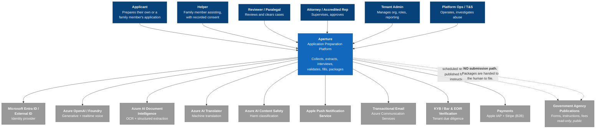
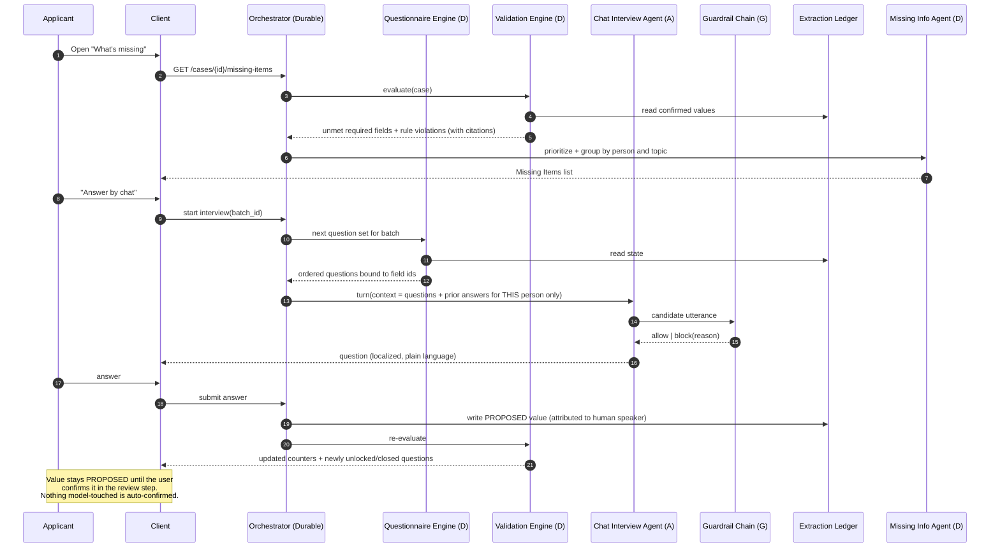
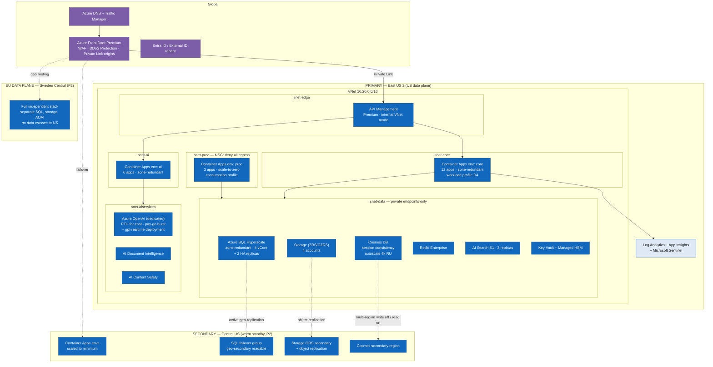
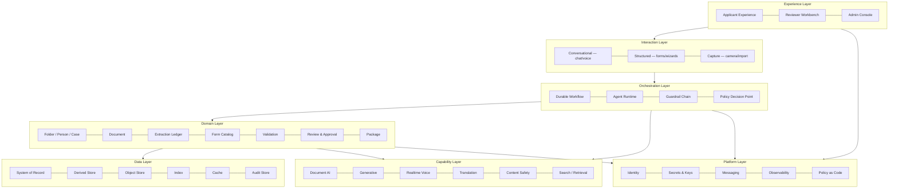
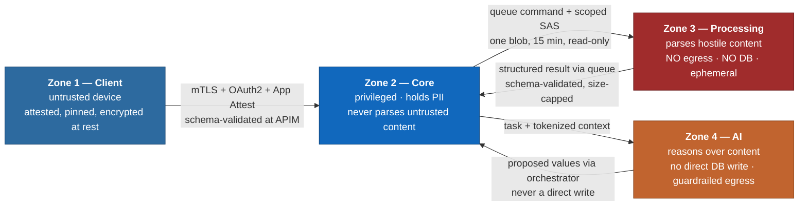

# 03 — Solution Architecture

> Platform boundary update (2026-08-12): applicant iPhone/iPad, reviewer-lite iPad, and the macOS
> workforce workbench share domain/API packages but receive server-issued personas and capabilities.
> See ADR-016. Demo is an isolated synthetic tenant under ADR-017, never a local authorization flag.

**Owner:** Principal Enterprise Architect · **Contributors:** Principal Application / Integration /
Cloud / Data / Security Architects, CTO, Lead Backend & Mobile Architects · **Status:** For ARB
approval

---

## 3.1 Architectural principles

These are binding. A design that violates one requires an ADR and an ARB exception.

| # | Principle | What it forbids in practice |
|---|---|---|
| **AP-1** | **Determinism at the boundary.** Anything that affects a government form is deterministic, versioned, and replayable. Models propose; code and humans decide. | An LLM writing directly to a form field. An LLM choosing the next workflow step. |
| **AP-2** | **Untrusted content never meets privilege.** Components that parse or reason over user-supplied content have no tools, no write authority, and no network egress. | An extraction agent that can call the case API. A document worker with internet access. |
| **AP-3** | **One system of record.** Every value that can reach a PDF has exactly one authoritative home. | Deriving a form value from a cache, a trace, or a transcript. |
| **AP-4** | **Minimize by construction, not by policy.** If we do not need a datum for a selected form, there is no column for it. | An "immigration status" field nobody's form asked for. Geolocation. Device advertising IDs. |
| **AP-5** | **Every assertion is cited.** Requirements, evidence lists, fees, and extracted values all carry provenance. | "The system says you need X" with no source. |
| **AP-6** | **Human-in-the-loop at every irreversible step.** | Automated approval, automated export, automated filing. |
| **AP-7** | **Fail closed, loudly.** Ambiguity produces a question, never a guess. | Silently picking between two conflicting dates. Truncating an overflowing field. |
| **AP-8** | **The tenant boundary is enforced at the data layer.** | Entitlement filtering in the UI or in application code alone. |
| **AP-9** | **Observability is a feature.** Cost, latency, accuracy, and guardrail verdicts are instrumented from the first commit. | Adding AI cost tracking "later". |
| **AP-10** | **Accessible and localized by default.** | Shipping an English-only screen "to be localized in P2". |

---

## 3.2 C4 Level 1 — System context



**The most important edge on this diagram is the dashed one that does not exist.** There is no
integration that submits anything to any agency. The relationship with government systems is
read-only and one-directional: we retrieve their published forms and instructions.
See [ADR-002](adr/ADR-002-no-efiling.md).

---

## 3.3 C4 Level 2 — Container diagram

```mermaid
graph TB
  classDef client fill:#2d6a9f,stroke:#1b4570,color:#fff
  classDef edge fill:#7b5ea7,stroke:#553f75,color:#fff
  classDef core fill:#1168bd,stroke:#0b4884,color:#fff
  classDef ai fill:#c1642f,stroke:#8a4720,color:#fff
  classDef proc fill:#a02c2c,stroke:#6e1e1e,color:#fff
  classDef data fill:#2e7d32,stroke:#1b5e20,color:#fff
  classDef ext fill:#888,stroke:#5f5f5f,color:#fff

  subgraph CLIENTS["Clients"]
    IOS["<b>Applicant App</b><br/>SwiftUI · iOS/iPadOS 18+"]:::client
    MACAPP["<b>Reviewer Workbench</b><br/>SwiftUI · macOS 15+"]:::client
    KIT["<b>ApertureKit</b><br/>shared Swift Package:<br/>domain · API · offline store"]:::client
  end

  subgraph EDGE["Edge"]
    FD["<b>Front Door + WAF</b><br/>TLS 1.3 · DDoS · geo policy"]:::edge
    APIM["<b>API Management</b><br/>JWT validation · schema validation<br/>quotas · versioning · idempotency"]:::edge
  end

  subgraph CORE["Core Zone — .NET 9 · Container Apps env: core"]
    IDN["<b>Identity &amp; Tenancy</b><br/>accounts · roles · KYB · consent"]:::core
    CASESVC["<b>Case &amp; Folder</b><br/>folders · persons · cases · state machine"]:::core
    DOCSVC["<b>Document</b><br/>upload sessions · metadata · versions"]:::core
    LEDGER["<b>Extraction Ledger</b><br/>values · provenance · discrepancies"]:::core
    FORMSVC["<b>Form Catalog</b><br/>forms · editions · field maps · drift monitor"]:::core
    VALID["<b>Validation Engine</b><br/>deterministic rules · missing items"]:::core
    REVIEW["<b>Review &amp; Approval</b><br/>queues · attestations"]:::core
    PKGSVC["<b>Package Generation</b><br/>AcroForm fill · round-trip verify · assembly"]:::core
    NOTIF["<b>Notification</b><br/>preferences · fan-out · digest"]:::core
    AUDITSVC["<b>Audit</b><br/>hash-chained append-only"]:::core
    EXPORT["<b>Export &amp; Delivery</b><br/>secure links · revocation"]:::core
    REPORT["<b>Reporting</b><br/>entitlement-scoped queries"]:::core
  end

  subgraph AIZONE["AI Zone — Python 3.12 · Container Apps env: ai"]
    ORCH["<b>Executive Orchestrator</b><br/>Durable Task workflows"]:::ai
    AGRT["<b>Agent Runtime</b><br/>23 roles · tiers D/M/A/G"]:::ai
    GUARD["<b>Guardrail Chain</b><br/>UPL · safety · PII · injection"]:::ai
    PIIPROXY["<b>PII Minimization Proxy</b><br/>tokenize → call → rehydrate"]:::ai
    QGEN["<b>Questionnaire Engine</b><br/>required-field graph"]:::ai
    VOICEBRK["<b>Voice Session Broker</b><br/>mints ephemeral WebRTC keys"]:::ai
  end

  subgraph PROCZONE["Processing Zone — isolated · NO egress · env: proc"]
    SANITIZE["<b>Sanitizer</b><br/>magic-byte typing · AV<br/>macro/JS strip · limits"]:::proc
    OCRW["<b>OCR &amp; Extraction Workers</b><br/>ephemeral · non-root · read-only FS"]:::proc
    RASTER["<b>Rasterizer</b><br/>server-side previews"]:::proc
  end

  subgraph DATA["Data"]
    SQL[("<b>Azure SQL Hyperscale</b><br/>system of record · RLS · CMK")]:::data
    COS[("<b>Cosmos DB</b><br/>traces · transcripts · payloads · TTL")]:::data
    BLOBQ[("<b>Blob: quarantine</b><br/>pre-scan")]:::data
    BLOBD[("<b>Blob: documents</b><br/>versioned · CMK · private endpoint")]:::data
    BLOBP[("<b>Blob: packages</b><br/>WORM immutable")]:::data
    BLOBA[("<b>Blob: audit</b><br/>append · immutable")]:::data
    SRCH[("<b>AI Search</b><br/>form instruction corpus + P2 case search")]:::data
    REDIS[("<b>Azure Cache for Redis</b><br/>sessions · rate limit · prompt cache")]:::data
    KV["<b>Key Vault + Managed HSM</b>"]:::data
  end

  subgraph BUS["Messaging"]
    SB["<b>Service Bus</b><br/>commands · sessions · ordering"]:::edge
    EG["<b>Event Grid</b><br/>domain event fan-out"]:::edge
  end

  subgraph EXT["External"]
    AOAI2["Azure OpenAI / Foundry"]:::ext
    RTV["GPT Realtime (WebRTC)"]:::ext
    DI2["AI Document Intelligence"]:::ext
    TR2["AI Translator"]:::ext
    CS2["AI Content Safety"]:::ext
    ENTRA2["Entra ID / External ID"]:::ext
    APNS2["APNs"]:::ext
    ACS2["Comm. Services (email)"]:::ext
  end

  IOS --- KIT
  MACAPP --- KIT
  KIT --> FD --> APIM
  APIM --> CORE
  APIM --> AIZONE
  IOS -.->|"ephemeral key<br/>audio never touches our backend"| RTV
  VOICEBRK -.->|mints key| IOS

  CORE --> SQL
  CORE --> REDIS
  CORE --> KV
  DOCSVC --> BLOBD
  PKGSVC --> BLOBP
  AUDITSVC --> BLOBA
  DOCSVC -->|"upload SAS"| BLOBQ

  DOCSVC -->|command| SB --> SANITIZE --> OCRW --> RASTER
  OCRW --> DI2
  OCRW --> BLOBD
  OCRW -->|results| SB
  SB --> LEDGER

  CORE --> EG --> NOTIF
  EG --> ORCH
  ORCH --> AGRT --> GUARD
  AGRT --> PIIPROXY --> AOAI2
  AGRT --> QGEN
  AGRT --> SRCH
  AGRT --> TR2
  GUARD --> CS2
  AGRT --> COS
  ORCH -->|"proposed values only"| LEDGER

  IDN --> ENTRA2
  NOTIF --> APNS2
  NOTIF --> ACS2
  FORMSVC -->|scheduled| SRCH
```



### Container responsibilities

| Container | Responsibility | Does **not** |
|---|---|---|
| **ApertureKit** | Domain models, API client, offline encrypted store, sync engine, capture pipeline, accessibility primitives | Contain UI; contain platform-specific code beyond `#if os()` shims |
| **API Management** | JWT validation, OpenAPI schema validation, per-tenant quota, idempotency-key enforcement, version routing, request/response size limits | Contain business logic |
| **Identity & Tenancy** | Accounts, roles, memberships, KYB state, consent ledger, break-glass | Store credentials (Entra does) |
| **Case & Folder** | Folder/person/case aggregate, relationship graph, state machine, per-person entitlement | Hold document bytes |
| **Document** | Upload sessions, metadata, versions, classification state, retention | Parse document content |
| **Extraction Ledger** | The single authoritative store of field values with provenance, state, and discrepancies | Extract anything |
| **Form Catalog** | Forms, editions, field maps, evidence requirements with citations, drift monitor | Recommend a form |
| **Validation Engine** | Deterministic cross-field/cross-form rules, missing-items computation | Call a model |
| **Review & Approval** | Reviewer queues, dwell metrics, step-up-gated approval records | Allow non-human approval |
| **Package Generation** | AcroForm fill, round-trip verification, addenda, assembly, WORM write | Redraw a form |
| **Executive Orchestrator** | Durable, replayable workflow; decides what happens next | Call a model to decide what happens next |
| **Agent Runtime** | Hosts the 23 agent roles with per-role tool allowlists and budgets | Write to the system of record |
| **Guardrail Chain** | UPL, safety, PII, injection classification on egress | Modify content silently (it blocks or annotates) |
| **PII Minimization Proxy** | Tokenize direct identifiers before inference, rehydrate after | Persist the token map beyond the call |
| **Sanitizer / OCR Workers** | Parse hostile content in isolation | Reach the internet or the SQL database |

---

## 3.4 C4 Level 3 — Component diagram: the document intake pipeline

The highest-risk and highest-value path in the system.

```mermaid
graph LR
  classDef c fill:#1168bd,stroke:#0b4884,color:#fff
  classDef p fill:#a02c2c,stroke:#6e1e1e,color:#fff
  classDef d fill:#2e7d32,stroke:#1b5e20,color:#fff
  classDef g fill:#c1642f,stroke:#8a4720,color:#fff

  CAP["Capture Pipeline<br/><i>client, on-device</i><br/>VisionKit edges · perspective ·<br/>blur/glare/dpi gate · EXIF strip"]:::c
  US["Upload Session Mgr<br/>chunked · resumable ·<br/>SHA-256 challenge"]:::c
  Q1[("Blob: quarantine<br/>write-only SAS, 15 min")]:::d

  TYPE["Type Verifier<br/>magic bytes only"]:::p
  AV["AV Scan<br/>multi-engine"]:::p
  BOMB["Structural Limiter<br/>pages · dims · nesting ·<br/>decompression ratio"]:::p
  STRIP["Active-Content Stripper<br/>macros · JS · embedded files ·<br/>external relationships · remote templates"]:::p
  NORM["Normalizer<br/>→ PDF/A or PNG<br/>deskew · denoise · contrast"]:::p

  CLS["Classification Agent (M)<br/>custom classifier + fallback"]:::g
  SEAL{"class ==<br/>SEALED_MEDICAL?"}:::p
  OPAQUE["Opaque Store<br/>no OCR · no LLM · no preview"]:::d

  OCR["OCR Agent (D)<br/>prebuilt-read / prebuilt-layout"]:::p
  IDM["prebuilt-idDocument<br/><i>passports, green cards,</i><br/><i>DLs, SSN cards</i>"]:::p
  CUST["custom neural extractors<br/><i>per document type</i>"]:::p

  EXTR["Extraction Agent (M)<br/>schema-constrained<br/>NO tools · NO egress"]:::g
  INJ["Injection Detector (G)"]:::g
  MAP["Field Mapper (D)<br/>canonical field graph"]:::c
  RECON["Reconciler (D)<br/>agreement · checksums ·<br/>discrepancy creation"]:::c

  LED[("Extraction Ledger<br/>Azure SQL")]:::d
  DOCB[("Blob: documents<br/>versioned · CMK")]:::d
  TRACE[("Cosmos: traces<br/>TTL 90d")]:::d

  CAP --> US --> Q1
  Q1 --> TYPE --> AV --> BOMB --> STRIP --> NORM --> CLS --> SEAL
  SEAL -->|yes| OPAQUE
  SEAL -->|no| OCR
  NORM --> DOCB
  OCR --> IDM
  OCR --> CUST
  IDM --> EXTR
  CUST --> EXTR
  OCR --> EXTR
  EXTR --> INJ --> MAP --> RECON --> LED
  EXTR --> TRACE
```



**Guarantees this pipeline provides**

1. No file reaches an extraction engine before typing, scanning, limiting, and stripping.
2. `SEALED_MEDICAL` short-circuits before any content processing
   ([C-06](00-design-authority-record.md#c-06--sealed-medical-exams-must-never-be-ocrd)).
3. The Extraction Agent has **no tools and no egress**; it returns a schema-validated structure to
   the orchestrator, which performs the write
   ([AP-2](#31-architectural-principles), [C-16](00-design-authority-record.md#c-16--prompt-injection-via-uploaded-documents-is-a-first-class-threat)).
4. Reconciliation is deterministic. Conflicts become `Discrepancy` rows; the system never arbitrates
   ([AP-7](#31-architectural-principles)).
5. Every value in the ledger carries document, page, polygon, engine, version, and confidence.

---

## 3.5 C4 Level 3 — Component diagram: interview and validation loop



Two structural points: the interview agent's retrieval context is **bound to one `person_id`** at
the data layer ([C-05](00-design-authority-record.md#c-05--a-household-folder-is-not-a-single-trust-boundary)),
and the orchestrator — not the agent — performs every write.

---

## 3.6 C4 Level 4 — Deployment diagram



### Environment topology

| Environment | Purpose | Data | Isolation |
|---|---|---|---|
| `dev` | Developer integration | Synthetic only, generated | Separate subscription |
| `test` | Automated test, contract, load | Synthetic only | Separate subscription |
| `staging` | Pre-production, security testing, UAT | Synthetic + consented pilot data | Separate subscription, production-equivalent controls |
| `prod-us` | US data plane | Real | Dedicated subscription, PIM-gated |
| `prod-eu` | EU data plane (P2) | Real, EU-resident | Dedicated subscription |

**Production data is never copied to a lower environment.** Test data is generated by a synthetic
document factory (see [10 §10.5](10-devsecops-and-continuity.md#105-test-strategy)).

---

## 3.7 Logical architecture



**Cross-cutting concerns** (identity, authorization, audit, consent, localization, accessibility,
cost attribution, observability) are implemented once, in the platform layer, and consumed by every
other layer. Notably, **authorization is a Policy Decision Point** consulted by services, not
`if (user.role == …)` scattered through handlers — this is what makes
[AP-8](#31-architectural-principles) enforceable.

---

## 3.8 Client architecture

### Structure

```
ApertureApp (iOS/iPadOS)      ApertureMac (macOS)
        │                             │
        └──────────┬──────────────────┘
                   ▼
        ApertureKit  (Swift Package, multiplatform)
        ├── ApertureDomain     value types, state machines, validation mirrors
        ├── ApertureAPI        generated OpenAPI client, retry, idempotency, ETag
        ├── ApertureStore      SwiftData/GRDB over encrypted SQLite, sync engine
        ├── ApertureCapture    VisionKit, quality gate, enhancement, EXIF strip
        ├── ApertureVoice      WebRTC session, ephemeral key exchange, consent flow
        ├── ApertureA11y       Dynamic Type, VoiceOver announcers, focus management
        └── ApertureUI         shared design system, tokens, components
```

| Decision | Choice | Rationale |
|---|---|---|
| UI framework | **SwiftUI**, `@Observable` (Observation) | One declarative UI across three platforms; free accessibility and Dynamic Type integration; matches Apple's accessibility trajectory. UIKit/AppKit representables only where SwiftUI lacks a capability (document camera, PDF view, some macOS table behaviors) |
| Architecture | Unidirectional: `View → Intent → Reducer → State`, with a thin coordinator per feature | Testable without a UI; state is a value type; replayable for bug reports |
| Concurrency | Swift Concurrency, strict concurrency checking on, actors for the store and sync engine | Compile-time data-race elimination in a sync-heavy app |
| Persistence | Encrypted SQLite (`NSFileProtectionComplete`), keys in Secure Enclave via Keychain with `.biometryCurrentSet` | Case data on a stolen, locked device is unreadable; biometric change invalidates the key |
| Networking | URLSession, background transfer for uploads/downloads, generated client from OpenAPI | Resumable transfer survives app termination — critical on poor connections ([C-21](00-design-authority-record.md#c-21--offline-and-poor-connectivity-behavior-is-unspecified)) |
| Offline | Local-first for capture and entry; queued mutations with idempotency keys; last-writer-wins per field with a visible, reversible conflict banner | Never silently overwrite a human-confirmed value ([AP-7](#31-architectural-principles)) |
| PDF | PDFKit for viewing; **all filling is server-side** | Client-side filling would require shipping field maps and would defeat round-trip verification |
| Voice | WebRTC directly to the model endpoint using a backend-minted ephemeral key | ~100 ms turn latency and our backend never holds the audio stream |
| Dependencies | Effectively zero third-party runtime dependencies; **no analytics, ads, attribution, or crash SDK** | [C-19](00-design-authority-record.md#c-19--analytics-on-this-data-is-a-liability-not-an-asset); enforced by SBOM gate and an egress test that fails CI on any unexpected host |

### Platform differentiation ([C-22](00-design-authority-record.md#c-22--macos-is-not-ios-on-a-bigger-screen))

| | iPhone | iPad | Mac |
|---|---|---|---|
| Primary persona | Applicant | Applicant + reviewer-lite | Reviewer / attorney |
| Navigation | Tab bar → stack | Split view, Stage Manager | Three-column `NavigationSplitView`, multiple windows |
| Capture | Primary surface | Supported | Import + connected-iPhone Continuity Camera |
| Review | Single-value focus | Two-column | Full workbench, side-by-side source/value, keyboard-first |
| Input | Touch, voice | Touch, pencil, keyboard, pointer | Keyboard-first with full shortcut set |
| Unique | Live capture guidance, widgets, Shortcuts | Pencil annotation of evidence | Bulk operations, `⌘F` find, print, Quick Look, multi-case windows |

### Client security posture
Certificate pinning with a documented rotation and break-glass plan · App Attest / DeviceCheck to
bind sessions to genuine app instances · jailbreak/root signals degrade to no-local-cache rather
than blocking the user · screenshot deterrence and blanked app-switcher snapshot on document views ·
no case content in logs, ever · pasteboard marked non-persistent for sensitive fields.

---

## 3.9 Integration architecture

### Patterns

| Pattern | Used for | Technology |
|---|---|---|
| Synchronous request/response | Client→API for reads and small writes | HTTPS/JSON through APIM |
| Asynchronous command | Document processing, package generation, bulk operations | Service Bus queues with sessions for per-case ordering |
| Domain event fan-out | `DocumentProcessed`, `ValueConfirmed`, `CaseApproved`, `FormEditionChanged` | Event Grid custom topics |
| Long-running orchestration | Intake → extraction → validation; package generation | Durable Task with replayable state |
| Streaming | Chat token stream; extraction progress | Server-sent events over the API |
| Peer media | Voice interview audio | WebRTC, client↔model, brokered ephemeral key |
| Scheduled | Form edition drift, retention sweeps, calibration reports | Container Apps Jobs (cron) |
| Outbound webhook | Partner case-management integration | P3 only; signed, retried, with replay protection |

### Why both Service Bus and Event Grid

They are not interchangeable and using one for both is a common and costly mistake.

- **Service Bus** carries *commands*: exactly one consumer must act, ordering within a case matters
  (session-enabled), failures must go to a DLQ and be replayable, and messages can be large-ish and
  long-lived. Document processing and package generation are commands.
- **Event Grid** carries *facts*: many consumers may care, ordering is not guaranteed, delivery is
  at-least-once with exponential retry, and the payload is a thin reference (never case content).
  Notifications, audit fan-out, and workflow triggers are events.

**Event payloads never contain personal data** — only identifiers. A consumer that needs content
fetches it through the API with its own authorization. This means the message bus is not a data
store to be subpoenaed or breached.

### Idempotency and delivery semantics

- Every mutating API accepts a client-generated `Idempotency-Key`; APIM enforces presence, the
  service enforces semantics with a 24-hour dedupe window in Redis.
- Every message handler is idempotent by `(message_id, handler)` with a processed-message table.
- Poison messages go to a DLQ with full context and raise an alert; they are never silently dropped.
- Retries use exponential backoff with jitter and a circuit breaker per downstream dependency.

### External integration contracts

| Integration | Direction | Auth | Failure mode |
|---|---|---|---|
| Entra External ID | Out | OIDC | Auth unavailable → existing sessions continue to their expiry; new logins blocked with a clear message |
| Azure OpenAI | Out | Managed identity | Degrade to cheaper model tier, then to "AI unavailable — manual entry still works" |
| Document Intelligence | Out | Managed identity | Queue and drain; user told plainly; capture and manual entry unaffected |
| GPT Realtime | Client→service | Ephemeral key, 60 s TTL, single use | Fall back to chat interview with answers preserved |
| Translator | Out | Managed identity | Fall back to English with an explicit notice |
| Content Safety | Out | Managed identity | **Fail closed** — no generative output ships without a safety verdict |
| APNs | Out | Token-based (p8) | Retry; in-app inbox is authoritative |
| Agency publications | In (scheduled pull) | None (public) | Retrieval failure → stale-catalog alert; **never** auto-degrade to a model's memory of a form |
| KYB / bar verification | Out | API key in Key Vault | Manual verification queue |
| Payments | Out | Apple IAP / Stripe | Entitlement cached; grace period on verification failure |

---

## 3.10 Technology selection and rationale

### Backend runtime — **.NET 9 primary, Python 3.12 for the AI/document plane**

| Criterion | .NET 9 | Python 3.12 | Node.js | Java 21 | Go |
|---|---|---|---|---|---|
| Azure/Entra SDK maturity | ●●●●● | ●●●● | ●●●● | ●●●● | ●●● |
| Type safety for a correctness-critical domain | ●●●●● | ●●● | ●●● | ●●●●● | ●●●● |
| Data access to Azure SQL (EF Core, Always Encrypted, RLS) | ●●●●● | ●●● | ●●● | ●●●● | ●●● |
| Document/AI ecosystem | ●●● | ●●●●● | ●●● | ●●● | ●● |
| Long-term support and enterprise hiring | ●●●●● | ●●●●● | ●●●● | ●●●●● | ●●●● |
| Cold start / density on Container Apps | ●●●● | ●●●● | ●●●●● | ●●● | ●●●●● |
| PDF/AcroForm tooling quality | ●●●● | ●●●● | ●●● | ●●●●● | ●● |

**Decision:** .NET 9 / ASP.NET Core for every service in the Core zone. The domain is relational,
correctness-critical, and Azure-native; C#'s type system, nullable reference types, and EF Core's
Always Encrypted and RLS support directly reduce the class of bug that matters most here (a wrong
value on a government form). Python 3.12 owns the AI zone and the processing zone, where the
document and model ecosystem actually lives, and where the isolation boundary already exists for
security reasons — so the polyglot seam costs nothing extra.

Rejected: Node.js (weaker typing for this domain, though excellent elsewhere); Java (equivalent
technically, weaker Azure-first ergonomics, heavier); Go (excellent runtime, thinnest ecosystem for
both PDF and Azure data). Full reasoning: [ADR-004](adr/ADR-004-backend-runtime.md).

### Compute — **Azure Container Apps**

| Option | Verdict |
|---|---|
| **Container Apps** | **Selected.** Kubernetes semantics (Dapr, KEDA, Envoy, revisions, traffic splitting, scale-to-zero) without cluster operations. Critically, a **Container Apps environment is a security boundary**, which lets us implement the three-zone isolation the threat model requires by using three environments rather than by trusting network policy inside one cluster. Consumption profiles make the bursty extraction workload cheap. |
| App Service | Good for a monolithic web app; weaker for event-driven workers and multi-zone isolation. Retained only for the marketing site. |
| Azure Functions | **Selected for a supporting role**: event glue, scheduled jobs, and the Durable Task orchestration host. Not the primary application platform — the programming model fights a rich domain. |
| AKS | Rejected for Phase 1–2. It buys Kubernetes API access, custom service mesh, and multi-tenancy primitives we do not yet need, at the price of a platform team we would rather spend on the product. Revisit at the trigger points in [ADR-005](adr/ADR-005-compute-platform.md#revisit-triggers). |
| Container Instances | Too low-level; no scaling, ingress, or lifecycle. |

### Data stores

| Store | Selection | Rationale |
|---|---|---|
| Relational | **Azure SQL Hyperscale** | Referential integrity for a genuinely relational domain; **Row-Level Security** for pooled tenancy enforced at the data layer ([AP-8](#31-architectural-principles)); **Always Encrypted with secure enclaves** for the few highest-sensitivity columns (A-Number, SSN, passport number) so they are opaque even to a DBA; PITR to 5 minutes; Hyperscale gives fast restore and read replicas without a re-platform |
| Document | **Cosmos DB (NoSQL API)** | Schemaless, high-write, TTL-native, partition-per-case. Holds **only derived, expiring data** — traces, transcripts, raw extraction payloads. Never authoritative ([ADR-006](adr/ADR-006-polyglot-persistence.md)) |
| Objects | **Blob Storage**, four accounts by purpose | Separate accounts (not just containers) for quarantine / documents / packages / audit gives distinct network, key, and lifecycle policy per sensitivity class. Versioning + soft delete + immutability policies (WORM) on packages and audit |
| Cache | **Azure Cache for Redis Enterprise** | Sessions, rate limiting, idempotency dedupe, and prompt-prefix cache metadata. Never the source of truth |
| Search | **Azure AI Search** | Vector + keyword hybrid over the *form instruction corpus* (Phase 1) and per-tenant case search (Phase 2). Per-tenant index partitioning with entitlement applied as index filters |
| Keys | **Key Vault** (application secrets, certificates) + **Managed HSM** (tenant CMK, FIPS 140-3 Level 3) | Separating application secrets from customer key material means a compromise of the former does not touch the latter |

**Cosmos vs. SQL was the most contested data decision.** The resolution — SQL is the only system of
record, Cosmos holds only data whose total loss is survivable — is recorded at
[C-18](00-design-authority-record.md#c-18--cosmos-db-and-azure-sql-both-in-mvp-is-premature-complexity)
and is validated by a recurring "drop Cosmos and regenerate every package" recovery drill.

### AI service selection

| Need | Service & configuration | Rationale |
|---|---|---|
| OCR / layout | **AI Document Intelligence** `prebuilt-read`, `prebuilt-layout` | Multi-language OCR including non-Latin scripts; layout gives us tables and selection marks that matter on government forms |
| ID documents | `prebuilt-idDocument` (v4.0) | Covers passport books and cards worldwide, plus US driver licences, ID cards, **residency permits (green cards)**, Social Security cards and military IDs — precisely our highest-volume document classes, with typed field output rather than raw text |
| Other document types | **Custom neural extraction models**, one per class (birth certificate, marriage certificate, I-94, approval notices, tax transcripts, pay stubs) | Neural handles structural variation far better than template models; ~5 labelled examples to bootstrap, scaling to a few hundred |
| Document classification | **Custom classification model** (no prebuilt classifier exists) with a model-based fallback and a mandatory human-override path | Classification errors are cheap to fix and expensive to hide, so the human override is authoritative |
| Generative (chat, questionnaire phrasing, extraction structuring, summarization) | **Azure OpenAI / Foundry**, dedicated resource, **pinned model versions**, CMK, modified abuse monitoring applied for, behind the PII Minimization Proxy | Version pinning is non-negotiable: a silent model upgrade changes behavior in a system whose behavior is certified |
| Realtime voice | **GPT Realtime via WebRTC**, deployed East US 2 (US plane); ephemeral client keys | WebRTC gives ~50–100 ms versus ~200–300 ms for WebSocket, and keeps audio off our backend. Note the regional constraint versus EU residency — tracked as RISK-021 |
| Translation | **AI Translator** with a pinned custom glossary of legal terms of art | Free-translating "adjustment of status" or "removal" produces dangerous nonsense |
| Safety | **AI Content Safety** + our own UPL classifier | Content Safety covers harm categories; UPL is domain-specific and ours to own. Safety **fails closed** |
| Retrieval | **AI Search** hybrid over the form-instruction corpus, chunked by section with citation metadata | Every requirement we state must be traceable to an agency sentence ([AP-5](#31-architectural-principles)) |

**Model tier policy (cost control per [C-11](00-design-authority-record.md#c-11--cost-model-for-real-time-voice-is-not-viable-as-specified)):**
a small model handles classification, routing, simple phrasing, and straightforward interview turns;
a frontier model handles extraction structuring, discrepancy explanation, and complex interview
turns; the realtime model is engaged only for voice sessions. The tier chosen and the reason are
logged on every invocation, and cost is attributed to agent, case, and tenant.

### Networking and edge

Front Door Premium (WAF with OWASP + bot rules, DDoS Protection, TLS 1.3, Private Link to origin) →
API Management Premium in internal VNet mode (JWT validation, OpenAPI request/response schema
validation, per-tenant and per-IP quotas, idempotency enforcement, version routing, size limits) →
Container Apps with internal ingress only. **No PaaS data service has a public endpoint**; all
access is via private endpoints with public network access disabled. The processing zone's NSG and
UDR deny all outbound internet.

---

## 3.11 Application architecture

### Service decomposition rationale

Services are bounded by **aggregate ownership and rate of change**, not by CRUD entity. Twelve core
services is deliberately more than a modular monolith and far fewer than one-per-entity:

- **Case & Folder** owns the folder/person/case aggregate and its state machine. It is the only
  writer of case state. It is also where the per-person entitlement model lives, so the trust
  boundary from [C-05](00-design-authority-record.md#c-05--a-household-folder-is-not-a-single-trust-boundary)
  has exactly one implementation.
- **Extraction Ledger** is separated from Document because their rates of change and access patterns
  differ sharply: documents are write-once-read-rarely blobs with metadata; ledger values are
  high-churn, heavily read, and the target of every review interaction.
- **Form Catalog** is separated because it is the only service with an *external* dependency on
  agency publications and its own scheduled drift-detection lifecycle — a failure there must not
  take down case management.
- **Package Generation** is separated because it is CPU-heavy, bursty, and the only component that
  touches the PDF toolchain (a distinct and risky dependency surface).
- **Validation** is separated and deliberately **stateless and pure**: given a case snapshot and a
  form edition, it returns violations. That purity is what makes it testable to the standard the
  domain requires, and it means the same engine runs server-side and (compiled to a shared rule
  spec) client-side for instant feedback.

### Patterns applied

| Pattern | Where | Why |
|---|---|---|
| Aggregate + invariants | Case, Folder, Document, Package | Transactional consistency exactly where it is needed and nowhere else |
| CQRS (light) | Reviewer queues, reporting | Read models tuned for review throughput without distorting the write model |
| Event sourcing (targeted) | Extraction Ledger value history, audit | We must be able to answer "what did this field say on 3 March and who changed it" |
| Outbox | Every service that publishes events | No lost events, no dual-write inconsistency |
| Saga / process manager | Package generation, intake | Long-running, compensable, replayable |
| Policy Decision Point | Authorization | One place to reason about entitlement; testable in isolation |
| Strangler-ready seams | All | Services communicate only via contracts, so any one can be replaced |

**Explicitly not used:** full event sourcing of the whole domain (operationally expensive, and the
audit + ledger history give us the benefit where we need it); a service mesh in Phase 1 (Container
Apps' built-in mTLS and Dapr cover the need); GraphQL (a mobile-first client with a small, stable
set of screens is better served by purpose-built REST resources with ETags).

---

## 3.12 Security architecture summary

Full treatment in [06](06-security-architecture.md). Structurally:



The invariants: Zone 3 has no route to the database and no internet egress. Zone 4 cannot write to
the system of record. Nothing from Zone 3 or Zone 4 crosses into Zone 2 except as a schema-validated
message. There is no code path from any zone to package approval except an authenticated,
re-authenticated human in Zone 1.

---

## 3.13 Infrastructure architecture

| Concern | Approach |
|---|---|
| Landing zone | Azure Landing Zones: management group hierarchy, policy-driven guardrails, dedicated subscriptions per environment, hub-spoke networking with Azure Firewall in the hub |
| IaC | **Bicep** for Azure resources (first-party, no state file to protect, native what-if), **Terraform** only where a resource genuinely needs it. All infrastructure through pipelines; **no portal changes in production** — enforced by deny policy and detected by drift scanning |
| Policy as code | Azure Policy for: required tags, allowed regions, deny public network access on data services, require CMK, require private endpoints, require TLS 1.2+ minimum, deny public blob access. Non-compliant deployments fail |
| Identity for workloads | Managed identity everywhere; **zero stored credentials**; RBAC assignments defined in Bicep and reviewed as code |
| Network | Hub-spoke; NSGs default-deny; UDR forcing egress through Azure Firewall with FQDN allowlists; private endpoints for every PaaS service; private DNS zones |
| Secrets | Key Vault with RBAC (not access policies), soft delete and purge protection on, rotation automation, and **no secret ever in a pipeline variable** |
| Scaling | KEDA rules: HTTP concurrency for core, queue depth for processing, and a token-budget-aware scaler for AI workers |
| Cost management | Budgets with alerts at 50/80/100 %, tag-based showback per environment and per tenant, reserved capacity for steady-state SQL and PTU for steady-state inference |
| Compliance posture | Microsoft Defender for Cloud with the relevant regulatory compliance initiatives enabled; continuous secure-score tracking with a floor gate in CI |

---

## 3.14 Deployment architecture

| Aspect | Approach |
|---|---|
| Strategy | Blue/green via Container Apps revisions with weighted traffic; canary at 5 % → 25 % → 100 % with automatic rollback on SLO burn |
| Database | Expand/contract migrations only. Every migration is backward-compatible with the previous app version; a deploy is never coupled to a migration |
| Client release | TestFlight → phased App Store release (1/2/5/10/20/50/100 %); server APIs support N-2 client versions; a forced-upgrade mechanism exists for security-critical releases only, with a 30-day grace period and an explicit in-app explanation |
| Feature flags | Azure App Configuration with feature filters; every risky capability behind a flag; flags are code-reviewed and expire (a flag older than 90 days fails a lint check) |
| Config | App Configuration + Key Vault references; **no configuration in images**; images are identical across environments |
| Rollback | Revision-level instant rollback; data migrations are always forward-compatible so rollback never requires a data restore |
| Release cadence | Backend continuous (multiple per day); client every 2 weeks; both behind flags |
| Gates | Build → unit → contract → integration → security (SAST/SCA/secrets/IaC) → **A11Y-GATE** → **UPL-GATE** → performance → staging soak → manual approval → canary. UPL and A11Y gates are blocking and cannot be overridden by engineering |

---

## 3.15 Key architectural risks and their structural mitigations

| Risk | Structural mitigation (not procedural) |
|---|---|
| A model writes a wrong value onto a government form | Models can only produce `PROPOSED` values; the generation API refuses to render anything not `HUMAN_CONFIRMED`. Enforced by a database check constraint, not by application logic |
| Prompt injection causes an agent to take action | Agents that read untrusted content have empty tool allowlists at the runtime level; the allowlist is a deployment artifact, not a prompt instruction |
| Cross-tenant data exposure | RLS predicates on every table keyed by `tenant_id` from the session context; per-tenant search indexes; a cross-tenant integration test runs on every build and fails the pipeline |
| Form edition drift produces rejectable filings | Hash-based drift monitor + edition pinning + quarantine state + round-trip verification |
| A compromised extraction worker reaches applicant data | Zone 3 has no network route to SQL and no internet egress; it holds one blob for one job with a 15-minute read-only SAS |
| Cost runaway from AI usage | Per-turn tier logging, per-case and per-tenant budgets enforced at the runtime, PTU for steady state, and a hard circuit breaker at 3× the daily forecast |
| Vendor/model lock-in | All model calls go through an internal abstraction with a pinned prompt-template registry and a golden-output evaluation suite, so a model swap is an evaluated change rather than a rewrite |
| Loss of the derived store | Cosmos holds nothing authoritative; a quarterly drill drops it in staging and regenerates every package from SQL |
