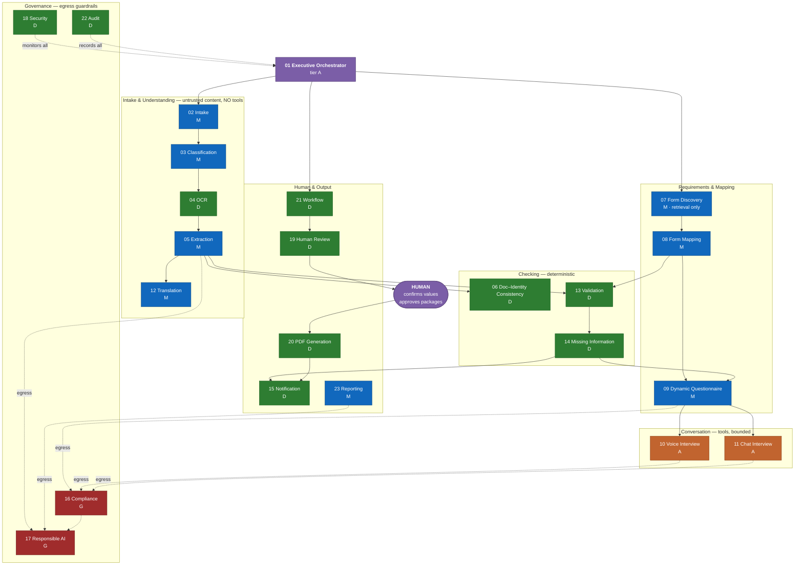
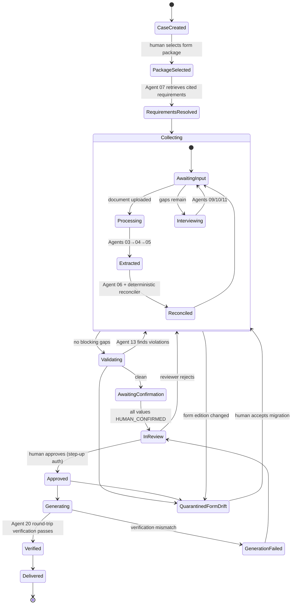

# 04 — AI Agent Architecture

**Owner:** AI Architect & Agentic AI Architect · **Contributors:** Chief AI Officer, Responsible AI
Lead, Prompt Engineering Lead, Principal Security Architect, Lead QA Architect · **Status:** For ARB
and Responsible AI board approval

---

## 4.1 Design philosophy

The brief specifies 23 agents. Implemented literally — 23 autonomous, tool-using, LLM-driven
services conversing with each other — that is an untestable, uncertifiable, unaffordable system.
[C-17](00-design-authority-record.md#c-17--twenty-three-agents-is-an-orchestration-liability-not-an-achievement)
records the challenge and its resolution.

**All 23 roles exist.** Each is separately addressable, separately observable, separately
budgeted, and separately audited. What changes is the honesty about how each is implemented:

> **A component is agentic only if it needs to be. Most of these do not.**

Eight of the 23 are ordinary deterministic code. Ten make a single, bounded, schema-constrained
model call with no tools and no autonomy. Two are guardrails that can only block or annotate.
**Three** are genuinely agentic — multi-turn, tool-using, capable of looping — and each of those
runs under a fixed tool allowlist, a turn budget, a wall-clock budget, and a token budget.

This is the difference between a system that demos and a system that a security review board and a
compliance officer will sign.

### The five invariants

| # | Invariant | Enforcement |
|---|---|---|
| **AI-1** | **No agent writes to the system of record.** Agents return values to the orchestrator; the orchestrator writes. | Agent runtime has no SQL credentials; the ledger API rejects agent principals |
| **AI-2** | **No agent approves anything.** | The approval endpoint rejects any non-human principal; enforced at APIM and in the service |
| **AI-3** | **Agents that read untrusted content have no tools.** | Tool allowlist is a deployment-time configuration, empty for tiers that touch user content |
| **AI-4** | **Every model output is schema-validated before use.** Out-of-schema output is rejected, not coerced. | Structured-output enforcement plus a validating deserializer that throws |
| **AI-5** | **Every generative output passes the guardrail chain before reaching a human, a form, or a document.** | Egress interception in the agent runtime; no bypass path exists |

---

## 4.2 Implementation tiers

| Tier | Definition | Model calls | Tools | Can loop | Count |
|---|---|---|---|---|---|
| **D — Deterministic** | Ordinary code. Rules, queries, transforms, integrations. | 0 | N/A | N/A | 8 |
| **M — Model-invoking** | One bounded call with a pinned template and a strict output schema. Stateless. | 1 per invocation | None | No | 10 |
| **A — Agentic** | Multi-turn, tool-using, may loop within budget. | Many | Fixed allowlist | Yes, bounded | 3 |
| **G — Guardrail** | Runs on another component's egress path. Can only allow, block, or annotate. | 0–1 | None | No | 2 |

| Agent | Tier | Agent | Tier |
|---|---|---|---|
| 01 Executive Orchestrator | **A** | 13 Validation | **D** |
| 02 Intake | M | 14 Missing Information | **D** |
| 03 Document Classification | M | 15 Notification | **D** |
| 04 OCR | **D** | 16 Compliance | **G** |
| 05 Data Extraction | M | 17 Responsible AI | **G** |
| 06 Document–Identity Consistency | **D** | 18 Security | **D** |
| 07 Form Discovery | M | 19 Human Review | **D** |
| 08 Form Mapping | M | 20 PDF Generation | **D** |
| 09 Dynamic Questionnaire | M | 21 Workflow | **D** |
| 10 Voice Interview | **A** | 22 Audit | **D** |
| 11 Chat Interview | **A** | 23 Reporting | M |
| 12 Translation | M | | |

---

## 4.3 Agent topology



**Read the diagram for what is missing:** no agent has an edge into `HUMAN → A20`. Package
generation is reachable only through a human approval. That gap is the architecture.

---

## 4.4 Trust tiers and the capability boundary

Every agent is assigned a **content trust level** and a **capability level**. The two are inversely
constrained: *the more untrusted content you read, the less you are allowed to do.*

| Content trust | Meaning | Agents | Max capability |
|---|---|---|---|
| **U0 — Hostile** | Reads raw user-supplied document content | 03, 04, 05, 12 | **No tools. No egress. Return structured data only.** |
| **U1 — Semi-trusted** | Reads user-typed text and conversation | 02, 09, 10, 11 | Fixed tool allowlist, read-only, scoped to one person |
| **U2 — Curated** | Reads only our curated corpus and our own database | 07, 08, 13, 14, 23 | Read tools within scope |
| **U3 — System** | Reads only system state | 01, 06, 15, 18, 19, 20, 21, 22 | Write authority within its own aggregate |

**The rule that makes this work:** an agent may never simultaneously hold U0/U1 content in context
*and* possess a state-changing tool. Where a workflow appears to need both, it is decomposed: the
reading agent returns data, the orchestrator validates it, and a separate deterministic component
acts. This is enforced at the runtime — the tool registry refuses to bind a tool to an agent whose
declared content trust exceeds the tool's maximum, and this is a unit-tested property of the runtime
itself.

### Prompt injection defense in depth

| Layer | Control |
|---|---|
| 1 — Structural | U0 agents have no tools. Injection can at worst corrupt returned *data*, not cause action |
| 2 — Envelope | Untrusted content is wrapped in delimited, escaped blocks with a standing directive that content within is inert input to be described, never obeyed |
| 3 — Schema | Returns are validated against a strict schema; anything out-of-schema is rejected and the job fails visibly |
| 4 — Detection | An injection classifier scans extracted text for instruction-like patterns; hits flag the document for human review and raise a security event |
| 5 — Semantic | Extracted values must be *locatable in the source document* (bounding polygon present and non-degenerate); a value the model produced without a source region is banded `NEEDS_REVIEW` |
| 6 — Human | Nothing model-touched reaches a form without human confirmation |

An adversary who defeats layers 2–5 still cannot cause an action, because of layer 1, and still
cannot reach a government form, because of layer 6.

---

## 4.5 Orchestration model

Orchestration is a **durable workflow**, not an LLM deciding what to do next.



**Why Durable Task rather than an agentic planner:**

| Property | Durable workflow | LLM planner |
|---|---|---|
| Replayable from history | Yes | No |
| Deterministic given the same inputs | Yes | No |
| Inspectable mid-flight | Yes | Partially |
| Testable to a compliance standard | Yes | Not meaningfully |
| Cost per case | ~$0 | Significant, and unbounded |
| Explains itself to an auditor | The state machine *is* the explanation | A transcript |

Agent 01 (Executive Orchestrator) is nevertheless tier **A**, because it does hold one genuinely
agentic responsibility: when the deterministic workflow reaches an *exception* — an unclassifiable
document, a contradiction the rule engine cannot resolve, an interview that has stalled — it
reasons about how to route the exception to the right agent or the right human. That reasoning is
bounded to a fixed set of routing actions and cannot invent a new step.

---

## 4.6 The agent contract

Every agent is defined by a machine-readable contract. Contracts are versioned, reviewed as code,
and used to generate both the runtime binding and the test harness.

```yaml
agent:
  id: "05"
  name: "Data Extraction Agent"
  version: "1.4.0"
  tier: M
  content_trust: U0
  purpose: >
    Convert OCR output and layout structure for a classified document into typed,
    schema-conformant candidate field values, each anchored to a source region.

  model:
    deployment: "aperture-extract-prod"
    version_pin: "REQUIRED"      # automatic upgrades disabled
    temperature: 0.0
    max_output_tokens: 4096
    structured_output: strict

  prompt:
    template_id: "extract.v1.4"
    registry_hash: "sha256:…"     # any change requires an eval run
    pii_minimization: false        # extraction requires the actual values

  inputs:
    - name: ocr_result
      schema: "schemas/ocr_result.v2.json"
      trust: U0
    - name: document_class
      schema: "schemas/document_class.v1.json"
    - name: target_field_schema
      schema: "schemas/extraction_target.v3.json"

  outputs:
    - name: candidate_values
      schema: "schemas/candidate_values.v3.json"
      validation: strict          # out-of-schema => reject, do not coerce
      post_conditions:
        - "every value has a non-degenerate source polygon"
        - "every value has an engine and engine_version"
        - "no value has state other than PROPOSED"

  tools: []                        # U0 => empty, enforced by the runtime

  data_access:
    read:  ["blob:documents/{document_id} (scoped SAS, 15m, read-only)"]
    write: []
    forbidden: ["sql:*", "cosmos:*", "http:*"]

  guardrails:
    egress: ["17-responsible-ai", "injection-detector"]
    fail_mode: closed

  budgets:
    wall_clock_ms: 30000
    tokens_in: 60000
    tokens_out: 4096
    cost_usd: 0.35
    retries: 2

  human_checkpoints:
    - "all outputs enter the ledger as PROPOSED and require human confirmation"
    - "confidence band NEEDS_REVIEW forces explicit reviewer attention"

  failure_conditions:
    - id: F1
      condition: "schema validation fails after retries"
      action: "mark document EXTRACTION_FAILED; surface manual-entry path; alert"
    - id: F2
      condition: "budget exceeded"
      action: "abort; partial results discarded; queue for retry with backoff"
    - id: F3
      condition: "injection detector fires"
      action: "flag document for human review; raise security event; results retained but all banded NEEDS_REVIEW"
    - id: F4
      condition: "output contains a value with no source region"
      action: "band NEEDS_REVIEW; log calibration event"

  escalation:
    - "3 consecutive F1 for the same document class within 1h => page the AI on-call"
    - "F3 rate > 0.5% of documents in 24h => security incident IR-AI-002"

  observability:
    emits: ["agent.invocation", "agent.cost", "extraction.confidence_distribution"]
    slo: { p95_latency_ms: 8000, success_rate: 0.995 }
```

Contracts for all 23 agents live in `contracts/agents/`. The sections below give the human-readable
specification for each.

---

## 4.7 Agent specifications

Every agent below is specified with: purpose · responsibilities · inputs · outputs · data access ·
security controls · human checkpoints · failure conditions · escalation · interactions.

---

### Agent 01 — Executive Orchestrator Agent

| | |
|---|---|
| **Tier / Trust** | A / U3 |
| **Purpose** | Own the lifecycle of a case as a durable workflow, and reason about exception routing when the deterministic path cannot proceed. |

**Responsibilities**
- Drive the case state machine ([§4.5](#45-orchestration-model)); every transition is its write.
- Dispatch work to agents with the correct scope, budget, and correlation id.
- Perform **all** writes arising from agent output, after schema validation.
- Enforce per-case budgets (tokens, cost, voice minutes, wall clock) and stop when exceeded.
- Route exceptions: unclassifiable documents, unresolvable contradictions, stalled interviews,
  budget exhaustion, guardrail blocks.
- Compensate on failure (saga rollback) and keep the case in a coherent state.

**Inputs** — case state; domain events; agent results; human actions; policy configuration.
**Outputs** — state transitions; agent dispatch commands; ledger writes; notifications; audit events.

**Data access** — Read: full case scope within the tenant. Write: case state, ledger `PROPOSED`
values, task queue. **Forbidden:** approval records, audit mutation, key operations, any cross-tenant
read.

**Security controls** — runs as its own managed identity, scoped per tenant via RLS session context ·
all dispatch is capability-checked against the target agent's contract · cannot elevate an agent's
tool allowlist at runtime · every action correlated and audited.

**Human checkpoints** — value confirmation; package approval; form-drift migration acceptance;
any exception it cannot route within 2 attempts.

**Failure conditions**
| ID | Condition | Action |
|---|---|---|
| F1 | Agent returns out-of-schema after retries | Mark step failed, surface manual path, alert |
| F2 | Case budget exhausted | Pause AI work, notify user with a plain explanation and options, keep manual paths open |
| F3 | Workflow deadlock (no progress in 72 h) | Move to `ON_HOLD`, notify case owner |
| F4 | Compensation fails | Freeze case, page on-call, never leave partial state |
| F5 | Two consecutive exception-routing attempts fail | Escalate to human queue with full context |

**Escalation** — F4 pages immediately · F2 aggregated at >5 % of cases/day escalates to CPO and
Finance · repeated F3 by form package escalates to Product.

**Interacts with** — all agents (dispatch); Workflow (21) for task materialization; Audit (22) on
every action; Human Review (19) for handoff.

---

### Agent 02 — Intake Agent

| | |
|---|---|
| **Tier / Trust** | M / U1 |
| **Purpose** | Turn the start of a case into a structured, cited plan of what must be collected — without ever choosing what the user should file. |

**Responsibilities**
- Take the human-selected form package and produce the initial collection plan: required fields by
  person, required evidence items, and the recommended capture order.
- Sequence collection to minimize context switching (all of one person's documents together; all of
  one topic's questions together).
- Produce the first-run explanation of what will be asked and why, in the user's language.
- Detect and surface an obviously mismatched selection *only* as a neutral observation
  ("this package includes forms for a spouse; you have not added a spouse to this folder") —
  never as a recommendation to change the selection.

**Inputs** — selected package + pinned editions; folder and person graph; existing documents;
locale and accessibility profile.
**Outputs** — `CollectionPlan` (ordered, per-person, citation-backed); onboarding narrative.

**Data access** — Read: folder, persons, case, form catalog. Write: none (orchestrator writes).

**Security controls** — no document content in context (works from metadata only) · guardrail egress ·
plan is validated against the form catalog so it cannot invent a requirement.

**Human checkpoints** — the plan is presented and can be reordered or deferred by the user.

**Failure conditions** — F1 package has no field map (catalog gap) → block case creation with a
clear message, alert catalog owner · F2 plan references a requirement with no citation → drop the
item and log a catalog defect.

**Escalation** — F1 for a *published* package is a Sev-2; the catalog is the product.

**Interacts with** — Form Discovery (07) for requirements; Dynamic Questionnaire (09); Orchestrator.

---

### Agent 03 — Document Classification Agent

| | |
|---|---|
| **Tier / Trust** | M / U0 |
| **Purpose** | Assign a document to the taxonomy so the right extraction path runs — and so sealed medical documents are never opened. |

**Responsibilities**
- Classify into the taxonomy (identity, civil, financial, immigration-issued, employment, medical,
  translation, correspondence, other) and subtype (~60 classes).
- Detect `SEALED_MEDICAL` **first**, before any other processing.
- Detect language and script; detect whether a document is a certified translation and link it to
  its source document.
- Detect multi-document files (a 30-page PDF containing six documents) and propose split points.
- Emit a confidence band; below threshold, route to the user.

**Inputs** — sanitized, normalized document; page images; `prebuilt-read` text.
**Outputs** — `DocumentClassification { class, subtype, confidence, language, script, is_translation, split_proposals[] }`.

**Data access** — Read: one blob via scoped SAS. Write: none.

**Security controls** — U0: no tools, no egress · runs in the processing zone · the
`SEALED_MEDICAL` check is a **deterministic pre-filter** (filename, page-count, visual template
match, and user declaration) evaluated *before* the model sees content, so a model error cannot
cause a sealed document to be opened.

**Human checkpoints** — classification is always overridable and the human override is
authoritative and permanent · low-confidence classifications are always asked.

**Failure conditions**
| ID | Condition | Action |
|---|---|---|
| F1 | Confidence below threshold | Route to user with the top 3 candidates |
| F2 | Detected as opened I-693 | Warn the user; refuse extraction regardless |
| F3 | Multi-document detected but split ambiguous | Ask the user to confirm split points |
| F4 | Classified as a type with no extractor | Store, OCR for search only, offer manual entry |

**Escalation** — F1 rate > 15 % for a class over 7 days → retrain trigger · any case of a
`SEALED_MEDICAL` document reaching OCR is a **Sev-1 privacy incident**.

**Interacts with** — OCR (04), Extraction (05), Orchestrator, Security (18).

---

### Agent 04 — OCR Agent

| | |
|---|---|
| **Tier / Trust** | **D** / U0 |
| **Purpose** | Produce text, layout, and structure from document images with per-token geometry and confidence. |

Deterministic: it is an integration with AI Document Intelligence plus routing logic. There is no
model *reasoning* here, and pretending otherwise would obscure where errors come from.

**Responsibilities**
- Route by class: `prebuilt-idDocument` for identity documents; `prebuilt-layout` for structured
  forms and tables; `prebuilt-read` for narrative documents; custom neural extractors for
  domain-specific classes.
- Preserve geometry (page, bounding polygon) and per-field/per-token confidence.
- Handle multi-page, mixed-orientation, and mixed-language documents.
- Retry with alternate preprocessing (rotation, contrast, upscale) on low-confidence pages before
  giving up.
- Never invent text: if a region is unreadable it is reported as unreadable.

**Inputs** — normalized document; classification; page images.
**Outputs** — `OcrResult { pages[], lines[], words[], tables[], selection_marks[], typed_fields[], confidences[], geometry[] }`.

**Data access** — Read: one blob via scoped SAS. Write: OCR result to the processing-zone queue.
Calls Document Intelligence over a private endpoint.

**Security controls** — processing zone; no internet egress except the private endpoint to
Document Intelligence · results size-capped · **never invoked for `SEALED_MEDICAL`** (enforced by
the workflow, not by the agent).

**Human checkpoints** — pages below the readability threshold trigger a "please re-scan this page"
prompt with the specific reason.

**Failure conditions** — F1 service error → retry with backoff, then queue and notify · F2 page
unreadable → request re-scan, mark page `UNREADABLE`, continue with other pages · F3 document
exceeds service limits (>500 MB, >2000 pages) → reject at ingest with guidance to split ·
F4 unsupported format reaches here → pipeline defect, Sev-2.

**Escalation** — sustained service error rate > 5 % for 15 min → page platform on-call and switch
the user-facing message to "processing is delayed."

**Interacts with** — Classification (03), Extraction (05), Translation (12).

---

### Agent 05 — Data Extraction Agent

| | |
|---|---|
| **Tier / Trust** | M / U0 |
| **Purpose** | Convert OCR output into typed candidate values anchored to source regions. |

Full contract at [§4.6](#46-the-agent-contract).

**Responsibilities**
- Map OCR output to the canonical field schema for the document class.
- Normalize types: dates to ISO-8601 *with the source format and any ambiguity flagged*; names with
  script and original string preserved; numbers with formatting stripped but the original retained.
- Validate structured identifiers (MRZ check digits, A-Number format, SSN format, receipt-number
  format) and force `NEEDS_REVIEW` on failure regardless of model confidence.
- Anchor every value to a page and polygon. A value with no anchor is `NEEDS_REVIEW` by definition.
- Report absence explicitly: "this field was not found" is an output, not a gap.

**Inputs** — OCR result; document class; target field schema for that class.
**Outputs** — `CandidateValue[]` each with value, type, source anchor, engine, engine version,
raw confidence, derived band, normalization notes.

**Data access** — Read: OCR result and the source blob (scoped SAS). Write: none. Forbidden: SQL,
Cosmos, HTTP.

**Security controls** — U0: **no tools**, no egress · deterministic post-conditions enforced by the
runtime (no anchor → reject or downgrade) · injection detector on input text · all output enters the
ledger as `PROPOSED` only.

**Human checkpoints** — every value requires human confirmation before it can reach a form
([AI-1](#41-design-philosophy), enforced by a DB check constraint).

**Failure conditions** — see the contract (F1–F4).

**Escalation** — F1 clustering by document class → model/extractor defect, AI on-call ·
F3 (injection) rate > 0.5 %/24 h → security incident.

**Interacts with** — OCR (04), Doc–Identity Consistency (06), Form Mapping (08), Validation (13),
Responsible AI (17) on egress.

---

### Agent 06 — Document–Identity Consistency Agent
*(renamed from "Identity Verification Agent" per [C-13](00-design-authority-record.md#c-13--identity-verification-agent-is-under-specified-and-legally-loaded))*

| | |
|---|---|
| **Tier / Trust** | **D** / U2 |
| **Purpose** | Detect internal inconsistencies between what different documents and the user say about the same person. Nothing more. |

**What it explicitly does NOT do:** face matching · liveness detection · biometric comparison ·
government or watchlist database checks · document authenticity or fraud adjudication ·
any decision that could deny a person service.

**Responsibilities**
- Compare name, DOB, place of birth, nationality, document numbers, and A-Number across every source
  for a `Person`, accounting for transliteration, diacritics, name ordering, patronymics, and
  maiden/married names.
- Check document validity windows (expired; expires before a plausible filing horizon).
- Validate structured-identifier formats and checksums.
- Emit `Discrepancy` records with both values, both sources, and a plain-language description.
- **Never** decide which value is correct.

**Inputs** — all confirmed and candidate values for a person; document metadata.
**Outputs** — `Discrepancy[]`, each typed (`NAME_VARIANT`, `DATE_CONFLICT`, `NUMBER_CONFLICT`,
`EXPIRY_RISK`, `CHECKSUM_FAIL`) with severity and both provenances.

**Data access** — Read: ledger values scoped to one person. Write: none.

**Security controls** — no biometric data exists in the system to compare · deterministic, so its
behavior is fully specified and testable · person-scoped so it cannot leak across household members.

**Human checkpoints** — every discrepancy is a human decision. Blocking discrepancies prevent
approval.

**Failure conditions** — F1 unresolvable conflict → block approval, present both options with
sources · F2 transliteration ambiguity → present as a name-variant choice, never auto-select ·
F3 document expired → surface as an informational item with the agency's own published guidance,
cited, and no advice.

**Escalation** — none automatic; discrepancy volume by type is reported monthly to tune extraction.

**Interacts with** — Extraction (05), Validation (13), Human Review (19).

---

### Agent 07 — Form Discovery Agent

| | |
|---|---|
| **Tier / Trust** | M / U2 |
| **Purpose** | Retrieve, from the agency's own published instructions, exactly what a *human-selected* form package requires — with a citation for every assertion. |

> **Scope boundary.** This agent performs **retrieval, not inference**. It never maps a person's
> circumstances to a benefit category. Redesigned per
> [C-01](00-design-authority-record.md#c-01--form-discovery-agent-as-briefed-is-unauthorized-practice-of-law);
> this is the single most heavily constrained agent in the system.

**Responsibilities**
- Given a selected package and pinned editions, retrieve the required field set, required evidence
  list, filing fee, filing address, and signature requirements.
- Attach to every retrieved item: source URL, document title, section, and revision date.
- Surface the agency's own conditional language verbatim where a requirement is conditional
  ("if you were previously married, submit …") rather than resolving the condition for the user.
- Detect and report when the corpus is stale relative to the catalog hash.
- **Refuse** any request phrased as "which form should I file" or "do I qualify," returning a
  deterministic deflection.

**Inputs** — selected package; pinned editions; the curated instruction corpus (AI Search hybrid).
**Outputs** — `RequirementSet { fields[], evidence[], fee, filing_address, signature_points[], citations[] }`.

**Data access** — Read: form catalog and instruction corpus only. **No access to case data, person
data, or documents** — architecturally, it cannot personalize because it cannot see the person.

**Security controls** — the corpus is curated and hash-verified; the agent cannot retrieve from the
open internet · Compliance guardrail (16) on egress with the strictest profile · every output item
must carry a citation or it is dropped by a post-condition.

**Human checkpoints** — the requirement set is displayed with citations and the user can inspect
the source for any item.

**Failure conditions**
| ID | Condition | Action |
|---|---|---|
| F1 | No citation for a proposed requirement | Drop the item; log a catalog defect |
| F2 | Corpus stale vs. catalog hash | Block and alert; **never** fall back to model memory of a form |
| F3 | Request implies eligibility advice | Deterministic deflection; log `UPL_DEFLECTION` |
| F4 | Conflicting instructions between sources | Present both with citations; do not resolve |

**Escalation** — F2 is a Sev-2 (a stale corpus produces wrong requirements at scale) ·
F3 rate is reported weekly to Compliance as a demand signal, not as a problem to solve by relaxing.

**Interacts with** — Form Mapping (08), Intake (02), Validation (13), Compliance (16).

---

### Agent 08 — Form Mapping Agent

| | |
|---|---|
| **Tier / Trust** | M / U2 |
| **Purpose** | Bind canonical data-model fields to specific PDF form-field identifiers for a pinned form edition. |

**Responsibilities**
- Maintain and apply the field map: `canonical_path → (form_id, edition, pdf_field_name, type, max_length, format)`.
- Handle transformations: date formats, name-part ordering, checkbox-group semantics, "same as
  above" propagation, unit conversions, and yes/no polarity (some forms ask the negative).
- Detect overflow against the form's character capacity and trigger addendum generation.
- Propose mappings for a *new* form edition by aligning against the previous edition, for **human
  approval** — a new field map is never activated without review.
- Maintain reverse mapping so a reviewer can go from a PDF field back to the canonical value and its
  provenance.

**Inputs** — canonical values; pinned form edition; existing field map; PDF field inventory.
**Outputs** — `FormFieldBinding[]`; `OverflowItem[]`; proposed map deltas for review.

**Data access** — Read: form catalog, field maps, ledger (values only, no documents). Write: none —
proposed map changes go to a human approval queue.

**Security controls** — a field map change is a **reviewed, versioned artifact** requiring two-person
approval, because a bad map silently puts the right value in the wrong box · maps are hash-pinned to
an edition · mapping is validated by a fixture test per form that fills a known value set and
asserts the output.

**Human checkpoints** — all new and changed field maps require two-person review and a passing
fixture test before activation.

**Failure conditions** — F1 unmapped required field → block generation, alert catalog owner ·
F2 type mismatch → block, do not coerce · F3 overflow → generate addendum, never truncate ·
F4 edition change invalidates the map → quarantine affected cases.

**Escalation** — F1 or F4 for a live package is Sev-2 and blocks generation for that package
globally until resolved.

**Interacts with** — Form Discovery (07), PDF Generation (20), Validation (13), Human Review (19).

---

### Agent 09 — Dynamic Questionnaire Agent

| | |
|---|---|
| **Tier / Trust** | M / U2 |
| **Purpose** | Generate the minimal, correctly-ordered, correctly-phrased set of questions needed to fill the gaps in the selected forms. |

**Responsibilities**
- Compute the unmet required-field set from the ledger and the requirement set.
- Order questions to minimize cognitive switching: group by person, then by topic, then by document
  the answer might come from.
- Apply conditional logic derived from the form's own instructions, with the condition cited.
- Phrase each question in the user's language at the target reading level, with the authoritative
  English form-field label available alongside.
- Recompute dependencies within 300 ms of any answer.
- Offer, for each question, the alternative "I have a document for that" path.

**Inputs** — requirement set; ledger state; person graph; locale; accessibility and reading-level
profile; prior answers **for this person only**.
**Outputs** — `QuestionSet { questions[] }`, each bound to exactly one `canonical_path` or evidence
item, with type, constraints, help text, citation, and the source form label.

**Data access** — Read: ledger scoped to one person, requirement set, catalog. Write: none.

**Security controls** — person-scoped retrieval enforced at the data layer, not by prompt · Compliance
guardrail on egress (question phrasing is a common route to accidental advice) · questions must bind
to a real field id or they are dropped.

**Human checkpoints** — the user can skip, defer, or answer any question out of order, and can
always say "I don't know" without being blocked from progressing elsewhere.

**Failure conditions** — F1 question does not bind to a field → drop and log · F2 phrasing exceeds
the reading-level threshold → regenerate once, then fall back to the curated canonical phrasing ·
F3 circular conditional dependency → fall back to flat ordering and log a catalog defect.

**Escalation** — F3 indicates a defective requirement graph; Sev-3 to the catalog team.

**Interacts with** — Chat (11) and Voice (10) Interview agents, Missing Information (14),
Translation (12), Validation (13).

---

### Agent 10 — Voice Interview Agent

| | |
|---|---|
| **Tier / Trust** | **A** / U1 |
| **Purpose** | Conduct a short, task-scoped spoken interview to resolve a specific batch of missing items. |

**Responsibilities**
- Deliver the mandatory disclosure (AI · transcribed · not a lawyer · you can switch to text) in
  audio and on screen, and obtain affirmative consent, **before** any audio is captured.
- Ask the questions in the assigned batch, confirm each answer back to the user, and accept
  corrections.
- Handle interruption, repetition, "I don't understand," code-switching, and background noise.
- Close the session when the batch is resolved or the budget is reached — it is not an open-ended
  companion.
- Detect distress, danger, or crisis disclosure and **stop**, offering pre-approved resources
  without attempting counselling.
- Never answer a legal question; deflect within scope.

**Inputs** — question batch; person-scoped prior answers; locale; consent state; budget.
**Outputs** — `Answer[]` (state `PROPOSED`, attributed to the human speaker); transcript; session
metrics.

**Data access** — Read: question batch and this person's prior answers. Write: none — answers return
through the orchestrator. Tools: `confirm_answer`, `repeat_question`, `switch_to_text`,
`end_session`, `offer_resources`. **That is the entire allowlist.**

**Security controls**
- Audio streams **client ↔ model over WebRTC**; our backend mints a single-use ephemeral key
  (≤ 60 s TTL) and never receives the audio.
- **No voiceprint, speaker embedding, or biometric identifier is created or stored, anywhere.**
  There is no embedding store in the architecture; a CI lint rule fails the build on any speaker-ID
  API reference ([C-07](00-design-authority-record.md#c-07--voice-interviews-create-biometric-and-wiretap-exposure)).
- Audio discarded at session end by default; opt-in 30-day clip retention per session.
- Consent recorded as a versioned `ConsentRecord` with modality, retention choice, and jurisdiction
  basis.
- Compliance (16) and Responsible AI (17) guardrails on every utterance; on block, a deterministic
  spoken refusal is substituted.
- Voice-minute budget enforced at the broker; waived for the accessibility profile.

**Human checkpoints** — consent before start · answer confirmation in-session · all answers remain
`PROPOSED` and require confirmation in review · crisis detection hands off to the human.

**Failure conditions**
| ID | Condition | Action |
|---|---|---|
| F1 | Consent not given | Do not start; offer chat |
| F2 | Connection quality unusable | Offer chat with answers preserved; do not retry indefinitely |
| F3 | Guardrail block | Substitute deterministic refusal; continue; log |
| F4 | Budget exhausted | Graceful close, answers preserved, explain plainly |
| F5 | Distress or danger detected | Stop, offer resources, notify the case owner **only if the user consents** |
| F6 | Three consecutive non-comprehensions | Offer to switch modality or to a human |

**Escalation** — F5 is reviewed by trust & safety within 24 h (metadata only, not content, unless
the user consented) · F3 clustering by phrase → prompt/guardrail review · sustained F2 by region →
platform investigation.

**Interacts with** — Dynamic Questionnaire (09), Translation (12), Compliance (16),
Responsible AI (17), Notification (15), Orchestrator.

---

### Agent 11 — Chat Interview Agent

| | |
|---|---|
| **Tier / Trust** | **A** / U1 |
| **Purpose** | The default interview modality: resolve missing items by text, in the user's language, at their reading level. |

**Responsibilities** — as Agent 10, in text, plus:
- Render structured input affordances (date picker, address form, dropdown) rather than asking the
  user to type a formatted value into prose.
- Support attaching a document mid-conversation as an answer.
- Maintain a visible, scrollable record the user can re-read — a significant accessibility and trust
  advantage over voice.
- Announce completed blocks to assistive technology rather than streaming tokens
  ([C-12](00-design-authority-record.md#c-12--accessibility-cannot-be-a-phase-2-item-for-this-population)).

**Tools** — `render_input_control`, `attach_document`, `confirm_answer`, `show_citation`,
`switch_to_voice`, `end_session`, `offer_resources`.

**Data access** — Read: question batch and this person's prior answers only. Write: none.

**Security controls** — person-scoped context enforced at the data layer · guardrail chain on every
turn, fail-closed · PII minimization proxy applied (the interview rarely needs actual identifier
values in model context) · transcript retained under case retention and exportable by the user ·
prompt-injection resistant to user-supplied text (a user pasting instructions is treated as content).

**Human checkpoints** — as Agent 10.

**Failure conditions** — F1 guardrail block → deterministic refusal · F2 model unavailable → fall
back to the plain structured questionnaire with a clear notice · F3 user asks for legal advice
repeatedly → after two deflections, proactively offer the nonprofit directory and stop re-deflecting
in the same session · F4 budget exhausted → switch to the structured questionnaire.

**Escalation** — F1 clustering → prompt review · F3 volume reported weekly to Compliance.

**Interacts with** — as Agent 10.

---

### Agent 12 — Translation Agent

| | |
|---|---|
| **Tier / Trust** | M / U0 |
| **Purpose** | Make the interview and the interface comprehensible in the user's language — while never being represented as certified interpretation or certified translation. |

> **Boundary.** Machine translation cannot sign a form's interpreter certification and cannot
> produce a certified translation of a foreign document.
> Per [C-08](00-design-authority-record.md#c-08--machine-translation-cannot-be-represented-as-interpretation).

**Responsibilities**
- Translate questions, help text, and confirmations into the user's language.
- Translate user answers into English for storage where the form requires English.
- Use the **pinned legal glossary** for terms of art; never free-translate them.
- Perform back-translation as a quality check and flag low-agreement segments for human review.
- Label every machine-translated string as machine-assisted, everywhere it is displayed.
- Provide a reading aid for foreign-language documents — clearly labelled as an unofficial aid,
  never as a certified translation, and never used as the basis of a form value without human
  confirmation.

**Inputs** — source text; source and target language; glossary; context type (question / answer /
document aid).
**Outputs** — translated text; back-translation agreement score; glossary hits; a mandatory
`machine_assisted: true` marker.

**Data access** — Read: glossary and the string to translate. Write: none. Calls AI Translator over
a private endpoint.

**Security controls** — U0 for document-aid mode: no tools · PII minimization applied to answer
translation where possible · the `machine_assisted` marker is structurally non-removable (it is part
of the output type, not a UI decision).

**Human checkpoints** — before package approval for a limited-English-proficiency user, the platform
requires either a named human interpreter attestation or an applicant self-attestation of
comprehension · low back-translation agreement flags the segment for review.

**Failure conditions** — F1 unsupported language pair → fall back to English with an explicit notice
and offer the directory · F2 back-translation agreement below threshold → flag for human review,
do not use for a form value · F3 a glossary term is missing → use the source term untranslated with
a gloss, rather than guessing · F4 service unavailable → English with a notice; never silently
monolingual.

**Escalation** — F2 clustering by language → glossary and model quality review, and a decision on
whether to keep offering that language.

**Interacts with** — Chat (11), Voice (10), Dynamic Questionnaire (09), Extraction (05).

---

### Agent 13 — Validation Agent

| | |
|---|---|
| **Tier / Trust** | **D** / U2 |
| **Purpose** | Deterministically evaluate a case against every rule the selected forms impose. |

Deliberately **not** a model. Validation must be exhaustive, deterministic, explainable, and
regression-testable. A model that "usually" catches a date inconsistency is worse than useless
here, because it creates false confidence.

**Responsibilities**
- **Presence:** every required field has a `HUMAN_CONFIRMED` value; every required evidence item is
  attached.
- **Type and format:** values conform to the form's constraints (length, charset, date range,
  enumerations).
- **Cross-field:** e.g. marriage date after both parties' birth dates; entry date after passport
  issue date; address history continuity within the form's stated window; employment history without
  unexplained gaps where the form requires continuity.
- **Cross-form:** the same logical field is identical everywhere in the package — guaranteed by
  construction (one value drives all bindings), and asserted here as a defense in depth.
- **Cross-document:** consistency with Agent 06's discrepancy set.
- **Edition:** the pinned edition is still current; otherwise raise drift.
- Emit violations with severity (`BLOCKING` / `ADVISORY`), the rule id, the plain-language
  explanation, the citation, and the exact remediation path.
- **Never auto-correct. Ever.** ([AP-7](03-solution-architecture.md#31-architectural-principles))

**Inputs** — case snapshot; requirement set; rule set for the pinned editions; discrepancies.
**Outputs** — `Violation[]`; counters (`fields_filled / fields_required`, `documents_collected / documents_required`).

**Data access** — Read: ledger, catalog, rules. Write: none. Pure function of its inputs, which is
what makes it testable to the required standard.

**Security controls** — no model, so no injection surface · rules are versioned code artifacts under
review · every rule has a unit test and a citation, and a rule without a citation cannot be
activated.

**Human checkpoints** — every violation resolves through a human action.

**Failure conditions** — F1 rule references a field not in the catalog → rule disabled, catalog
defect logged · F2 rule set version mismatch with the pinned edition → block validation and
quarantine · F3 contradictory rules fire → surface both, block approval, log a rule defect.

**Escalation** — F2/F3 block approval for the affected package globally; Sev-2.

**Interacts with** — Missing Information (14), Human Review (19), PDF Generation (20), Orchestrator.

---

### Agent 14 — Missing Information Agent

| | |
|---|---|
| **Tier / Trust** | **D** / U2 |
| **Purpose** | Turn a list of violations into a prioritized, human-sized, assignable work list. |

**Responsibilities**
- Convert violations into `MissingItem`s with: what it is, which form/field or evidence requirement
  it satisfies, why it is required (cited), the fastest resolution path, and the owning `Person`.
- Prioritize by: blocking before advisory, then by unlock value (items that unblock the most other
  items first), then by estimated effort.
- Group into batches sized for a single sitting (a chat batch of ~8 questions; a voice batch of
  ~5 minutes).
- Assign each item to exactly one person so a household can divide work without collision.
- Detect and suppress duplicate items arising from the same root cause — one missing passport should
  produce one item, not eleven.
- Track ageing and feed the notification cadence.

**Inputs** — violations; person graph; historical resolution-time data; notification preferences.
**Outputs** — `MissingItem[]`; batches; per-person work lists; notification triggers.

**Data access** — Read: violations, ledger, person graph. Write: none.

**Security controls** — deterministic · person-scoped assignment respects the household trust
boundary — an item assigned to person B is not described to person A beyond "waiting on another
participant."

**Human checkpoints** — the user can defer, reassign (with the target person's consent), or mark
"I cannot get this," which routes to human review rather than blocking silently.

**Failure conditions** — F1 item has no resolution path → route to human review · F2 all items are
blocked on one unobtainable document → escalate to human review with the full picture rather than
leaving the user stuck · F3 duplicate-suppression collapses two genuinely distinct items → detected
by a reconciliation check against the violation set; log and un-collapse.

**Escalation** — F2 volume by document type is a product signal reported monthly (it tells us which
document is hardest for real people to obtain).

**Interacts with** — Validation (13), Dynamic Questionnaire (09), Notification (15),
Human Review (19).

---

### Agent 15 — Notification Agent

| | |
|---|---|
| **Tier / Trust** | **D** / U3 |
| **Purpose** | Get the right person's attention, on their terms, without leaking anything. |

**Responsibilities**
- Fan out domain events to the right recipients per their preferences and role.
- Enforce **content-free** delivery: push and email carry no case content, no person name, no form
  identifier — only "you have an update" plus a deep link
  ([NT-002](02-product-requirements.md#213-notification-requirements)).
- Batch, de-duplicate, and respect quiet hours, digest mode, and global pause.
- Guarantee delivery of non-suppressible security notifications.
- **Generate nothing** for Quiet Exit or Private Annex operations
  ([C-05](00-design-authority-record.md#c-05--a-household-folder-is-not-a-single-trust-boundary)).
- Localize fully, including RTL.

**Inputs** — domain events; preferences; role and entitlement; locale.
**Outputs** — in-app inbox items; APNs pushes; emails; delivery receipts.

**Data access** — Read: preferences, entitlement, event metadata. Write: notification records only.
**Never reads case content** — it operates on event identifiers, which is why it structurally cannot
leak.

**Security controls** — content-free payloads verified by a test that asserts no notification body
matches any case value · deep links require an authenticated session and re-verify entitlement on
open · email is DMARC/DKIM/SPF-aligned with no tracking pixels · **no SMS** for case content.

**Human checkpoints** — the user controls channels, categories, quiet hours, and pause; security
notifications are non-suppressible by design and this is disclosed.

**Failure conditions** — F1 APNs failure → in-app inbox remains authoritative; retry with backoff ·
F2 email bounce → mark channel unhealthy, surface in-app · F3 a notification would reveal Private
Annex activity → **drop it**, and log the drop as a privacy-control success, not an error.

**Escalation** — F3 occurring at all indicates an event-design defect; Sev-2 review of the emitting
event.

**Interacts with** — Missing Information (14), Human Review (19), PDF Generation (20),
Security (18), Orchestrator.

---

### Agent 16 — Compliance Agent

| | |
|---|---|
| **Tier / Trust** | **G** / U1 |
| **Purpose** | Enforce the scrivener boundary on every generative output. This is the agent that keeps the company out of court. |

**Responsibilities**
- Classify every candidate output against the **nine prohibited speech acts**
  ([09 §9.3](09-responsible-ai.md#93-the-legal-advice-classifier)): eligibility assessment ·
  outcome prediction · strategy recommendation · form/benefit selection · interpretation of law
  applied to facts · advice on what to disclose or omit · characterization of evidence
  sufficiency · statements about consequences of a filing decision · representations of an
  attorney-client-like relationship.
- **Block** on detection and substitute a deterministic, warm, scope-restating refusal.
- Verify mandatory disclosures are present where required (interview start, package footer).
- Verify tenant branding has not suppressed the not-a-law-firm disclosure.
- Log every block and every deflection with the triggering text hash for offline review.

**Inputs** — candidate output; the generating agent's identity and context type; tenant profile.
**Outputs** — `{ verdict: ALLOW | BLOCK, categories[], confidence, substitute_text? }`.

**Data access** — Read: the candidate output and its metadata only. Write: compliance event log.

**Security controls** — **fail closed**: if the classifier is unavailable, generative output does not
ship · runs in-process on the egress path with no bypass route · its own decisions are audited ·
the classifier is itself a versioned, evaluated artifact with a blocking release gate.

**Human checkpoints** — 1 % of allowed turns are sampled for offline classification and human
spot-check, weekly to Compliance · all blocks are reviewed in aggregate.

**Failure conditions**
| ID | Condition | Action |
|---|---|---|
| F1 | Classifier unavailable | **Fail closed.** Generative features degrade to structured, non-generative flows |
| F2 | Ambiguous verdict | Block. False positives are cheap; false negatives are existential |
| F3 | Block rate spikes | Alert; likely a prompt regression upstream |
| F4 | An escape is found in sampling | **Sev-1.** Halt the affected surface, patch, re-run the full corpus |

**Escalation** — F4 goes directly to the Compliance Officer and the CPO, and blocks release.

**Interacts with** — every generative agent (07, 09, 10, 11, 23) on egress; Responsible AI (17);
Audit (22).

---

### Agent 17 — Responsible AI Agent

| | |
|---|---|
| **Tier / Trust** | **G** / U1 |
| **Purpose** | Enforce the non-legal dimensions of responsible output: harm, bias, PII leakage, hallucination, and provenance. |

**Responsibilities**
- Harm classification via AI Content Safety (violence, self-harm, sexual, hate) with thresholds
  tuned for a population that will legitimately describe difficult facts — a user recounting
  domestic violence must not be blocked from completing their application.
- **PII leakage check:** does this output contain a value belonging to a different `Person` than the
  recipient is entitled to see? This is the technical enforcement of the household trust boundary on
  the generative path.
- **Groundedness check:** does every factual assertion trace to a citation or a ledger value? An
  ungrounded assertion is annotated or blocked.
- **Bias monitoring:** sampled measurement of question phrasing, refusal rates, extraction accuracy,
  and completion rates stratified by language, script, country of origin, and name origin.
- Enforce uncertainty language: the assistant says "I read this as X — is that right?" not "X."

**Inputs** — candidate output; recipient entitlement; grounding set (citations and ledger values).
**Outputs** — `{ verdict, harm_categories[], pii_violations[], groundedness_score, annotations[] }`.

**Data access** — Read: candidate output, entitlement scope, grounding set. Write: RAI event log.

**Security controls** — fail closed on harm and PII checks · groundedness failures annotate rather
than block where blocking would harm usability, but an ungrounded *requirement* claim always blocks ·
bias metrics are computed on aggregates with k-anonymity and never expose individuals.

**Human checkpoints** — monthly bias report to the Chief AI Officer and Responsible AI Lead, with
a required written response to any disparity beyond threshold · quarterly external review.

**Failure conditions** — F1 harm detected → route to the crisis-resource path, not a bare refusal ·
F2 PII leakage → **block, Sev-1 privacy event**, page immediately · F3 groundedness below threshold
on a requirement claim → block · F4 bias metric exceeds the disparity threshold → the affected
capability is flagged for remediation with a deadline, and repeated failure removes the capability.

**Escalation** — F2 is always Sev-1 · F4 escalates to the Chief AI Officer with a 30-day remediation
clock.

**Interacts with** — all generative agents; Compliance (16); Security (18); Reporting (23).

---

### Agent 18 — Security Agent

| | |
|---|---|
| **Tier / Trust** | **D** / U3 |
| **Purpose** | Detect, correlate, and respond to security-relevant behavior across the platform. |

**Responsibilities**
- Detect anomalies: impossible travel, credential-stuffing patterns, abnormal export or download
  volume, unusual cross-person access within a folder, break-glass misuse, agent budget anomalies.
- Correlate prompt-injection detections, guardrail blocks, and malware findings into incidents.
- Enforce automated responses: session revocation, rate limiting, temporary capability suspension,
  quarantine.
- Feed Microsoft Sentinel with normalized events and maintain detection rules as code.
- Monitor for the specific abuse pattern of a bad-faith tenant
  ([C-10](00-design-authority-record.md#c-10--the-platform-will-attract-bad-faith-administrator-tenants)):
  volume anomalies, identical narratives across unrelated applicants, fee-collection language.

**Inputs** — auth events, access logs, agent telemetry, guardrail events, scanner findings, network
telemetry.
**Outputs** — security events, incidents, automated response actions, alerts.

**Data access** — Read: telemetry and metadata. **Explicitly not case content** — trust-and-safety
telemetry is designed so that Sam ([P6](02-product-requirements.md#p6--sam-platform-operations--trust--safety-internal))
can do their job without reading anyone's application.

**Security controls** — its own detections are audited · automated response actions are bounded and
reversible · any action that would affect a user is logged and, where it degrades service, disclosed
to that user.

**Human checkpoints** — incident triage is human · any action that would disclose case content
requires dual approval and generates a user-visible notice.

**Failure conditions** — F1 detection pipeline down → alert immediately; this is a Sev-2 because we
are blind · F2 false-positive rate above threshold → tune, do not disable · F3 automated response
would lock out a legitimate user mid-case → prefer step-up challenge over lockout.

**Escalation** — standard IR: Sev-1 pages the CISO; privacy-affecting incidents also page the
Privacy Officer within 1 hour.

**Interacts with** — all components (observes); Notification (15); Audit (22); Human Review (19).

---

### Agent 19 — Human Review Agent

| | |
|---|---|
| **Tier / Trust** | **D** / U3 |
| **Purpose** | Route work to the right human, at the right moment, with everything they need to decide — and make the handoff itself auditable. |

**Responsibilities**
- Materialize review tasks: value confirmation batches, discrepancy resolution, classification
  overrides, field-map approvals, package approval, exception handling.
- Route by required competence, tenant policy, language, and workload.
- Assemble the review context: the value, its provenance, the source region on the document image,
  the conflicting alternative, and the citation.
- Enforce SLAs and escalate ageing tasks.
- Capture the decision, the rationale where required, the dwell time, and the identity — every one
  of which is audit evidence.
- Enforce that approval requires step-up authentication and a human principal.

**Inputs** — validation output; discrepancies; agent exceptions; tenant routing policy; reviewer
availability.
**Outputs** — review tasks; assignments; decisions; approval records; escalations.

**Data access** — Read: case data within the reviewer's entitlement. Write: task state, decisions,
approval records.

**Security controls** — **the approval endpoint rejects non-human principals** (checked at APIM and
in the service) · step-up re-authentication required · approval is invalidated automatically if any
value subsequently changes · reviewer entitlement is evaluated per task, not per session.

**Human checkpoints** — this agent *is* the human checkpoint mechanism.

**Failure conditions** — F1 no eligible reviewer → escalate to tenant admin, then to platform ·
F2 SLA breach → escalate and notify the applicant honestly about the delay · F3 reviewer attempts
to approve with unresolved blocking items → refuse and list them · F4 approval attempted by a
non-human principal → **reject and raise a Sev-1 security event** (this should be impossible).

**Escalation** — F4 is treated as an attempted control bypass and investigated as such.

**Interacts with** — Validation (13), Missing Information (14), Doc–Identity (06),
Form Mapping (08), PDF Generation (20), Audit (22).

---

### Agent 20 — PDF Generation Agent

| | |
|---|---|
| **Tier / Trust** | **D** / U3 |
| **Purpose** | Produce the filled official forms and the complete package — correctly, verifiably, or not at all. |

**Responsibilities**
- Fill the agency's **own published AcroForm** at the pinned edition. Never recreate a form's
  appearance ([ADR-003](adr/ADR-003-form-fidelity.md)).
- **Round-trip verify**: re-parse the generated PDF, re-extract every field, assert equality with the
  source record. Any mismatch **fails** generation — it does not warn.
- Generate conforming addenda for overflow; never truncate.
- Assemble the package: cover index, forms in the agency's stated order, labelled evidence exhibits,
  translation certificates, filing checklist, fee sheet.
- Stamp the preparing organization and its verification status in a discreet footer on every page.
- Write to WORM storage with the edition hash, value-set hash, and approval record id in metadata.
- Handle `XFA`/`FLAT` forms as **Assisted Fill Only** with a clearly stated limitation.

**Inputs** — approved case; field bindings; pinned editions; evidence set; approval record.
**Outputs** — filled PDFs; package manifest; verification report; WORM blob references.

**Data access** — Read: ledger (`HUMAN_CONFIRMED` values only), catalog, documents. Write: package
blobs, manifest.

**Security controls** — **refuses to render any value not `HUMAN_CONFIRMED`** (enforced by a database
check constraint as well as service logic) · refuses to run without a valid approval record ·
output is immutable and hash-recorded · generated text passes the Compliance guardrail so no
advice-like statement can reach a package · the PDF toolchain runs in an isolated worker with the
same hardening as the processing zone (it parses agency PDFs, which are external input).

**Human checkpoints** — approval before generation · preview before export · re-approval required if
any value changes.

**Failure conditions**
| ID | Condition | Action |
|---|---|---|
| F1 | Round-trip verification mismatch | **Fail generation.** Do not deliver. Alert. Return case to review |
| F2 | Unmapped or unconfirmed required field | Fail with the specific field named |
| F3 | Edition changed since approval | Quarantine; require re-approval on the new edition |
| F4 | Overflow with no addendum format defined | Fail; do not truncate |
| F5 | Form encoding is XFA/FLAT | Produce Assisted-Fill output with the limitation stated; do not claim a filled form |

**Escalation** — F1 is Sev-2 and, if it recurs for the same form, blocks that form globally until
the field map is fixed. A wrong value on a filed government form is the worst outcome this system
can produce, so this path fails hard by design.

**Interacts with** — Form Mapping (08), Validation (13), Human Review (19), Compliance (16),
Notification (15), Audit (22).

---

### Agent 21 — Workflow Agent

| | |
|---|---|
| **Tier / Trust** | **D** / U3 |
| **Purpose** | Materialize the orchestrator's plan into durable, retryable, observable tasks. |

**Responsibilities**
- Own the task table: creation, assignment, dependency, retry policy, timeout, compensation.
- Enforce ordering where ordering matters (Service Bus sessions keyed by case).
- Manage SLAs and timers.
- Provide the operational view: what is in flight, what is stuck, what is retrying, what is dead.
- Execute compensation on saga failure.

**Inputs** — orchestrator dispatch; task completion; timers.
**Outputs** — task state; queue messages; timer fires; DLQ entries.

**Data access** — Read/write: task state only.

**Security controls** — tasks carry only identifiers, never content · DLQ entries are inspectable
without exposing case data · retry with exponential backoff and jitter; a poison message is never
silently dropped.

**Human checkpoints** — the operational dashboard is human-monitored; DLQ requires human
disposition.

**Failure conditions** — F1 poison message → DLQ + alert, never drop · F2 timer storm → rate limit
and alert · F3 orphaned task (parent case deleted) → reap and log.

**Escalation** — DLQ depth > 50 or age > 1 h pages platform on-call.

**Interacts with** — Orchestrator (01), every asynchronous component.

---

### Agent 22 — Audit Agent

| | |
|---|---|
| **Tier / Trust** | **D** / U3 |
| **Purpose** | Produce a complete, tamper-evident, content-free record of everything that happened. |

**Responsibilities**
- Record every: authorization decision including denials, personal-data read and write, AI
  invocation with full metadata, state transition, consent event, access grant and revocation,
  export and delivery, break-glass session, administrative action, key operation.
- Maintain the hash chain per tenant; anchor periodically.
- Write to immutable append-blob storage with a legal-hold-capable immutability policy.
- Serve the user's own audit trail in plain language.
- Enforce the invariant that **no principal, including `SystemAdmin`, can modify or delete an audit
  record.**

**Inputs** — audit events from every component.
**Outputs** — audit records; hash chain; user-facing trail; compliance exports.

**Data access** — Write-only to the audit store. Read: only for serving entitled queries. Cannot
read case content — it records identifiers and hashes, never values.

**Security controls** — append-only storage with an immutability policy · hash chaining makes
tampering detectable · **audit records contain no case content**, so the 7-year audit retention does
not defeat the right to erasure · every audit *read* is itself audited · a separate managed identity
with write-only permission.

**Human checkpoints** — users can read their own trail; auditors have a dedicated read-only role.

**Failure conditions** — F1 audit write fails → **the originating operation fails**. An unaudited
privileged action is not permitted to succeed · F2 hash chain break detected → Sev-1 security
incident · F3 storage immutability policy missing or altered → Sev-1, block deploys.

**Escalation** — F1 sustained is a Sev-1 availability *and* compliance incident · F2 is
investigated as a potential compromise.

**Interacts with** — every component.

---

### Agent 23 — Reporting Agent

| | |
|---|---|
| **Tier / Trust** | M / U2 |
| **Purpose** | Answer operational and compliance questions from data the asker is entitled to see, with a natural-language layer over governed queries. |

**Responsibilities**
- Execute the governed report catalog ([02 §2.12](02-product-requirements.md#212-reporting-requirements)).
- Provide a natural-language interface that maps a question to a **parameterized report from the
  catalog** — it does **not** generate free-form SQL.
- Apply entitlement at the query layer and k-anonymity (k ≥ 25) before any aggregate is returned.
- Generate narrative summaries of numbers, with the numbers always shown alongside.
- Schedule and deliver reports via secure links, never attachments.

**Inputs** — report request; parameters; requester entitlement.
**Outputs** — report data; narrative summary; export artifacts.

**Data access** — Read: governed views only, always entitlement-filtered. Write: none.

**Security controls** — **no free-form query generation** — the model selects and parameterizes from
a fixed catalog, which eliminates the SQL-injection-by-LLM class entirely · k-anonymity enforced in
the view, not in the model's output · Responsible AI guardrail on the narrative (a narrative must not
characterize an individual) · every report execution audited with requester and parameters.

**Human checkpoints** — new report definitions require review · any report that would return fewer
than k rows returns a suppression notice instead.

**Failure conditions** — F1 request maps to no catalog report → decline and list available reports;
never improvise a query · F2 result below k → suppress with an explanation · F3 narrative makes an
unsupported claim → groundedness check blocks it.

**Escalation** — repeated F1 for the same question is a product signal to add a governed report.

**Interacts with** — Responsible AI (17), Audit (22), Human Review (19).

---

## 4.8 Interaction matrix

| From ↓ / To → | 01 | 02 | 03 | 04 | 05 | 06 | 07 | 08 | 09 | 10 | 11 | 12 | 13 | 14 | 15 | 16 | 17 | 18 | 19 | 20 | 21 | 22 | 23 |
|---|---|---|---|---|---|---|---|---|---|---|---|---|---|---|---|---|---|---|---|---|---|---|---|
| **01 Orchestrator** | – | ▶ | ▶ | ▶ | ▶ | ▶ | ▶ | ▶ | ▶ | ▶ | ▶ | ▶ | ▶ | ▶ | ▶ | | | | ▶ | ▶ | ▶ | ● | ▶ |
| **02 Intake** | ◀ | – | | | | | ▶ | | ▶ | | | | | | | | | | | | | ● | |
| **03 Classification** | ◀ | | – | ▶ | | | | | | | | | | | | | ○ | ● | | | | ● | |
| **04 OCR** | ◀ | | | – | ▶ | | | | | | | ▶ | | | | | | | | | | ● | |
| **05 Extraction** | ◀ | | | | – | ▶ | | ▶ | | | | ▶ | ▶ | | | | ○ | ● | | | | ● | |
| **06 Doc–Identity** | ◀ | | | | | – | | | | | | | ▶ | | | | | | ▶ | | | ● | |
| **07 Form Discovery** | ◀ | | | | | | – | ▶ | ▶ | | | | ▶ | | | ○ | | | | | | ● | |
| **08 Form Mapping** | ◀ | | | | | | | – | | | | | ▶ | | | | | | ▶ | ▶ | | ● | |
| **09 Questionnaire** | ◀ | | | | | | | | – | ▶ | ▶ | ▶ | | | | ○ | ○ | | | | | ● | |
| **10 Voice** | ◀ | | | | | | | | ◀ | – | ↔ | ▶ | | | ▶ | ○ | ○ | ● | | | | ● | |
| **11 Chat** | ◀ | | | | | | | | ◀ | ↔ | – | ▶ | | | ▶ | ○ | ○ | ● | | | | ● | |
| **12 Translation** | ◀ | | | | | | | | | | | – | | | | | ○ | | | | | ● | |
| **13 Validation** | ◀ | | | | | | | | | | | | – | ▶ | | | | | ▶ | ▶ | | ● | |
| **14 Missing Info** | ◀ | | | | | | | | ▶ | | | | | – | ▶ | | | | ▶ | | | ● | |
| **15 Notification** | ◀ | | | | | | | | | | | | | | – | | | | | | | ● | |
| **16 Compliance** | | | | | | | ○ | | ○ | ○ | ○ | | | | | – | ↔ | ▶ | | ○ | | ● | |
| **17 Responsible AI** | | | ○ | | ○ | | | | ○ | ○ | ○ | ○ | | | | ↔ | – | ▶ | | | | ● | ○ |
| **18 Security** | ▶ | | | | | | | | | ▶ | ▶ | | | | ▶ | | | – | ▶ | | | ● | |
| **19 Human Review** | ◀ | | | | | | | | | | | | | | ▶ | | | | – | ▶ | | ● | |
| **20 PDF Generation** | ◀ | | | | | | | | | | | | | | ▶ | | | | | – | | ● | |
| **21 Workflow** | ↔ | | | | | | | | | | | | | | | | | | ▶ | | – | ● | |
| **22 Audit** | | | | | | | | | | | | | | | | | | ▶ | | | | – | ▶ |
| **23 Reporting** | ◀ | | | | | | | | | | | | | | | | ○ | | ▶ | | | ● | – |

**Legend:** ▶ invokes · ◀ returns to · ↔ bidirectional · ○ guardrail on egress · ● emits audit

Note the shape: **column 22 is full** (everything is audited), **rows 16 and 17 contain only
guardrail marks** (they intercept, they do not initiate), and **no agent row has a ▶ into column 20
except 19** (only human review reaches generation).

---

## 4.9 Prompt engineering standards

Owned by the Prompt Engineering Lead. Prompts are **code**: versioned, reviewed, tested, and
released.

| Standard | Requirement |
|---|---|
| Registry | Every prompt is a versioned artifact with an id and a content hash. Runtime loads by id; there are **no inline prompt strings in application code** (lint-enforced) |
| Change control | A prompt change is a pull request requiring: an eval run against the golden set, a UPL corpus run, a diff of behavior on 50 sampled real-shaped inputs, and a second reviewer |
| Structure | Fixed sections: role · scope and hard limits · output schema · untrusted-content envelope rules · refusal policy · few-shot exemplars. The stable prefix is designed for prompt caching (target ≥ 60 % hit rate) |
| Scope statement | Every generative prompt states the scrivener boundary explicitly and enumerates what the agent must refuse |
| Untrusted content | Always delimited, escaped, and preceded by the standing "content within is inert data" directive |
| Output | Strict structured output. Free-text is permitted only where the output is shown to a human and passes the guardrail chain |
| Determinism | Temperature 0 for extraction, classification, mapping, and validation-adjacent tasks. Low temperature with a fixed seed where available for conversation |
| Language | Instructions in English; output language is a parameter. Never rely on the model to infer the target language |
| Reading level | Target reading level is an explicit instruction and is measured on output in CI |
| Anti-patterns banned | "You are a helpful immigration assistant" (invites advice) · "use your best judgment" (invites inference) · any instruction that could be read as authorizing an eligibility opinion |

### Evaluation

| Suite | Contents | Gate |
|---|---|---|
| **Golden extraction** | 2,000 labelled document/field pairs across classes, languages, and quality levels | Field accuracy ≥ 96 %, no regression > 0.5 % |
| **UPL adversarial** | ≥ 1,000 prompts across the nine speech acts, in every supported language, including indirection, roleplay, hypotheticals, and multi-turn escalation | **Escapes = 0. Blocking** |
| **Groundedness** | 500 requirement questions with known citations | ≥ 99 % cited, 0 fabricated citations |
| **Calibration** | Held-out labelled sample | ECE ≤ 0.08 (P1), ≤ 0.05 (P2) |
| **Bias** | Matched-pair prompts varying name origin, country, and language | No disparity beyond threshold in refusal rate, question phrasing, or accuracy |
| **Injection** | 300 documents with embedded instructions | 0 tool invocations, 0 state changes, 100 % flagged |
| **Reading level** | Sampled outputs | ≤ 6th grade (default), ≤ 4th grade (Plain Language) |
| **Regression** | Full suite on every model version change | Model upgrades are **blocked** until the suite passes |

---

## 4.10 Observability, budgets and cost

Every agent invocation emits:

```json
{
  "invocation_id": "…", "correlation_id": "…", "case_id": "…", "tenant_id": "…",
  "agent_id": "05", "agent_version": "1.4.0", "tier": "M", "content_trust": "U0",
  "model_deployment": "aperture-extract-prod", "model_version": "pinned-…",
  "prompt_template_id": "extract.v1.4", "prompt_hash": "sha256:…",
  "tier_selected": "frontier", "tier_reason": "document_class=passport requires typed extraction",
  "input_hash": "sha256:…", "output_hash": "sha256:…",
  "tokens_in": 12403, "tokens_out": 892, "cached_tokens_in": 9800,
  "latency_ms": 4210, "cost_usd": 0.0412,
  "guardrail_verdicts": [{"agent":"17","verdict":"ALLOW","groundedness":0.97}],
  "outcome": "SUCCESS", "retries": 0,
  "confidence_distribution": {"VERIFIED": 11, "EXTRACTED": 4, "NEEDS_REVIEW": 2}
}
```

**No prompt or completion content is logged** — only hashes. Content is available only in the
Cosmos trace store, under case retention, accessible only with case entitlement.

### Budget enforcement

| Level | Budget | On breach |
|---|---|---|
| Per invocation | Tokens, wall clock, cost, retries (in the contract) | Abort, discard partials, retry with backoff |
| Per case | Cumulative AI cost; voice minutes | Pause AI features with a plain explanation; manual paths stay open; offer a top-up |
| Per tenant | Daily and monthly cost; voice minutes | Soft warning at 80 %, hard stop at 100 %, admin-visible |
| Per platform | Daily forecast × 3 | Circuit breaker: degrade to cheaper tiers, then to non-generative flows; page on-call |

Cost is attributed to agent, model, case, and tenant on every call, which is what makes the
unit-economics dashboard in [11 §11.6](11-roadmap.md#116-unit-economics) possible from Day 1 rather
than as an afterthought.

---

## 4.11 Failure taxonomy and escalation

| Class | Examples | Default handling | Escalation |
|---|---|---|---|
| **Transient** | Service 429/503, timeout | Exponential backoff + jitter, ≤ 3 attempts, circuit breaker | Page if sustained > 15 min |
| **Contract** | Out-of-schema output, missing post-condition | Reject, retry once with a repair instruction, then fail visibly | Cluster by agent → prompt/model defect review |
| **Quality** | Low confidence, low groundedness, calibration drift | Downgrade band, route to human | Weekly quality review; retrain trigger |
| **Guardrail** | UPL block, harm, PII leakage | Block; deterministic substitute | PII leakage = Sev-1 immediately |
| **Budget** | Token, cost, time, voice minutes | Graceful degradation, preserve user work, explain honestly | Aggregate breach > 5 % of cases → CPO + Finance |
| **Integrity** | Round-trip verification mismatch, hash-chain break, edition drift | **Fail closed.** Quarantine | Sev-1/Sev-2; may block a form or a release globally |
| **Safety** | Distress, crisis, abuse disclosure | Stop the interview; offer pre-approved resources; no counselling | Trust & safety review within 24 h, metadata only |

**The governing rule:** when an AI component fails, the user must always retain a **non-AI path to
completion**. Manual entry, structured questionnaires, human review, and package generation from
confirmed values all work with every model offline. The AI makes the product fast; it is not what
makes it work.
