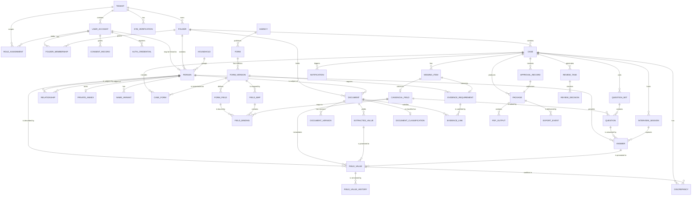
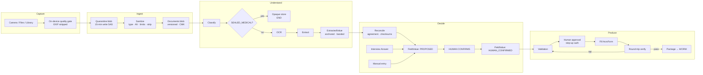

# 05 — Data Architecture

**Owner:** Principal Data Architect · **Accountable:** Chief Data Officer · **Contributors:**
Privacy Officer, Principal Security Architect, Lead Backend Architect · **Status:** For ARB approval

---

## 5.1 Principles

| # | Principle | Consequence |
|---|---|---|
| **DP-1** | **One system of record.** Every value that can reach a government form lives in Azure SQL and nowhere else authoritatively. | Cosmos, Redis, and search indexes are derived and disposable |
| **DP-2** | **Minimize by construction.** If no selected form requires a datum, there is no column for it. | No inferred profiles, no risk scores, no "status" field, no geolocation |
| **DP-3** | **Every value carries provenance.** Value, source, and confidence are inseparable. | A value without provenance is a defect, not a value |
| **DP-4** | **Data belongs to a `Person`, never to a folder.** | Household trust boundaries are expressible ([C-05](00-design-authority-record.md#c-05--a-household-folder-is-not-a-single-trust-boundary)) |
| **DP-5** | **Tenant isolation is enforced at the data layer.** | RLS predicates, not application `WHERE` clauses |
| **DP-6** | **Documents are immutable.** | Corrections create versions; nothing is ever overwritten |
| **DP-7** | **Audit records contain identifiers and hashes, never content.** | 7-year audit retention does not defeat erasure rights |
| **DP-8** | **Deletion must be provable.** | Per-tenant keys enable crypto-shred where row deletion cannot reach (backups, replicas) |

---

## 5.2 Canonical data model



### Core entity definitions

| Entity | Definition | Notes |
|---|---|---|
| **Tenant** | An organization or an individual consumer account boundary | Consumer users are in a synthetic per-user tenant so the isolation model is uniform |
| **UserAccount** | An authenticating principal | Credentials live in Entra, never here |
| **Role / RoleAssignment** | Named capability set, scoped to tenant, folder, or person | Scope is part of the assignment, not the role |
| **Folder** | The Virtual Applicant Folder — a container for people, documents, and cases | Holds no personal data itself |
| **Person** | A human the case is about | **The unit of privacy.** All personal data hangs off Person |
| **Household** | A grouping of Persons for a shared living situation | Distinct from Folder; a folder may span households |
| **Relationship** | A typed, directed edge between two Persons | `SPOUSE_OF`, `PARENT_OF`, `PETITIONER_FOR`, … |
| **PrivateAnnex** | Per-person storage the folder owner cannot enumerate | The technical implementation of [C-05](00-design-authority-record.md#c-05--a-household-folder-is-not-a-single-trust-boundary) |
| **Case** | One folder + one form package + one pinned edition set | Has a state machine |
| **Agency** | The publishing authority | USCIS, DOS, DOL, SSA, state agencies |
| **Form** | A form identity (e.g. "I-130") | Stable across editions |
| **FormVersion** | A specific edition of a form | The unit of pinning and drift detection |
| **FormField** | A field on a specific FormVersion, with the PDF field name | Edition-specific |
| **CanonicalField** | A logical field in our domain (e.g. `person.birth.date`) | Edition-independent; the thing a value is *of* |
| **FieldMap / FieldBinding** | The mapping from CanonicalField to FormField | Versioned, two-person-reviewed |
| **QuestionSet / Question / Answer** | Generated interview structure and responses | Answers attributed to the human who gave them |
| **Document / DocumentVersion** | An uploaded artifact and its immutable versions | Bytes in Blob; metadata here |
| **ExtractedValue** | A candidate value produced from a document | Always carries an anchor |
| **FieldValue** | The current authoritative value for a CanonicalField for a Person in a Case | **The only thing a PDF may read** |
| **Discrepancy** | A recorded conflict awaiting a human decision | Never auto-resolved |
| **MissingItem** | An actionable gap | Assigned to exactly one Person |
| **ReviewTask / ReviewDecision** | Human work and its outcome | Audit evidence |
| **ApprovalRecord** | The human authorization to generate | Requires step-up auth |
| **Package / PdfOutput** | The generated artifacts | Immutable, WORM |
| **Notification** | A delivery record | Content-free |
| **AuditLog** | The tamper-evident record | Identifiers and hashes only |
| **ConsentRecord** | A granular, versioned consent event | 7-year retention |

---

## 5.3 Relational model — Azure SQL

Full DDL for the security- and correctness-critical tables. Conventions: `uniqueidentifier` PKs
(sequential GUIDs for index locality), `datetime2(3)` UTC, RLS on every tenant-scoped table,
temporal tables where history matters, `ROWVERSION` for optimistic concurrency.

### Tenancy and identity

```sql
CREATE TABLE dbo.Tenant (
    TenantId            UNIQUEIDENTIFIER  NOT NULL CONSTRAINT PK_Tenant PRIMARY KEY
                        CONSTRAINT DF_Tenant_Id DEFAULT NEWSEQUENTIALID(),
    TenantType          VARCHAR(20)       NOT NULL,  -- CONSUMER | ORGANIZATION
    LegalName           NVARCHAR(300)     NULL,
    DisplayName         NVARCHAR(200)     NOT NULL,
    HomeGeo             CHAR(2)           NOT NULL,  -- US | EU  (default plane for new cases)
    -- NOTE: residency is ultimately a property of the DATA SUBJECT, not the tenant. A US
    -- organizational tenant preparing a case for an EU-resident beneficiary must not place that
    -- person's data in the US plane. Case-level residency is resolved per Person at case
    -- creation; a case that would span planes is refused, not silently split. (SME M-02)
    -- KYB / legal-provider verification (C-10)
    ProviderClaim       VARCHAR(30)       NOT NULL CONSTRAINT DF_Tenant_PC DEFAULT 'NONE',
                        -- NONE | LAW_FIRM | EOIR_RECOGNIZED | SELF_HELP
    VerificationStatus  VARCHAR(20)       NOT NULL CONSTRAINT DF_Tenant_VS DEFAULT 'UNVERIFIED',
                        -- UNVERIFIED | PENDING | VERIFIED | REVOKED
    VerifiedAtUtc       DATETIME2(3)      NULL,
    VerificationExpiry  DATETIME2(3)      NULL,
    -- Per-tenant key material (crypto-shred capability)
    CmkKeyUri           NVARCHAR(500)     NULL,
    DekWrapped          VARBINARY(512)    NULL,
    Status              VARCHAR(20)       NOT NULL CONSTRAINT DF_Tenant_St DEFAULT 'ACTIVE',
    CreatedAtUtc        DATETIME2(3)      NOT NULL CONSTRAINT DF_Tenant_CA DEFAULT SYSUTCDATETIME(),
    RowVer              ROWVERSION,
    CONSTRAINT CK_Tenant_Type    CHECK (TenantType IN ('CONSUMER','ORGANIZATION')),
    CONSTRAINT CK_Tenant_Geo     CHECK (HomeGeo IN ('US','EU')),
    CONSTRAINT CK_Tenant_Verif   CHECK (VerificationStatus IN ('UNVERIFIED','PENDING','VERIFIED','REVOKED')),
    -- A tenant claiming to provide legal services MUST be verified before it can operate
    CONSTRAINT CK_Tenant_ProviderVerified CHECK (
        ProviderClaim = 'NONE' OR VerificationStatus IN ('PENDING','VERIFIED','REVOKED'))
);

CREATE TABLE dbo.UserAccount (
    UserId              UNIQUEIDENTIFIER  NOT NULL CONSTRAINT PK_UserAccount PRIMARY KEY
                        CONSTRAINT DF_User_Id DEFAULT NEWSEQUENTIALID(),
    TenantId            UNIQUEIDENTIFIER  NOT NULL CONSTRAINT FK_User_Tenant REFERENCES dbo.Tenant(TenantId),
    ExternalSubjectId   NVARCHAR(200)     NOT NULL,   -- Entra 'oid'; no credentials stored here
    EmailHash           BINARY(32)        NOT NULL,   -- lookup without storing plaintext
    EmailEncrypted      VARBINARY(512)    NOT NULL,   -- Always Encrypted (deterministic off)
    DisplayName         NVARCHAR(200)     NULL,
    PreferredLanguage   VARCHAR(10)       NOT NULL CONSTRAINT DF_User_Lang DEFAULT 'en-US',
    ReadingLevelProfile VARCHAR(20)       NOT NULL CONSTRAINT DF_User_RLP  DEFAULT 'STANDARD',
                        -- STANDARD | PLAIN_LANGUAGE
    AccessibilityProfile NVARCHAR(MAX)    NULL,       -- JSON: voiceFirst, largeText, reduceMotion…
    AuthAssurance       VARCHAR(20)       NOT NULL CONSTRAINT DF_User_AA DEFAULT 'PASSKEY',
                        -- PASSKEY | OTP_TOTP | AUTH_DOWNGRADED
    Status              VARCHAR(20)       NOT NULL CONSTRAINT DF_User_St DEFAULT 'ACTIVE',
    CreatedAtUtc        DATETIME2(3)      NOT NULL CONSTRAINT DF_User_CA DEFAULT SYSUTCDATETIME(),
    LastSeenAtUtc       DATETIME2(3)      NULL,
    RowVer              ROWVERSION,
    CONSTRAINT UQ_User_External UNIQUE (ExternalSubjectId),
    INDEX IX_User_Tenant NONCLUSTERED (TenantId, Status),
    INDEX IX_User_EmailHash NONCLUSTERED (EmailHash)
);
```

### Folder, person, and the household trust boundary

```sql
CREATE TABLE dbo.Folder (
    FolderId        UNIQUEIDENTIFIER NOT NULL CONSTRAINT PK_Folder PRIMARY KEY
                    CONSTRAINT DF_Folder_Id DEFAULT NEWSEQUENTIALID(),
    TenantId        UNIQUEIDENTIFIER NOT NULL CONSTRAINT FK_Folder_Tenant REFERENCES dbo.Tenant(TenantId),
    Name            NVARCHAR(200)    NOT NULL,
    OwnerUserId     UNIQUEIDENTIFIER NOT NULL CONSTRAINT FK_Folder_Owner REFERENCES dbo.UserAccount(UserId),
    Status          VARCHAR(20)      NOT NULL CONSTRAINT DF_Folder_St DEFAULT 'ACTIVE',
    RetentionPolicyId UNIQUEIDENTIFIER NULL,
    CreatedAtUtc    DATETIME2(3)     NOT NULL CONSTRAINT DF_Folder_CA DEFAULT SYSUTCDATETIME(),
    ClosedAtUtc     DATETIME2(3)     NULL,
    RowVer          ROWVERSION,
    INDEX IX_Folder_Tenant NONCLUSTERED (TenantId, Status)
);

CREATE TABLE dbo.Person (
    PersonId        UNIQUEIDENTIFIER NOT NULL CONSTRAINT PK_Person PRIMARY KEY
                    CONSTRAINT DF_Person_Id DEFAULT NEWSEQUENTIALID(),
    TenantId        UNIQUEIDENTIFIER NOT NULL CONSTRAINT FK_Person_Tenant REFERENCES dbo.Tenant(TenantId),
    FolderId        UNIQUEIDENTIFIER NOT NULL CONSTRAINT FK_Person_Folder REFERENCES dbo.Folder(FolderId),
    HouseholdId     UNIQUEIDENTIFIER NULL,
    -- A Person MAY be linked to a UserAccount (they hold their own credential)
    LinkedUserId    UNIQUEIDENTIFIER NULL CONSTRAINT FK_Person_User REFERENCES dbo.UserAccount(UserId),
    IsMinor         BIT              NOT NULL CONSTRAINT DF_Person_Minor DEFAULT 0,
    -- Participation state supports Quiet Exit without revealing why (C-05)
    ParticipationState VARCHAR(20)   NOT NULL CONSTRAINT DF_Person_PS DEFAULT 'ACTIVE',
                       -- ACTIVE | INVITED | INACTIVE
    -- A user-chosen label for navigation ONLY. It is NOT the person's name and is never
    -- written to a form. The authoritative name is a FieldValue with provenance, like every
    -- other attribute. Rev A stored a name here, outside the provenance model. (SME M-01)
    DisplayLabel    NVARCHAR(200)    NOT NULL,
    DisplayLabelIsUserProvided BIT   NOT NULL CONSTRAINT DF_Person_DLU DEFAULT 1,
    CreatedAtUtc    DATETIME2(3)     NOT NULL CONSTRAINT DF_Person_CA DEFAULT SYSUTCDATETIME(),
    RowVer          ROWVERSION,
    CONSTRAINT CK_Person_PS CHECK (ParticipationState IN ('ACTIVE','INVITED','INACTIVE')),
    -- A minor may never hold their own credential
    CONSTRAINT CK_Person_MinorNoLogin CHECK (IsMinor = 0 OR LinkedUserId IS NULL),
    INDEX IX_Person_Folder NONCLUSTERED (FolderId, ParticipationState)
);

CREATE TABLE dbo.Relationship (
    RelationshipId  UNIQUEIDENTIFIER NOT NULL CONSTRAINT PK_Relationship PRIMARY KEY
                    CONSTRAINT DF_Rel_Id DEFAULT NEWSEQUENTIALID(),
    TenantId        UNIQUEIDENTIFIER NOT NULL,
    SubjectPersonId UNIQUEIDENTIFIER NOT NULL CONSTRAINT FK_Rel_Subject REFERENCES dbo.Person(PersonId),
    ObjectPersonId  UNIQUEIDENTIFIER NOT NULL CONSTRAINT FK_Rel_Object  REFERENCES dbo.Person(PersonId),
    RelationType    VARCHAR(30)      NOT NULL,
      -- SPOUSE_OF | PARENT_OF | CHILD_OF | SIBLING_OF | GUARDIAN_OF
      -- PETITIONER_FOR | BENEFICIARY_OF | SPONSOR_FOR | DERIVATIVE_OF
    EffectiveFrom   DATE             NULL,
    EffectiveTo     DATE             NULL,
    CreatedAtUtc    DATETIME2(3)     NOT NULL CONSTRAINT DF_Rel_CA DEFAULT SYSUTCDATETIME(),
    CONSTRAINT CK_Rel_NotSelf CHECK (SubjectPersonId <> ObjectPersonId),
    CONSTRAINT UQ_Rel UNIQUE (SubjectPersonId, ObjectPersonId, RelationType, EffectiveFrom)
);

-- Per-person, per-section access. This is what makes a household not one trust boundary.
CREATE TABLE dbo.FolderMembership (
    MembershipId    UNIQUEIDENTIFIER NOT NULL CONSTRAINT PK_FolderMembership PRIMARY KEY
                    CONSTRAINT DF_FM_Id DEFAULT NEWSEQUENTIALID(),
    TenantId        UNIQUEIDENTIFIER NOT NULL,
    FolderId        UNIQUEIDENTIFIER NOT NULL CONSTRAINT FK_FM_Folder REFERENCES dbo.Folder(FolderId),
    UserId          UNIQUEIDENTIFIER NOT NULL CONSTRAINT FK_FM_User   REFERENCES dbo.UserAccount(UserId),
    MemberRole      VARCHAR(30)      NOT NULL,  -- OWNER | PARTICIPANT | HELPER | REVIEWER | ATTORNEY | READONLY
    -- Explicit scope: which persons and which sections
    ScopedPersonIds NVARCHAR(MAX)    NULL,      -- JSON array; NULL = all persons in folder
    ScopedSections  NVARCHAR(MAX)    NULL,      -- JSON array; NULL = all sections
    CanAnswerOnBehalf BIT            NOT NULL CONSTRAINT DF_FM_COB DEFAULT 0,
    GrantedByUserId UNIQUEIDENTIFIER NOT NULL,
    GrantedAtUtc    DATETIME2(3)     NOT NULL CONSTRAINT DF_FM_GA DEFAULT SYSUTCDATETIME(),
    RevokedAtUtc    DATETIME2(3)     NULL,
    CONSTRAINT CK_FM_Role CHECK (MemberRole IN ('OWNER','PARTICIPANT','HELPER','REVIEWER','ATTORNEY','READONLY')),
    INDEX IX_FM_User NONCLUSTERED (UserId, RevokedAtUtc) INCLUDE (FolderId, MemberRole)
);

-- The Private Annex: content the folder owner cannot enumerate.
-- Stored in a separate table with its own RLS predicate so that the *existence* of a row
-- is invisible, not merely its contents.
CREATE TABLE dbo.PrivateAnnexItem (
    AnnexItemId     UNIQUEIDENTIFIER NOT NULL CONSTRAINT PK_PrivateAnnexItem PRIMARY KEY
                    CONSTRAINT DF_PA_Id DEFAULT NEWSEQUENTIALID(),
    TenantId        UNIQUEIDENTIFIER NOT NULL,
    PersonId        UNIQUEIDENTIFIER NOT NULL CONSTRAINT FK_PA_Person REFERENCES dbo.Person(PersonId),
    OwnerUserId     UNIQUEIDENTIFIER NOT NULL,   -- ONLY this user may ever see this row
    ItemType        VARCHAR(30)      NOT NULL,   -- DOCUMENT | ANSWER | NOTE
    ItemRefId       UNIQUEIDENTIFIER NOT NULL,
    CreatedAtUtc    DATETIME2(3)     NOT NULL CONSTRAINT DF_PA_CA DEFAULT SYSUTCDATETIME(),
    INDEX IX_PA_Owner NONCLUSTERED (OwnerUserId, PersonId)
);
```

### Form catalog and edition control

```sql
CREATE TABLE dbo.Agency (
    AgencyId        UNIQUEIDENTIFIER NOT NULL CONSTRAINT PK_Agency PRIMARY KEY,
    Code            VARCHAR(20)      NOT NULL CONSTRAINT UQ_Agency_Code UNIQUE, -- USCIS, DOS, DOL, SSA
    Name            NVARCHAR(200)    NOT NULL,
    Jurisdiction    VARCHAR(10)      NOT NULL,
    PublicationsUrl NVARCHAR(500)    NOT NULL
);

CREATE TABLE dbo.Form (
    FormId          UNIQUEIDENTIFIER NOT NULL CONSTRAINT PK_Form PRIMARY KEY,
    AgencyId        UNIQUEIDENTIFIER NOT NULL CONSTRAINT FK_Form_Agency REFERENCES dbo.Agency(AgencyId),
    FormNumber      VARCHAR(30)      NOT NULL,   -- 'I-130'
    Title           NVARCHAR(400)    NOT NULL,
    CategoryLabel   NVARCHAR(200)    NULL,       -- the AGENCY's own label; never ours
    CONSTRAINT UQ_Form UNIQUE (AgencyId, FormNumber)
);

-- The unit of pinning and of drift detection (ADR-003)
CREATE TABLE dbo.FormVersion (
    FormVersionId   UNIQUEIDENTIFIER NOT NULL CONSTRAINT PK_FormVersion PRIMARY KEY,
    FormId          UNIQUEIDENTIFIER NOT NULL CONSTRAINT FK_FV_Form REFERENCES dbo.Form(FormId),
    EditionDate     DATE             NOT NULL,   -- the agency's printed edition date
    SourceUrl       NVARCHAR(1000)   NOT NULL,
    SourceSha256    BINARY(32)       NOT NULL,   -- hash of the agency's published PDF
    Encoding        VARCHAR(20)      NOT NULL,   -- ACROFORM | XFA | FLAT
    PageCount       INT              NOT NULL,
    FeeUsdCents     INT              NULL,
    FeeCitationUrl  NVARCHAR(1000)   NULL,
    FieldMapVersion INT              NULL,       -- NULL until a map is approved
    Status          VARCHAR(20)      NOT NULL,   -- DRAFT | CURRENT | SUPERSEDED | WITHDRAWN
    FirstSeenAtUtc  DATETIME2(3)     NOT NULL,
    LastVerifiedUtc DATETIME2(3)     NOT NULL,
    SupersededAtUtc DATETIME2(3)     NULL,
    CONSTRAINT UQ_FV UNIQUE (FormId, EditionDate),
    CONSTRAINT CK_FV_Enc    CHECK (Encoding IN ('ACROFORM','XFA','FLAT')),
    CONSTRAINT CK_FV_Status CHECK (Status IN ('DRAFT','CURRENT','SUPERSEDED','WITHDRAWN')),
    -- Only ACROFORM forms may be marked CURRENT for automated fill in MVP
    CONSTRAINT CK_FV_AcroOnly CHECK (Status <> 'CURRENT' OR Encoding = 'ACROFORM' OR FieldMapVersion IS NULL)
);
CREATE UNIQUE INDEX UX_FV_OneCurrent ON dbo.FormVersion(FormId) WHERE Status = 'CURRENT';

CREATE TABLE dbo.FormField (
    FormFieldId     UNIQUEIDENTIFIER NOT NULL CONSTRAINT PK_FormField PRIMARY KEY,
    FormVersionId   UNIQUEIDENTIFIER NOT NULL CONSTRAINT FK_FF_FV REFERENCES dbo.FormVersion(FormVersionId),
    PdfFieldName    NVARCHAR(300)    NOT NULL,   -- exact AcroForm field name
    PartLabel       NVARCHAR(200)    NULL,       -- 'Part 3, Item 12.a'
    DisplayLabel    NVARCHAR(500)    NOT NULL,   -- the AUTHORITATIVE English label
    DataType        VARCHAR(20)      NOT NULL,   -- TEXT|DATE|NUMBER|CHECKBOX|RADIO|SIGNATURE
    MaxLength       INT              NULL,
    FormatMask      NVARCHAR(100)    NULL,       -- 'MM/DD/YYYY'
    IsRequired      BIT              NOT NULL,
    ConditionExpr   NVARCHAR(1000)   NULL,       -- derived from agency instructions
    ConditionCitationId UNIQUEIDENTIFIER NULL,
    CONSTRAINT UQ_FF UNIQUE (FormVersionId, PdfFieldName)
);

-- Edition-independent logical fields. FieldValues are of these, not of FormFields.
CREATE TABLE dbo.CanonicalField (
    CanonicalFieldId UNIQUEIDENTIFIER NOT NULL CONSTRAINT PK_CanonicalField PRIMARY KEY,
    Path             VARCHAR(200)     NOT NULL CONSTRAINT UQ_CF_Path UNIQUE, -- 'person.birth.date'
    DataType         VARCHAR(20)      NOT NULL,
    Sensitivity      VARCHAR(20)      NOT NULL,  -- NORMAL | HIGH | CRITICAL
    Description      NVARCHAR(500)    NOT NULL,
    IsPersonScoped   BIT              NOT NULL CONSTRAINT DF_CF_PS DEFAULT 1,
    CONSTRAINT CK_CF_Sens CHECK (Sensitivity IN ('NORMAL','HIGH','CRITICAL'))
);

CREATE TABLE dbo.FieldBinding (
    FieldBindingId  UNIQUEIDENTIFIER NOT NULL CONSTRAINT PK_FieldBinding PRIMARY KEY,
    FormVersionId   UNIQUEIDENTIFIER NOT NULL CONSTRAINT FK_FB_FV REFERENCES dbo.FormVersion(FormVersionId),
    FormFieldId     UNIQUEIDENTIFIER NOT NULL CONSTRAINT FK_FB_FF REFERENCES dbo.FormField(FormFieldId),
    CanonicalFieldId UNIQUEIDENTIFIER NOT NULL CONSTRAINT FK_FB_CF REFERENCES dbo.CanonicalField(CanonicalFieldId),
    PersonRole      VARCHAR(30)      NOT NULL,   -- which person in the case this field is about
    TransformExpr   NVARCHAR(1000)   NULL,       -- format, polarity, name-part ordering
    MapVersion      INT              NOT NULL,
    -- Two-person approval (Agent 08 security control)
    ApprovedByUserId1 UNIQUEIDENTIFIER NOT NULL,
    ApprovedByUserId2 UNIQUEIDENTIFIER NOT NULL,
    ApprovedAtUtc   DATETIME2(3)     NOT NULL,
    CONSTRAINT UQ_FB UNIQUE (FormVersionId, FormFieldId, MapVersion),
    CONSTRAINT CK_FB_TwoPerson CHECK (ApprovedByUserId1 <> ApprovedByUserId2)
);

CREATE TABLE dbo.EvidenceRequirement (
    EvidenceReqId   UNIQUEIDENTIFIER NOT NULL CONSTRAINT PK_EvidenceRequirement PRIMARY KEY,
    FormVersionId   UNIQUEIDENTIFIER NOT NULL CONSTRAINT FK_ER_FV REFERENCES dbo.FormVersion(FormVersionId),
    Code            VARCHAR(50)      NOT NULL,
    Description     NVARCHAR(1000)   NOT NULL,
    PersonRole      VARCHAR(30)      NOT NULL,
    IsConditional   BIT              NOT NULL,
    ConditionText   NVARCHAR(1000)   NULL,       -- the AGENCY's own conditional language, verbatim
    -- AP-5: no requirement exists without a citation
    CitationId      UNIQUEIDENTIFIER NOT NULL CONSTRAINT FK_ER_Cite REFERENCES dbo.Citation(CitationId),
    CONSTRAINT UQ_ER UNIQUE (FormVersionId, Code, PersonRole)
);

CREATE TABLE dbo.Citation (
    CitationId      UNIQUEIDENTIFIER NOT NULL CONSTRAINT PK_Citation PRIMARY KEY,
    SourceUrl       NVARCHAR(1000)   NOT NULL,
    DocumentTitle   NVARCHAR(400)    NOT NULL,
    SectionRef      NVARCHAR(200)    NULL,
    RevisionDate    DATE             NULL,
    QuotedText      NVARCHAR(2000)   NULL,
    RetrievedAtUtc  DATETIME2(3)     NOT NULL,
    ContentSha256   BINARY(32)       NOT NULL
);
```

### Case, documents, and the extraction ledger

```sql
CREATE TABLE dbo.[Case] (
    CaseId          UNIQUEIDENTIFIER NOT NULL CONSTRAINT PK_Case PRIMARY KEY
                    CONSTRAINT DF_Case_Id DEFAULT NEWSEQUENTIALID(),
    TenantId        UNIQUEIDENTIFIER NOT NULL,
    FolderId        UNIQUEIDENTIFIER NOT NULL CONSTRAINT FK_Case_Folder REFERENCES dbo.Folder(FolderId),
    PackageCode     VARCHAR(50)      NOT NULL,   -- 'FAMILY_I130_I485'
    -- Resolved from the residency of every Person in the case, not inherited from the tenant
    DataPlane       CHAR(2)          NOT NULL,   -- US | EU  (SME M-02)
    State           VARCHAR(30)      NOT NULL CONSTRAINT DF_Case_State DEFAULT 'DRAFT',
    -- The human who selected the package, and their attestation (C-01)
    SelectedByUserId UNIQUEIDENTIFIER NOT NULL,
    SelectionAttestedAtUtc DATETIME2(3) NOT NULL,
    AiCostUsdCents  INT              NOT NULL CONSTRAINT DF_Case_Cost DEFAULT 0,
    VoiceSecondsUsed INT             NOT NULL CONSTRAINT DF_Case_VS DEFAULT 0,
    CreatedAtUtc    DATETIME2(3)     NOT NULL CONSTRAINT DF_Case_CA DEFAULT SYSUTCDATETIME(),
    ClosedAtUtc     DATETIME2(3)     NULL,
    RowVer          ROWVERSION,
    CONSTRAINT CK_Case_State CHECK (State IN (
        'DRAFT','COLLECTING','INTERVIEWING','VALIDATING','IN_REVIEW','APPROVED',
        'GENERATED','DELIVERED','CLOSED','QUARANTINED_FORM_DRIFT','ON_HOLD','ABANDONED')),
    INDEX IX_Case_Folder NONCLUSTERED (FolderId, State)
);

-- Pins the exact edition this case is being prepared against
CREATE TABLE dbo.CaseForm (
    CaseFormId      UNIQUEIDENTIFIER NOT NULL CONSTRAINT PK_CaseForm PRIMARY KEY,
    TenantId        UNIQUEIDENTIFIER NOT NULL,
    CaseId          UNIQUEIDENTIFIER NOT NULL CONSTRAINT FK_CF_Case REFERENCES dbo.[Case](CaseId),
    FormVersionId   UNIQUEIDENTIFIER NOT NULL CONSTRAINT FK_CF_FV REFERENCES dbo.FormVersion(FormVersionId),
    PinnedAtUtc     DATETIME2(3)     NOT NULL,
    SortOrder       INT              NOT NULL,   -- the agency's stated filing order
    DriftDetected   BIT              NOT NULL CONSTRAINT DF_CF_Drift DEFAULT 0,
    CONSTRAINT UQ_CF UNIQUE (CaseId, FormVersionId)
);

CREATE TABLE dbo.Document (
    DocumentId      UNIQUEIDENTIFIER NOT NULL CONSTRAINT PK_Document PRIMARY KEY
                    CONSTRAINT DF_Doc_Id DEFAULT NEWSEQUENTIALID(),
    TenantId        UNIQUEIDENTIFIER NOT NULL,
    FolderId        UNIQUEIDENTIFIER NOT NULL CONSTRAINT FK_Doc_Folder REFERENCES dbo.Folder(FolderId),
    SubjectPersonId UNIQUEIDENTIFIER NULL CONSTRAINT FK_Doc_Person REFERENCES dbo.Person(PersonId),
    -- Private annex documents are not visible to the folder owner (C-05)
    IsPrivateAnnex  BIT              NOT NULL CONSTRAINT DF_Doc_PA DEFAULT 0,
    OriginalName    NVARCHAR(400)    NOT NULL,
    MimeTypeVerified VARCHAR(100)    NOT NULL,   -- from magic bytes, never the client claim
    SizeBytes       BIGINT           NOT NULL,
    Sha256          BINARY(32)       NOT NULL,
    DocumentClass   VARCHAR(50)      NULL,
    DocumentSubtype VARCHAR(50)      NULL,
    ClassConfidence DECIMAL(5,4)     NULL,
    ClassOverriddenByUserId UNIQUEIDENTIFIER NULL,  -- human override is authoritative
    DetectedLanguage VARCHAR(10)     NULL,
    DetectedScript  VARCHAR(20)      NULL,
    ProcessingState VARCHAR(30)      NOT NULL CONSTRAINT DF_Doc_PS DEFAULT 'UPLOADED',
    -- C-06: sealed medical documents never enter any content pipeline
    IsOpaque        BIT              NOT NULL CONSTRAINT DF_Doc_Opaque DEFAULT 0,
    SourceChannel   VARCHAR(20)      NOT NULL,   -- CAMERA|LIBRARY|FILES|SHARE|EMAIL
    CaptureQualityOverridden BIT     NOT NULL CONSTRAINT DF_Doc_CQO DEFAULT 0,
    BlobUri         NVARCHAR(1000)   NOT NULL,
    UploadedByUserId UNIQUEIDENTIFIER NOT NULL,
    UploadedAtUtc   DATETIME2(3)     NOT NULL CONSTRAINT DF_Doc_UA DEFAULT SYSUTCDATETIME(),
    DeletedAtUtc    DATETIME2(3)     NULL,
    RowVer          ROWVERSION,
    CONSTRAINT CK_Doc_PS CHECK (ProcessingState IN (
        'UPLOADED','SCANNING','QUARANTINED','SANITIZED','CLASSIFYING','NEEDS_CLASSIFICATION',
        'EXTRACTING','EXTRACTED','EXTRACTION_FAILED','OPAQUE_STORED','DELETED')),
    -- An opaque document may never reach an extraction state
    CONSTRAINT CK_Doc_OpaqueNoExtract CHECK (
        IsOpaque = 0 OR ProcessingState IN ('UPLOADED','SCANNING','SANITIZED','OPAQUE_STORED','DELETED')),
    INDEX IX_Doc_Folder NONCLUSTERED (FolderId, ProcessingState) WHERE DeletedAtUtc IS NULL,
    INDEX IX_Doc_Hash NONCLUSTERED (TenantId, Sha256)
);

-- Candidate values produced by extraction. Always anchored. (DP-3)
CREATE TABLE dbo.ExtractedValue (
    ExtractedValueId UNIQUEIDENTIFIER NOT NULL CONSTRAINT PK_ExtractedValue PRIMARY KEY
                     CONSTRAINT DF_EV_Id DEFAULT NEWSEQUENTIALID(),
    TenantId        UNIQUEIDENTIFIER NOT NULL,
    DocumentId      UNIQUEIDENTIFIER NOT NULL CONSTRAINT FK_EV_Doc REFERENCES dbo.Document(DocumentId),
    CanonicalFieldId UNIQUEIDENTIFIER NOT NULL CONSTRAINT FK_EV_CF REFERENCES dbo.CanonicalField(CanonicalFieldId),
    SubjectPersonId UNIQUEIDENTIFIER NULL CONSTRAINT FK_EV_Person REFERENCES dbo.Person(PersonId),
    RawText         NVARCHAR(2000)   NULL,
    NormalizedValue NVARCHAR(2000)   NULL,
    ValueEncrypted  VARBINARY(2000)  NULL,       -- Always Encrypted for CRITICAL fields
    -- Provenance (DP-3) — all NOT NULL for a reason
    PageNumber      INT              NOT NULL,
    BoundingPolygon NVARCHAR(200)    NOT NULL,   -- JSON [[x,y],...]
    Engine          VARCHAR(50)      NOT NULL,
    EngineVersion   VARCHAR(50)      NOT NULL,
    RawConfidence   DECIMAL(5,4)     NOT NULL,
    ConfidenceBand  VARCHAR(20)      NOT NULL,   -- VERIFIED | EXTRACTED | NEEDS_REVIEW
    ChecksumValid   BIT              NULL,       -- MRZ, A-Number etc.; NULL = not applicable
    NormalizationNote NVARCHAR(500)  NULL,       -- e.g. 'date ambiguous DD/MM vs MM/DD'
    IsModelGenerated BIT             NOT NULL,   -- C-14: model-generated => always NEEDS_REVIEW
    ExtractedAtUtc  DATETIME2(3)     NOT NULL CONSTRAINT DF_EV_EA DEFAULT SYSUTCDATETIME(),
    CONSTRAINT CK_EV_Band CHECK (ConfidenceBand IN ('VERIFIED','EXTRACTED','NEEDS_REVIEW')),
    -- C-14 enforced in the schema, not in application code
    CONSTRAINT CK_EV_ModelNeedsReview CHECK (IsModelGenerated = 0 OR ConfidenceBand = 'NEEDS_REVIEW'),
    -- A failed checksum can never be VERIFIED
    CONSTRAINT CK_EV_ChecksumBand CHECK (ChecksumValid IS NULL OR ChecksumValid = 1 OR ConfidenceBand = 'NEEDS_REVIEW'),
    INDEX IX_EV_Field NONCLUSTERED (SubjectPersonId, CanonicalFieldId)
);

-- Candidate values awaiting a human decision. Zero-or-many per field.
-- Separated from FieldValue so that a NEW proposal can coexist with an ALREADY-CONFIRMED
-- value — which is what makes "never silently overwrite a human" implementable. (SME B-02)
CREATE TABLE dbo.ValueProposal (
    ProposalId      UNIQUEIDENTIFIER NOT NULL CONSTRAINT PK_ValueProposal PRIMARY KEY
                    CONSTRAINT DF_VP_Id DEFAULT NEWSEQUENTIALID(),
    TenantId        UNIQUEIDENTIFIER NOT NULL,
    CaseId          UNIQUEIDENTIFIER NOT NULL CONSTRAINT FK_VP_Case REFERENCES dbo.[Case](CaseId),
    SubjectPersonId UNIQUEIDENTIFIER NOT NULL CONSTRAINT FK_VP_Person REFERENCES dbo.Person(PersonId),
    CanonicalFieldId UNIQUEIDENTIFIER NOT NULL CONSTRAINT FK_VP_CF REFERENCES dbo.CanonicalField(CanonicalFieldId),
    ProposedValue   NVARCHAR(2000)   NULL,
    ValueEncrypted  VARBINARY(2000)  NULL,
    ConfidenceBand  VARCHAR(20)      NOT NULL,
    OriginType      VARCHAR(20)      NOT NULL,  -- EXTRACTION | INTERVIEW | DERIVED
    OriginRefId     UNIQUEIDENTIFIER NULL,      -- ExtractedValueId | AnswerId
    Disposition     VARCHAR(20)      NOT NULL CONSTRAINT DF_VP_Disp DEFAULT 'OPEN',
                    -- OPEN | ACCEPTED | REJECTED | SUPERSEDED
    DecidedByUserId UNIQUEIDENTIFIER NULL,
    DecidedAtUtc    DATETIME2(3)     NULL,
    CreatedAtUtc    DATETIME2(3)     NOT NULL CONSTRAINT DF_VP_CA DEFAULT SYSUTCDATETIME(),
    CONSTRAINT CK_VP_Disp CHECK (Disposition IN ('OPEN','ACCEPTED','REJECTED','SUPERSEDED')),
    CONSTRAINT CK_VP_Origin CHECK (OriginType IN ('EXTRACTION','INTERVIEW','DERIVED')),
    -- A decided proposal must name the human who decided it
    CONSTRAINT CK_VP_DecidedByHuman CHECK (
        Disposition = 'OPEN' OR Disposition = 'SUPERSEDED'
        OR (DecidedByUserId IS NOT NULL AND DecidedAtUtc IS NOT NULL)),
    INDEX IX_VP_Open NONCLUSTERED (CaseId, SubjectPersonId, CanonicalFieldId)
        WHERE Disposition = 'OPEN'
);

-- THE authoritative value. The ONLY thing a PDF may read. (DP-1)
-- Written ONLY by a human accepting a proposal or entering a value directly.
CREATE TABLE dbo.FieldValue (
    FieldValueId    UNIQUEIDENTIFIER NOT NULL CONSTRAINT PK_FieldValue PRIMARY KEY
                    CONSTRAINT DF_FVAL_Id DEFAULT NEWSEQUENTIALID(),
    TenantId        UNIQUEIDENTIFIER NOT NULL,
    CaseId          UNIQUEIDENTIFIER NOT NULL CONSTRAINT FK_FVAL_Case REFERENCES dbo.[Case](CaseId),
    SubjectPersonId UNIQUEIDENTIFIER NOT NULL CONSTRAINT FK_FVAL_Person REFERENCES dbo.Person(PersonId),
    CanonicalFieldId UNIQUEIDENTIFIER NOT NULL CONSTRAINT FK_FVAL_CF REFERENCES dbo.CanonicalField(CanonicalFieldId),
    NormalizedValue NVARCHAR(2000)   NULL,
    ValueEncrypted  VARBINARY(2000)  NULL,
    ConfidenceBand  VARCHAR(20)      NOT NULL,
    -- Origin: which proposal was accepted, or MANUAL for direct human entry
    OriginType      VARCHAR(20)      NOT NULL,  -- EXTRACTION | INTERVIEW | MANUAL | DERIVED
    AcceptedProposalId UNIQUEIDENTIFIER NULL CONSTRAINT FK_FVAL_Proposal
                       REFERENCES dbo.ValueProposal(ProposalId),
    -- Human attribution (US-02.08: who actually gave this answer). NOT NULL by design:
    -- a row can only exist because a human put it there. (AI-1 / US-06.03)
    ConfirmedByUserId UNIQUEIDENTIFIER NOT NULL CONSTRAINT FK_FVAL_User
                      REFERENCES dbo.UserAccount(UserId),
    ConfirmedOnBehalfOfPersonId UNIQUEIDENTIFIER NULL,
    ConfirmedAtUtc  DATETIME2(3)     NOT NULL,
    CreatedAtUtc    DATETIME2(3)     NOT NULL CONSTRAINT DF_FVAL_CA DEFAULT SYSUTCDATETIME(),
    RowVer          ROWVERSION,
    CONSTRAINT CK_FVAL_Origin CHECK (OriginType IN ('EXTRACTION','INTERVIEW','MANUAL','DERIVED')),
    -- A non-manual value must trace to the proposal a human accepted
    CONSTRAINT CK_FVAL_ProposalTrace CHECK (
        OriginType = 'MANUAL' OR AcceptedProposalId IS NOT NULL),
    -- Exactly one authoritative value per (case, person, field)
    CONSTRAINT UQ_FVAL_Current UNIQUE (CaseId, SubjectPersonId, CanonicalFieldId),
    INDEX IX_FVAL_Case NONCLUSTERED (CaseId, SubjectPersonId)
)
WITH (SYSTEM_VERSIONING = ON (HISTORY_TABLE = dbo.FieldValueHistory));

CREATE TABLE dbo.Discrepancy (
    DiscrepancyId   UNIQUEIDENTIFIER NOT NULL CONSTRAINT PK_Discrepancy PRIMARY KEY,
    TenantId        UNIQUEIDENTIFIER NOT NULL,
    CaseId          UNIQUEIDENTIFIER NOT NULL CONSTRAINT FK_Disc_Case REFERENCES dbo.[Case](CaseId),
    SubjectPersonId UNIQUEIDENTIFIER NOT NULL,
    CanonicalFieldId UNIQUEIDENTIFIER NOT NULL,
    DiscrepancyType VARCHAR(30)      NOT NULL,  -- NAME_VARIANT|DATE_CONFLICT|NUMBER_CONFLICT|EXPIRY_RISK|CHECKSUM_FAIL
    Severity        VARCHAR(20)      NOT NULL,  -- BLOCKING | ADVISORY
    ValueAId        UNIQUEIDENTIFIER NOT NULL,  -- ExtractedValueId
    ValueBId        UNIQUEIDENTIFIER NULL,
    Description     NVARCHAR(1000)   NOT NULL,
    ResolvedByUserId UNIQUEIDENTIFIER NULL,
    ResolvedAtUtc   DATETIME2(3)     NULL,
    ResolutionNote  NVARCHAR(1000)   NULL,
    CONSTRAINT CK_Disc_Sev CHECK (Severity IN ('BLOCKING','ADVISORY'))
);
```

### Review, approval, and output

```sql
CREATE TABLE dbo.ApprovalRecord (
    ApprovalId      UNIQUEIDENTIFIER NOT NULL CONSTRAINT PK_ApprovalRecord PRIMARY KEY,
    TenantId        UNIQUEIDENTIFIER NOT NULL,
    CaseId          UNIQUEIDENTIFIER NOT NULL CONSTRAINT FK_AR_Case REFERENCES dbo.[Case](CaseId),
    -- AI-2: a human, and only a human
    ApprovedByUserId UNIQUEIDENTIFIER NOT NULL CONSTRAINT FK_AR_User REFERENCES dbo.UserAccount(UserId),
    ApproverRole    VARCHAR(30)      NOT NULL,
    StepUpAuthRef   NVARCHAR(200)    NOT NULL,  -- proof of re-authentication
    AttestationTextVersion VARCHAR(20) NOT NULL,
    -- Snapshot: what exactly was approved
    ValueSetSha256  BINARY(32)       NOT NULL,
    FormEditionSet  NVARCHAR(MAX)    NOT NULL,  -- JSON [{formVersionId, editionDate, sourceSha256}]
    ApprovedAtUtc   DATETIME2(3)     NOT NULL,
    InvalidatedAtUtc DATETIME2(3)    NULL,      -- auto-set if any value changes
    InvalidationReason NVARCHAR(500) NULL,
    INDEX IX_AR_Case NONCLUSTERED (CaseId, InvalidatedAtUtc)
);

CREATE TABLE dbo.Package (
    PackageId       UNIQUEIDENTIFIER NOT NULL CONSTRAINT PK_Package PRIMARY KEY,
    TenantId        UNIQUEIDENTIFIER NOT NULL,
    CaseId          UNIQUEIDENTIFIER NOT NULL CONSTRAINT FK_Pkg_Case REFERENCES dbo.[Case](CaseId),
    ApprovalId      UNIQUEIDENTIFIER NOT NULL CONSTRAINT FK_Pkg_Approval REFERENCES dbo.ApprovalRecord(ApprovalId),
    ManifestJson    NVARCHAR(MAX)    NOT NULL,
    -- FR-FORM-005: generation fails if verification fails; a package cannot exist unverified
    VerificationPassed BIT           NOT NULL,
    VerificationReport NVARCHAR(MAX) NOT NULL,
    PreparerOrgName NVARCHAR(300)    NOT NULL,
    PreparerVerificationStatus VARCHAR(20) NOT NULL,
    GeneratedAtUtc  DATETIME2(3)     NOT NULL,
    WormBlobUri     NVARCHAR(1000)   NOT NULL,
    CONSTRAINT CK_Pkg_Verified CHECK (VerificationPassed = 1)
);

CREATE TABLE dbo.PdfOutput (
    PdfOutputId     UNIQUEIDENTIFIER NOT NULL CONSTRAINT PK_PdfOutput PRIMARY KEY,
    PackageId       UNIQUEIDENTIFIER NOT NULL CONSTRAINT FK_Pdf_Pkg REFERENCES dbo.Package(PackageId),
    FormVersionId   UNIQUEIDENTIFIER NOT NULL,
    OutputType      VARCHAR(30)      NOT NULL,  -- FILLED_FORM|ADDENDUM|COVER_INDEX|CHECKLIST|EXHIBIT|DATA_SHEET
    FillMode        VARCHAR(20)      NOT NULL,  -- ACROFORM_FILLED | ASSISTED_ONLY
    BlobUri         NVARCHAR(1000)   NOT NULL,
    Sha256          BINARY(32)       NOT NULL,
    PageCount       INT              NOT NULL,
    SortOrder       INT              NOT NULL
);

CREATE TABLE dbo.ExportEvent (
    ExportEventId   UNIQUEIDENTIFIER NOT NULL CONSTRAINT PK_ExportEvent PRIMARY KEY,
    TenantId        UNIQUEIDENTIFIER NOT NULL,
    PackageId       UNIQUEIDENTIFIER NOT NULL,
    ExportedByUserId UNIQUEIDENTIFIER NOT NULL,
    Channel         VARCHAR(20)      NOT NULL,  -- FILES|PRINT|SECURE_LINK
    RecipientHash   BINARY(32)       NULL,
    LinkTokenHash   BINARY(32)       NULL,
    ExpiresAtUtc    DATETIME2(3)     NULL,
    MaxDownloads    INT              NULL,
    DownloadCount   INT              NOT NULL CONSTRAINT DF_EE_DC DEFAULT 0,
    RevokedAtUtc    DATETIME2(3)     NULL,
    CreatedAtUtc    DATETIME2(3)     NOT NULL
);
```

### Consent and audit

```sql
CREATE TABLE dbo.ConsentRecord (
    ConsentId       UNIQUEIDENTIFIER NOT NULL CONSTRAINT PK_ConsentRecord PRIMARY KEY,
    TenantId        UNIQUEIDENTIFIER NOT NULL,
    UserId          UNIQUEIDENTIFIER NOT NULL,
    PersonId        UNIQUEIDENTIFIER NULL,
    Purpose         VARCHAR(50)      NOT NULL,
      -- SERVICE_TERMS | AI_PROCESSING | VOICE_RECORDING | VOICE_CLIP_RETENTION
      -- | ANALYTICS | HELPER_ACCESS | DATA_SHARING_WITH_TENANT | MARKETING
    Granted         BIT              NOT NULL,
    NoticeVersion   VARCHAR(20)      NOT NULL,
    NoticeTextSha256 BINARY(32)      NOT NULL,  -- the EXACT text shown
    Locale          VARCHAR(10)      NOT NULL,
    Modality        VARCHAR(20)      NULL,      -- SCREEN | AUDIO | BOTH
    JurisdictionBasis VARCHAR(50)    NULL,      -- e.g. 'ALL_PARTY_CONSENT_STATE'
    GrantedAtUtc    DATETIME2(3)     NOT NULL,
    WithdrawnAtUtc  DATETIME2(3)     NULL,
    INDEX IX_Consent_User NONCLUSTERED (UserId, Purpose, WithdrawnAtUtc)
);

-- Identifiers and hashes only. NO case content. (DP-7)
--
-- Chaining is NOT computed inline. Rev A chained on insert against a BIGINT IDENTITY, which
-- forks the chain under concurrency and makes audit a synchronous throughput ceiling on every
-- request. (SME B-03) Instead:
--   1. The operation writes AuditEvent in ITS OWN transaction (transactional outbox). If that
--      write fails, the operation fails — the control is preserved and is now a cheap local insert.
--   2. A single-writer sequencer per tenant assigns SeqNo and computes the chain asynchronously.
--   3. Chain lag is monitored; lag > 5 min is a Sev-2. Request serving never blocks on it.
CREATE TABLE dbo.AuditEvent (
    EventId         UNIQUEIDENTIFIER NOT NULL CONSTRAINT PK_AuditEvent PRIMARY KEY
                    CONSTRAINT DF_AE_Id DEFAULT NEWSEQUENTIALID(),
    OccurredAtUtc   DATETIME2(3)     NOT NULL,
    TenantId        UNIQUEIDENTIFIER NOT NULL,
    ActorId         UNIQUEIDENTIFIER NULL,
    ActorType       VARCHAR(20)      NOT NULL,  -- USER|SERVICE|AGENT|SYSTEM
    OnBehalfOfPersonId UNIQUEIDENTIFIER NULL,
    FolderId        UNIQUEIDENTIFIER NULL,
    CaseId          UNIQUEIDENTIFIER NULL,
    PersonId        UNIQUEIDENTIFIER NULL,
    SubjectType     VARCHAR(50)      NOT NULL,
    SubjectId       UNIQUEIDENTIFIER NULL,
    Action          VARCHAR(60)      NOT NULL,
    Outcome         VARCHAR(20)      NOT NULL,  -- SUCCESS|DENIED|ERROR
    -- Enum, NOT free text. Rev A used NVARCHAR(500), which would have carried case content
    -- into a store the deliverable claims holds none. (SME m-04)
    ReasonCode      VARCHAR(50)      NULL,
    ReasonRefId     UNIQUEIDENTIFIER NULL,      -- points at a ReviewNote under CASE retention
    BeforeHash      BINARY(32)       NULL,
    AfterHash       BINARY(32)       NULL,
    SourceIpClass   VARCHAR(45)      NULL,      -- truncated /24 or /48 only
    DeviceId        NVARCHAR(100)    NULL,
    CorrelationId   UNIQUEIDENTIFIER NOT NULL,
    -- Pseudonymization: on erasure, subject identifiers are replaced by a per-subject salted
    -- token so the chain stays verifiable while linkage to the person is destroyed. (SME m-05)
    SubjectPseudonym BINARY(32)      NULL,
    -- Chain fields, populated by the sequencer, NOT by the writer
    SeqNo           BIGINT           NULL,
    PrevEventHash   BINARY(32)       NULL,
    EventHash       BINARY(32)       NULL,
    ChainedAtUtc    DATETIME2(3)     NULL,
    INDEX IX_Audit_Tenant NONCLUSTERED (TenantId, OccurredAtUtc DESC),
    INDEX IX_Audit_Subject NONCLUSTERED (SubjectType, SubjectId, OccurredAtUtc DESC),
    INDEX IX_Audit_Unchained NONCLUSTERED (TenantId, OccurredAtUtc) WHERE SeqNo IS NULL
);
CREATE UNIQUE INDEX UX_Audit_Seq ON dbo.AuditEvent(TenantId, SeqNo) WHERE SeqNo IS NOT NULL;

-- Fixed points a verifier can trust without replaying the whole chain.
CREATE TABLE dbo.AuditAnchor (
    AnchorId        UNIQUEIDENTIFIER NOT NULL CONSTRAINT PK_AuditAnchor PRIMARY KEY,
    TenantId        UNIQUEIDENTIFIER NOT NULL,
    ThroughSeqNo    BIGINT           NOT NULL,
    ChainHash       BINARY(32)       NOT NULL,
    AnchoredAtUtc   DATETIME2(3)     NOT NULL,
    CONSTRAINT UQ_AuditAnchor UNIQUE (TenantId, ThroughSeqNo)
);
-- No UPDATE or DELETE grant exists on either table for any principal, including db_owner.
-- The sequencer holds a narrowly-scoped UPDATE grant on the four chain columns only.
```

---

## 5.4 Row-Level Security

Tenant isolation is enforced by the database, not by application code
([DP-5](#51-principles), [AP-8](03-solution-architecture.md#31-architectural-principles)).

```sql
CREATE SCHEMA sec;
GO

-- Tenant predicate: session context is set by the connection interceptor on every request.
--
-- NOTE: Rev A included `OR SESSION_CONTEXT('IsPlatformOperation') = 1` as a break-glass escape.
-- That was a single boolean, reachable from application code, that disabled tenant isolation
-- globally — defended by convention rather than by a mechanism. It has been DELETED. (SME B-05)
-- Break-glass now uses a separate database principal on a separate connection string, whose
-- grant is issued after dual approval and is bound to ONE tenant and a time window, so
-- break-glass is scoped to a tenant rather than to everything.
CREATE FUNCTION sec.fn_TenantPredicate(@TenantId UNIQUEIDENTIFIER)
RETURNS TABLE WITH SCHEMABINDING
AS RETURN
    SELECT 1 AS ok
    WHERE @TenantId = CAST(SESSION_CONTEXT(N'TenantId') AS UNIQUEIDENTIFIER);
GO

CREATE SECURITY POLICY sec.TenantIsolation
    ADD FILTER PREDICATE sec.fn_TenantPredicate(TenantId) ON dbo.Folder,
    ADD BLOCK  PREDICATE sec.fn_TenantPredicate(TenantId) ON dbo.Folder AFTER INSERT,
    ADD FILTER PREDICATE sec.fn_TenantPredicate(TenantId) ON dbo.Person,
    ADD FILTER PREDICATE sec.fn_TenantPredicate(TenantId) ON dbo.[Case],
    ADD FILTER PREDICATE sec.fn_TenantPredicate(TenantId) ON dbo.Document,
    ADD FILTER PREDICATE sec.fn_TenantPredicate(TenantId) ON dbo.ExtractedValue,
    ADD FILTER PREDICATE sec.fn_TenantPredicate(TenantId) ON dbo.FieldValue,
    ADD FILTER PREDICATE sec.fn_TenantPredicate(TenantId) ON dbo.Discrepancy,
    ADD FILTER PREDICATE sec.fn_TenantPredicate(TenantId) ON dbo.ApprovalRecord,
    ADD FILTER PREDICATE sec.fn_TenantPredicate(TenantId) ON dbo.Package
    -- …every tenant-scoped table
    WITH (STATE = ON);
GO

-- Folder scope: a SECOND predicate, because tenant isolation alone is not entitlement.
--
-- Rev A enforced only TenantId at the data layer and left folder/person scoping to the Policy
-- Decision Point — i.e. to application code — while claiming "the tenant boundary is enforced at
-- the data layer" and forbidding app-layer-only filtering. At a 400-case organizational tenant a
-- missing WHERE clause returns all 400 and RLS does not catch it. (SME B-04)
--
-- sec.EffectiveFolderGrant is a materialized projection of FolderMembership maintained by the
-- PDP; it is the same source of truth, evaluated in the database rather than trusted from above.
CREATE FUNCTION sec.fn_FolderScopePredicate(@FolderId UNIQUEIDENTIFIER)
RETURNS TABLE WITH SCHEMABINDING
AS RETURN
    SELECT 1 AS ok
    WHERE EXISTS (
        SELECT 1 FROM sec.EffectiveFolderGrant g
        WHERE g.FolderId = @FolderId
          AND g.UserId   = CAST(SESSION_CONTEXT(N'UserId') AS UNIQUEIDENTIFIER)
          AND g.RevokedAtUtc IS NULL);
GO

CREATE SECURITY POLICY sec.FolderScopeIsolation
    ADD FILTER PREDICATE sec.fn_FolderScopePredicate(FolderId) ON dbo.Folder,
    ADD FILTER PREDICATE sec.fn_FolderScopePredicate(FolderId) ON dbo.Person,
    ADD FILTER PREDICATE sec.fn_FolderScopePredicate(FolderId) ON dbo.Document
    -- …and every folder-scoped table
    WITH (STATE = ON);
GO

-- Private Annex: a THIRD, stricter predicate. The folder owner does not merely fail to read
-- these rows — the rows do not exist for them. (C-05 AC2)
CREATE FUNCTION sec.fn_PrivateAnnexPredicate(@OwnerUserId UNIQUEIDENTIFIER)
RETURNS TABLE WITH SCHEMABINDING
AS RETURN
    SELECT 1 AS ok
    WHERE @OwnerUserId = CAST(SESSION_CONTEXT(N'UserId') AS UNIQUEIDENTIFIER);
GO

CREATE SECURITY POLICY sec.PrivateAnnexIsolation
    ADD FILTER PREDICATE sec.fn_PrivateAnnexPredicate(OwnerUserId) ON dbo.PrivateAnnexItem,
    ADD BLOCK  PREDICATE sec.fn_PrivateAnnexPredicate(OwnerUserId) ON dbo.PrivateAnnexItem
    WITH (STATE = ON);
GO

-- Documents flagged IsPrivateAnnex are filtered by joining the annex table, so a
-- COUNT(*) over Document by the folder owner does not reveal their existence.
CREATE FUNCTION sec.fn_DocumentVisibility(@DocumentId UNIQUEIDENTIFIER, @IsPrivateAnnex BIT)
RETURNS TABLE WITH SCHEMABINDING
AS RETURN
    SELECT 1 AS ok
    WHERE @IsPrivateAnnex = 0
       OR EXISTS (SELECT 1 FROM dbo.PrivateAnnexItem pa
                  WHERE pa.ItemRefId = @DocumentId
                    AND pa.OwnerUserId = CAST(SESSION_CONTEXT(N'UserId') AS UNIQUEIDENTIFIER));
GO
```

**Session context is set by a connection interceptor** in the data layer and is not settable by
application code paths that handle user input. It is set with `@read_only = 1` so it cannot be
changed mid-session, and the pooled-connection reset behavior that clears it is verified by an
integration test rather than assumed.

**Three predicates, three questions.** Tenant (*is this your organization's data?*), folder scope
(*were you granted this folder?*), and private annex (*is this yours alone?*). Rev A had only the
first and the third, which left the middle question — the one that matters most inside a large
tenant — enforced in application code only.

**Invariant tests, extended.** Rev A tested cross-*tenant* leakage. That is the case least likely to
occur in production, because tenants differ in every identifier. Rev B additionally tests
**cross-folder and cross-person leakage within a single tenant**, which is the case a real defect
produces. Both run on every build; either failing fails the pipeline. A seeded-defect test confirms
the suite actually catches a missing scope clause rather than passing vacuously.

---

## 5.5 Always Encrypted for critical fields

The `CRITICAL` sensitivity class — A-Number, SSN, passport number, alien registration data — is
encrypted with **Always Encrypted with secure enclaves**, so these values are opaque to a database
administrator, to a compromised connection string, and to a backup thief.

| Aspect | Choice |
|---|---|
| Encryption type | Randomized (not deterministic) for maximum protection |
| Enclave | VBS enclaves enabled, so `LIKE` and range predicates still work where needed |
| Column Master Key | In Managed HSM, per data plane |
| Key rotation | Annual, online rotation using the enclave |
| Who can decrypt | Only the application's managed identity with the CMK role; the DBA role explicitly lacks it |
| Trade-off accepted | Some query patterns are restricted, and the enclave adds latency; this is acceptable because these fields are read individually, never scanned in bulk |

---

## 5.6 Document model — Cosmos DB

**Nothing here is authoritative** ([C-18](00-design-authority-record.md#c-18--cosmos-db-and-azure-sql-both-in-mvp-is-premature-complexity)).
Total loss of this store must not affect the correctness of any package — verified quarterly by a
drill that drops it in staging and regenerates every package from SQL alone.

### Container: `agent-traces` — partition key `/caseId`, TTL 90 days

```json
{
  "id": "trace_01JQ8K2M4N5P6R7S8T9V",
  "caseId": "3f2b…", "tenantId": "9a1c…", "correlationId": "…",
  "agentId": "05", "agentVersion": "1.4.0", "tier": "M", "contentTrust": "U0",
  "modelDeployment": "aperture-extract-prod", "modelVersion": "pinned-2026-03-11",
  "promptTemplateId": "extract.v1.4", "promptHash": "sha256:…",
  "tierSelected": "frontier", "tierReason": "document_class=passport",
  "inputHash": "sha256:…", "outputHash": "sha256:…",
  "tokensIn": 12403, "tokensOut": 892, "cachedTokensIn": 9800,
  "latencyMs": 4210, "costUsd": 0.0412,
  "guardrailVerdicts": [{"agent": "17", "verdict": "ALLOW", "groundedness": 0.97}],
  "outcome": "SUCCESS", "retries": 0,
  "confidenceDistribution": {"VERIFIED": 11, "EXTRACTED": 4, "NEEDS_REVIEW": 2},
  "_ts": 1785312000, "ttl": 7776000
}
```

> Note what is **absent**: no prompt text, no completion text, no field values. Only hashes.
> Prompt/completion content lives in `interview-transcripts` under case retention, or nowhere.

### Container: `interview-transcripts` — partition key `/caseId`, TTL bound to case retention

```json
{
  "id": "session_01JQ8…", "caseId": "3f2b…", "tenantId": "9a1c…",
  "personId": "7d4e…",            // scope: this session belongs to ONE person (C-05)
  "modality": "VOICE", "locale": "es-MX",
  "consentId": "c_01JQ…", "audioRetained": false,
  "startedAtUtc": "2026-08-01T14:02:11Z", "endedAtUtc": "2026-08-01T14:07:48Z",
  "batchId": "mi_batch_017", "endReason": "BATCH_RESOLVED",
  "turns": [
    { "seq": 1, "role": "assistant", "text": "…",
      "boundFieldPath": "person.birth.city", "guardrail": {"16":"ALLOW","17":"ALLOW"} },
    { "seq": 2, "role": "user", "text": "…", "speakerUserId": "u_5f…",
      "producedAnswerId": "a_01JQ…" }
  ],
  "metrics": { "turnCount": 14, "meanTurnLatencyMs": 310, "comprehensionRetries": 1,
               "voiceSeconds": 337, "costUsd": 0.94 }
}
```

### Container: `extraction-payloads` — partition key `/documentId`, TTL 90 days
Raw OCR output with full geometry. Large, regenerable, and needed only while a human might want to
inspect an extraction. Regenerating it costs an OCR call; losing it costs nothing permanent.

### Container: `questionnaire-graphs` — partition key `/caseId`, TTL bound to case
The materialized question dependency graph. Derived from the form catalog plus ledger state, so it
is always rebuildable.

**Cosmos configuration:** Session consistency (sufficient for derived data, materially cheaper than
Strong) · autoscale 400–4,000 RU/s per container · analytical store off (we do not want a second
copy) · CMK enabled · private endpoint only · **no cross-partition queries in hot paths**.

---

## 5.7 Metadata model

Four registries, all versioned, all reviewed as code, all deployed through the pipeline.

| Registry | Contents | Change control |
|---|---|---|
| **Canonical Field Registry** | `path`, type, sensitivity, description, person-scoped flag, validation rules | PR + data-architect review; a new `CRITICAL` field additionally requires Privacy Officer approval |
| **Document Taxonomy** | ~60 classes/subtypes with expected fields, extractor binding, and handling policy (including `SEALED_MEDICAL`) | PR + review; adding a class requires a labelled evaluation set |
| **Form Catalog** | Forms, editions, fields, evidence requirements, citations, field maps, encoding | Automated ingest + **two-person approval** before a map activates |
| **Prompt Registry** | Template id, content, hash, model binding, eval results | PR + eval run + second reviewer ([04 §4.9](04-ai-agent-architecture.md#49-prompt-engineering-standards)) |

**Data classification** applies to every field and every document class:

| Class | Examples | Controls |
|---|---|---|
| **Public** | Form catalog, agency citations | Standard |
| **Internal** | Aggregate metrics, system config | Standard + tenant scoping |
| **Confidential** | Names, addresses, dates, relationships, documents | CMK, RLS, audit on read, retention policy |
| **Critical** | A-Number, SSN, passport number, biometric-adjacent identifiers | Above **+ Always Encrypted**, plus a break-glass-only read path with dual approval |
| **Opaque** | `SEALED_MEDICAL` documents | Stored encrypted, never processed, never previewed, never indexed |

---

## 5.8 Blob and object model

Four **separate storage accounts** — not four containers — so that network policy, key material,
lifecycle, and blast radius differ by sensitivity class.

| Account | Purpose | Configuration |
|---|---|---|
| `stapquarantine` | Pre-scan landing zone | Write-only SAS from client (15 min, single blob); 24 h lifecycle delete; no read access from Core zone; CMK |
| `stapdocuments` | Sanitized documents | Versioning on, soft delete 30 d, private endpoint only, public access disabled, CMK per data plane, infrequent-access tier after 30 d |
| `stappackages` | Generated packages | **Immutability policy (WORM), time-based, 1 year**, legal hold capable, versioning, CMK |
| `stapaudit` | Audit chain | Append blobs, **immutability policy 7 years**, legal hold, CMK, separate key |

**Blob path convention** — no personal data in paths, ever:
```
documents/{tenantId}/{folderId}/{documentId}/{versionId}.{ext}
packages/{tenantId}/{caseId}/{packageId}/{outputId}.pdf
```

**Access pattern:** the client never holds a long-lived credential. Upload uses a **user-delegation
SAS** scoped to one blob, write-only, 15 minutes. Download uses a short-lived read SAS minted after
an entitlement check, 5 minutes, single blob. The processing zone receives a read-only SAS for
exactly one blob per job.

---

## 5.9 Search index model

| Index | Scope | Notes |
|---|---|---|
| `form-instructions` | Global, public content | Hybrid vector + keyword; chunked by instruction section; every chunk carries `citationId`, `formVersionId`, `revisionDate`. This is the corpus Agent 07 retrieves from — and the only corpus it can reach |
| `case-content` (P2) | **Per-tenant index** | Entitlement applied as an index filter (`tenantId`, `folderId`, `personId`, `sectionId`), never as post-query pruning |
| `person-private` (P2) | **Per-person index** | Private Annex content; no other principal can query it |

Excluded from all indexes: `SEALED_MEDICAL` content, `CRITICAL`-class field values, audit records.
Query strings are audited as **hashes**, not plaintext, so we do not create a searchable record of
what a user was looking for ([02 §2.14](02-product-requirements.md#214-search-requirements)).

---

## 5.10 Data flow and lineage



**Lineage guarantee:** for any value on any generated PDF, the system can answer — from data, not
inference — *what document page and region it came from or which human typed it, which engine read
it, what its confidence was, who confirmed it and when, who approved the package, and which form
edition it was rendered onto.* That chain is the product's evidentiary spine and is reconstructible
from `PdfOutput → Package → ApprovalRecord → FieldValue(History) → ExtractedValue → Document`.

---

## 5.11 Retention and lifecycle

| Data | Default | User control | Hard max | Mechanism |
|---|---|---|---|---|
| Raw documents | 90 d after case close | Delete anytime; extend to 1 y | 2 y | Blob lifecycle + version purge |
| Extracted values | Case retention | Delete with case | 2 y | SQL sweep job |
| Field values | Case retention | Delete with case | 2 y | SQL sweep job |
| Generated packages | 1 y after generation | Download and delete anytime | 2 y | WORM policy expiry |
| Chat transcripts | 90 d after case close | Delete anytime | 1 y | Cosmos TTL |
| Voice audio | **Discarded at session end** | Opt-in 30 d | 30 d | Never persisted by default |
| Voice transcripts | As chat | Delete anytime | 1 y | Cosmos TTL |
| Agent traces | 90 d | — | 90 d | Cosmos TTL |
| Extraction payloads | 90 d | — | 90 d | Cosmos TTL |
| Consent records | 7 y | — | 7 y | Legal basis: proving consent |
| Audit metadata | 7 y | — | 7 y | Immutable blob + SQL |
| Analytics raw | 90 d | Opt out entirely | 90 d | Pipeline TTL |
| Security logs | 1 y | — | 1 y | Log Analytics retention |
| Backups | 35 d PITR + 12 monthly LTR | — | 12 mo | Automatic expiry |

### Deletion mechanics

| Mechanism | Reaches | Latency |
|---|---|---|
| Soft delete | Row/blob marked, hidden from all queries | Immediate |
| Hard delete | Row and all blob versions removed | ≤ 30 days |
| Cosmos TTL | Derived documents expire | Automatic |
| Search index removal | Documents dropped from all indexes | ≤ 24 h |
| **Crypto-shred** | Backups, replicas, and any residual ciphertext | Immediate on key destruction |

**Key granularity by tenant type.** Rev A modelled every consumer user as a synthetic tenant and gave
every tenant its own CMK — which at the Phase-2 target of 12,000 subscribers means 12,000 HSM keys,
hitting the exact limit [OPEN-01](12-risks-and-gap-analysis.md#127-open-decisions) was scheduled to
consider two phases later ([14 M-03](14-sme-review-and-signoff.md#144-major-findings)). Corrected:

| Tenant type | Key model |
|---|---|
| Organizational | Per-tenant CMK in Managed HSM; crypto-shred at tenant granularity |
| Consumer | **Pooled CMK with per-case DEKs**; crypto-shred at case granularity without a per-user HSM key |

OPEN-01 is re-scoped accordingly and its decision date moves forward to Phase 1 exit.

**We tell users the truth about backups.** Row deletion cannot reach a 30-day-old backup. For
consumer tenants the honest statement is "your data is removed from the live system within 30 days
and expires from backups within 12 months." For organizational tenants with per-tenant CMK, key
destruction makes the residual ciphertext unrecoverable immediately, and a **crypto-shred
certificate** is issued. Extending per-*case* keys to consumer tenants is the Phase 3 objective and
the subject of [OPEN-01](00-design-authority-record.md#03-conflicts-that-remain-open-with-owners).

### Legal-hold exceptions to erasure
Enumerated to the user at the time of an erasure request: consent records (proving we had consent),
audit metadata (identifiers and hashes, no content), financial records required by tax law, and any
record under an active legal hold. Nothing else survives erasure.

---

## 5.12 Data quality

| Dimension | Control | Measure |
|---|---|---|
| Accuracy | Provenance on every value; human confirmation before use; checksum validation | Field-level accuracy on the gold set ≥ 96 % (P1) |
| Completeness | Deterministic validation against the pinned edition's required set | Fields filled / fields required, per case |
| Consistency | One value drives every form binding; cross-field rules | Cross-form divergence = 0 by construction |
| Timeliness | Edition drift monitor; catalog freshness check | Catalog staleness alert > 48 h |
| Uniqueness | Content-hash dedupe within a tenant; one current value per (case, person, field) | Enforced by a filtered unique index |
| Validity | Type, format, and range constraints from the form's own definition | Validation violation rate at approval |
| Calibration | Reliability curve of confidence band vs. reviewer edit rate | ECE ≤ 0.08 (P1), ≤ 0.05 (P2) |

Quality is not a dashboard; the **reviewer edit rate by confidence band** is the ground-truth signal
that drives extractor retraining and threshold tuning, and it is reported monthly to the Chief AI
Officer.

---

## 5.13 Migration, seeding and evolution

| Concern | Approach |
|---|---|
| Schema migrations | Expand/contract only. Every migration is backward-compatible with the previous application version, so a deploy is never coupled to a migration and rollback never needs a restore |
| Reference data | Canonical fields, taxonomy, and rules are deployed as versioned seed data through the pipeline |
| Form catalog seeding | Automated retrieval → parse → propose field map → **two-person approval** → activate |
| Canonical field evolution | Adding a field is additive. Renaming creates an alias with a deprecation window. Removing requires a data-architect sign-off and a migration of existing values |
| Field map evolution | A new edition's map is proposed by alignment against the previous edition and never activates without two-person review and a passing fixture test |
| Test data | **Production data is never copied to a lower environment.** A synthetic document factory generates realistic passports, certificates, and notices with plausible artifacts (skew, glare, folds, non-Latin scripts) and known ground truth |
| Zero-downtime | Online index operations; Hyperscale's fast restore; blue/green at the application tier absorbs schema-compatible changes |
