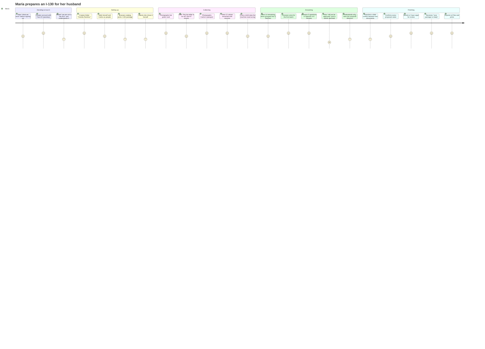

# 08 — UX Design

**Owner:** UX Architect · **Contributors:** Customer Experience Lead, Accessibility Specialist,
Lead Mobile Architect, Business Analyst · **Status:** For design and engineering intake

---

## 8.1 Design principles

Derived from the personas in [02 §2.4](02-product-requirements.md#24-user-personas) and from the
governing constraints. Each has a testable consequence.

| # | Principle | Test |
|---|---|---|
| **UX-1** | **One decision per screen.** María will abandon a screen with four competing choices. | No applicant screen has more than one primary action |
| **UX-2** | **Never imply an outcome.** No progress ring, no "great job, you're almost approved," no green checkmark that reads as endorsement. | Copy review by Compliance; no `percentComplete` exists ([C-20](00-design-authority-record.md#c-20--the-completion-percentage-will-be-read-as-a-prediction)) |
| **UX-3** | **Show the source.** Every value the machine proposes is one tap from the pixels it came from. | Every field cell has a provenance affordance |
| **UX-4** | **Fix quality at capture.** A bad photo is corrected while the document is still in the user's hand, not hours later. | On-device feedback ≤ 800 ms with a specific reason |
| **UX-5** | **Voice is offered, never assumed** — except in the accessibility profile, where it is the default. | Modality is a choice on every batch |
| **UX-6** | **The user's language is the interface language, and the form's language is shown beside it.** | Bilingual field labels throughout |
| **UX-7** | **Nothing is lost.** Offline capture, resumable upload, no time limits, no destructive action without a stated consequence. | No interaction has a timeout |
| **UX-8** | **Be honest about what we are.** The not-a-law-firm statement is present, plain, and never suppressed by a tenant's branding. | Rendered by the platform layer, not the tenant template |
| **UX-9** | **The reviewer's product is throughput.** Keyboard-first, side-by-side, zero mouse round-trips. | Cases-reviewed-per-hour is the macOS success metric |
| **UX-10** | **Accessibility is the design, not a mode.** | A11Y acceptance criteria on every screen |

---

## 8.2 Information architecture

```mermaid
graph TB
  ROOT["Aperture"]

  ROOT --> AUTH["Unauthenticated"]
  AUTH --> A1["Welcome / What this is"]
  AUTH --> A2["What we store<br/><i>before any account</i>"]
  AUTH --> A3["Sign in"]
  AUTH --> A4["Create account"]
  AUTH --> A5["Recover access"]

  ROOT --> APP["Applicant (iPhone / iPad)"]
  APP --> H["Home"]
  H --> H1["My folders"]
  H --> H2["Needs my attention"]
  H --> H3["Recent activity"]

  APP --> F["Folder"]
  F --> F1["People"]
  F --> F2["Documents"]
  F --> F3["Cases"]
  F --> F4["Who has access"]

  APP --> C["Case"]
  C --> C1["Overview &amp; counters"]
  C --> C2["What's missing"]
  C --> C3["Review information"]
  C --> C4["Forms preview"]
  C --> C5["Package &amp; export"]
  C --> C6["Case history"]

  APP --> CAP["Capture"]
  CAP --> CP1["Camera scan"]
  CAP --> CP2["Import from Files / Photos"]
  CAP --> CP3["Review &amp; classify"]

  APP --> INT["Interview"]
  INT --> I1["Choose how to answer"]
  INT --> I2["Chat"]
  INT --> I3["Voice"]
  INT --> I4["Type it in"]

  APP --> ME["Me"]
  ME --> M1["Notifications"]
  ME --> M2["Language &amp; reading level"]
  ME --> M3["Accessibility"]
  ME --> M4["Privacy &amp; data"]
  ME --> M5["My activity log"]
  ME --> M6["Get legal help"]
  ME --> M7["Security"]

  ROOT --> REV["Reviewer (Mac)"]
  REV --> R1["Queue"]
  REV --> R2["Case workbench"]
  REV --> R3["Discrepancies"]
  REV --> R4["Approvals"]
  REV --> R5["Reports"]

  ROOT --> ADM["Administration (Mac / iPad)"]
  ADM --> D1["Organization"]
  ADM --> D2["People &amp; roles"]
  ADM --> D3["Verification (KYB)"]
  ADM --> D4["Usage &amp; budgets"]
  ADM --> D5["Audit"]
  ADM --> D6["Form catalog"]
```



### Navigation architecture

| Platform | Pattern | Rationale |
|---|---|---|
| iPhone | Tab bar: **Home · Capture · Missing · Me**, with modal flows for wizards | Four tabs is the ceiling for this population; Capture is a tab, not a button, because it is the highest-frequency action |
| iPad | `NavigationSplitView` two-column, Stage Manager aware, pointer and keyboard support | Same IA, more shown at once |
| Mac | `NavigationSplitView` three-column: queue · items · source viewer. Multiple windows. Full menu bar | A different job, not a bigger screen ([C-22](00-design-authority-record.md#c-22--macos-is-not-ios-on-a-bigger-screen)) |

**Deep-link scheme:** `aperture://cases/{id}/missing-items`, `aperture://documents/{id}`,
`aperture://interviews/{id}`. Every notification deep-links to the exact item requiring action and
re-verifies entitlement on open.

---

## 8.3 Applicant journey — María, first case



**The two low points are deliberate and correct.** Reading the not-a-law-firm notice and being
declined an outcome prediction are moments of friction we choose to keep, because removing them is
the failure mode of this entire product category. What we optimize is the *recovery* from those
moments: the refusal is warm, immediately offers something useful, and never repeats itself
condescendingly in the same session.

---

## 8.4 Reviewer journey — Danielle, macOS

```mermaid
journey
  title Danielle clears a morning queue
  section Triage
    Opens queue sorted by ageing: 5: Danielle
    Sees 6 cases, 2 blocked on discrepancies: 4: Danielle
  section Reviewing a case
    Opens case; source document loads beside the field list: 5: Danielle
    Presses J to move through 41 proposed values: 5: Danielle
    Sees each value highlighted on the document as she moves: 5: Danielle
    Accepts 38 with Cmd-Return: 5: Danielle
    Edits 2 transliterated names: 4: Danielle
    Rejects 1 with a reason: 4: Danielle
  section Resolving
    Opens the date discrepancy, sees both documents side by side: 5: Danielle
    Picks the passport value, records why: 5: Danielle
  section Approving
    Reviews the generated preview: 4: Danielle
    Touch ID step-up, attests, approves: 5: Danielle
    Package generates and verifies in 40 seconds: 5: Danielle
```

**Target: 12 minutes per package at Phase 2.** Every interaction above is keyboard-reachable; the
mouse is optional throughout.

---

## 8.5 Screen inventory

62 screens across three platform experiences. The 18 called out in the brief are specified in
[§8.6](#86-screen-specifications); the remainder are listed here for completeness and are
specified in the design system file.

| Group | Screens | Platform |
|---|---|---|
| Onboarding | Welcome · What We Store · Language Picker · Sign In · Create Account · Passkey Setup · Recovery Code · Recover Access · Notices & Consent | iOS/iPad/Mac |
| Home | Dashboard · Needs Attention · Folder List · Empty State | iOS/iPad |
| Folder | Folder Overview · People · Add Person · Person Detail · Relationships · Who Has Access · Invite Member · Helper Scope · Quiet Exit | iOS/iPad |
| Case setup | New Case Wizard (5 steps) · Form Catalog Browser · Package Detail · Requirements & Citations · Selection Attestation · Role Assignment | iOS/iPad |
| Capture | Camera Scan · Capture Review · Quality Warning · Multi-page Manager · Import Picker · Classification Confirm · Split Proposal · Sealed Document Notice | iOS/iPad |
| Documents | Document List · Document Detail · Preview · Extraction List · Delete Confirmation | iOS/iPad/Mac |
| Case work | Case Overview · What's Missing · Missing Item Detail · Batch Chooser · Review Information · Field Detail & Provenance · Discrepancy Resolution · Forms Preview · Package Ready | iOS/iPad/Mac |
| Interview | Modality Chooser · Voice Consent · Voice Session · Voice Summary · Chat Session · Structured Question Form · Budget Notice | iOS/iPad |
| Output | Package Preview · PDF Viewer · Filing Checklist · Export Options · Secure Delivery · Delivery Status | iOS/iPad/Mac |
| Me | Settings · Notifications · Language & Reading Level · Accessibility · Privacy & Data · My Data Export · Erasure · My Activity Log · Devices & Sessions · Get Legal Help | iOS/iPad/Mac |
| Reviewer | Queue · Case Workbench · Discrepancy Panel · Approval Sheet · Reviewer Metrics | Mac/iPad |
| Admin | Org Profile · People & Roles · Role Detail · KYB Status · Usage & Budgets · Audit Explorer · Form Catalog · Field Map Approval · Break-glass Requests | Mac |

---

## 8.6 Screen specifications

Each specification gives: purpose · layout · content · interactions · states · accessibility ·
compliance constraints.

---

### S-01 Login

**Purpose.** Return a known user to their work in under 5 seconds without a password.

**Layout (iPhone).** Logo · "Welcome back" · large primary button **Sign in with Face ID** ·
secondary text link *Use a code sent to my email* · footer link *Trouble signing in?* ·
persistent one-line footer: *Aperture is not a law firm and does not give legal advice.*

**Interactions.** Primary triggers the platform authenticator. On success, restore last screen. On
failure, an inline explanation (not a modal) and the fallback remains visible. Five failures in
15 minutes → temporary lock with a plain explanation and a time.

**States.** Idle · authenticating · failed · locked · offline (*"You're offline. You can still open
documents you've already downloaded."*) · version-forced-upgrade.

**Accessibility.** VoiceOver: button labelled "Sign in with Face ID", hint "Uses the face or
fingerprint already set up on this iPhone." Dynamic Type to XXXL without truncation. Full keyboard
on Mac with visible focus. No time limit on the code entry.

**Compliance.** The not-a-law-firm footer is present pre-authentication and is rendered by the
platform layer; a tenant cannot remove it.

---

### S-02 Registration

**Purpose.** Create an account with informed consent, in three screens.

**Screen 1 — What we store.** Shown *before* any field is collected. Six plain sentences at ≤ 6th
grade: what we keep, where it lives, how long, who can see it, what we do if the government asks,
and how to delete it. A single **Continue**. A link to the full notice. This screen is required by
[US-01.06](02-product-requirements.md#e-01--identity--account) and is one of the highest-leverage
trust interventions in the product.

**Screen 2 — Create your passkey.** Email · display name · **Create passkey**. Copy explains what a
passkey is in one sentence and why it is safer. Fallback link to email code.

**Screen 3 — Your recovery code.** Displayed once, large, monospaced, with copy and share-to-Notes
affordances and an explicit *"Write this down. We cannot show it again."* Requires an explicit
acknowledgment checkbox, not a passive dismiss.

**Consent capture.** Two notices — not-a-law-firm and privacy — each with its version hash recorded
in a `ConsentRecord`. Analytics consent is **not** requested here; it is offered later, in Settings,
defaulted off.

**Accessibility.** Recovery code is announced character-by-character on request; VoiceOver users get
an explicit "copy to clipboard" action. No screen has a timeout.

---

### S-03 Dashboard (Home)

**Purpose.** Answer "what do I need to do next" in one glance.

**Layout.**
1. **Needs your attention** — at most 3 cards, each one action. Empty state: *"Nothing needs you
   right now."*
2. **Your folders** — folder cards with two mechanical counters, never a ring or a percentage.
3. **Recent activity** — last 5 events in plain language.
4. Persistent footer disclosure.

**Folder card content.** Name · people count · `Forms: 174 of 218 fields filled` ·
`Documents: 7 of 11 collected` · state chip (`Collecting`, `In review`, `Ready to file`).

**Compliance.** No percentage. No ring. No "almost there!" No color that reads as endorsement — the
`Ready to file` chip is neutral-toned and accompanied by *"Ready to file means the paperwork is
complete. It is not a prediction about any decision."*

**Accessibility.** Each card is a single VoiceOver element with a composed label
(*"Familia Ramírez. 2 people. 174 of 218 form fields filled. 7 of 11 documents collected. In
review."*) and a custom rotor action for the primary action. Dynamic Type reflows cards to a single
column.

---

### S-04 Virtual Folder

**Purpose.** The container view: who is in this folder, what has been collected, what cases exist,
and who can see it.

**Layout.** Segmented control: **People · Documents · Cases · Access**.

- **People** — person rows with a relationship line, a `holds own sign-in` indicator, and an
  *Add person* action. Adults can be invited; minors cannot.
- **Documents** — grid of thumbnails with class chips; sealed documents show a distinct lock
  treatment and the text *"Sealed — we never open this."*
- **Cases** — case rows with state and counters.
- **Access** — every member, their role, their scope, when granted, by whom, plus **Revoke**.

**The Access tab is a safety surface, not an admin surface.** It is written for a user who wants to
check whether someone can see their information. It shows *exactly* what each member can see
("Jorge can see: your documents, your basic information. Jorge cannot see: Carlos's information,
your private items.").

**Private Annex rendering.** For the annex owner, a distinct section *"Only you can see this."* For
everyone else, **nothing** — no count, no placeholder, no shadow. The screen for a folder with three
annex items is pixel-identical for a non-owner to one with none.

**States.** Active · closed · quarantined (form drift) · a member has quietly exited (shown only as
*"Participant no longer active"*, with no reason and no precise date).

---

### S-05 New Case Wizard

**Purpose.** Five steps from folder to a case with a pinned form package. One decision per step.

| Step | Content | Constraint |
|---|---|---|
| 1 — Who is this for | Select the people involved from the folder | — |
| 2 — Choose forms | Opens the Form Selection screen | **No recommendation** |
| 3 — Assign roles | Map each person to a role the package defines (petitioner / beneficiary / sponsor) | Plain-language role explanations quoted from the agency |
| 4 — What you'll need | The cited requirement list, with an estimate of fields and documents | Every item cited |
| 5 — Confirm | The selection attestation | Required to proceed |

**Step 5 copy (exact).**
> **You chose these forms.**
> Aperture did not choose them for you and cannot tell you whether they are right for your
> situation. If you are not sure, a nonprofit legal provider can help — we have a list.
>
> ☐ I understand. I chose these forms myself, or my legal representative chose them for me.

Progress is saveable and resumable at every step. No timeout.

---

### S-06 Form Selection

**Purpose.** Let a person find a form package. The single most compliance-sensitive screen in the
product.

**Layout.** Search field · agency filter · the agency's own category labels as browse chips ·
result cards.

**Result card.** Form numbers · title · agency · **edition date** · fee · *last verified* date ·
*View requirements* · *View on the agency's website*.

**What this screen does NOT do**
- No "recommended for you", no "popular", no "based on your documents", no ranking of any kind.
- Results are ordered alphabetically by form number within the agency. Ordering is deterministic and
  identical for every user.
- The screen makes **no request that carries case data** — the catalog API does not accept it
  ([07 §7.8](07-api-architecture.md#78-form-catalog-apis)), so personalization is not merely
  disallowed, it is impossible.

**Persistent banner.**
> We can't tell you which form to file. This list is the same for everyone.
> [Find free or low-cost legal help →]

**The assistant on this screen.** If the user taps the help affordance and asks "which one do I
need," the response is deterministic (not generated), warm, and immediately useful:
> I can't choose a form for you — that's a legal decision, and I'm not a lawyer. What I *can* do is
> show you exactly what any form on this list asks for, and help you fill it in once you've chosen.
> If you'd like help deciding, here are nonprofit organizations that do that for free.

---

### S-07 Document Upload

**Purpose.** Get a file in from anywhere, safely, on a bad connection.

**Layout.** Three large entry points: **Take a photo** · **Choose from Photos** · **Choose a file**.
Below: the upload queue with per-item state and a *Wi-Fi only* toggle showing the estimated data
size.

**Behavior.**
- Photos uses the **limited-access picker**; the app never requests full library authorization, and
  says so.
- Uploads are chunked, resumable, and survive app termination.
- Metered-connection default is Wi-Fi-only with a visible one-tap override.
- Client-side rejection for > 100 MB or > 500 pages, with a suggestion to split.
- SHA-256 verified before the local copy is released.

**States.** Queued · uploading (with bytes) · paused (no connection) · paused (waiting for Wi-Fi) ·
scanning · processing · done · failed with a specific, actionable reason.

**Accessibility.** Every state announced via a polite live region. The queue is a table on Mac with
full keyboard navigation.

---

### S-08 Camera Scan

**Purpose.** The highest-leverage screen in the product. Get a usable image on the first or second
try, while the document is still in the user's hand ([UX-4](#81-design-principles)).

**Layout.** Full-bleed camera · live edge overlay · a single capture control · page counter for
multi-page · **Done** · a persistent one-line coaching hint.

**On-device quality gate (≤ 800 ms).** Evaluates blur, glare, resolution, edge completeness, and
text presence. On failure, a **specific** hint replaces the generic one:

| Detection | Hint |
|---|---|
| Edges incomplete | "Move back a little — the top edge is cut off." |
| Blur | "Hold still for a second." |
| Glare | "Tilt the page slightly away from the light." |
| Low resolution | "Move a bit closer." |
| No text detected | "I can't see any writing — is this the right side?" |

The user may always override and keep the image; the override is recorded and downstream confidence
is adjusted accordingly.

**Non-visual capture path** (required, [NFR-A11Y-010](02-product-requirements.md#accessibility)):
audio framing guidance ("move left… a little further… hold… captured"), haptic confirmation, and an
equally prominent *Choose a file instead* route that is never harder to reach than the camera.

**Privacy.** No location metadata is ever attached. Imported images have EXIF GPS stripped on device
before upload and again server-side.

**States.** Ready · analyzing · warning · captured · multi-page review · permission denied (with a
plain path to Settings and an alternative route).

---

### S-09 Voice Interview

**Purpose.** Resolve a specific batch of missing items in ≤ 7 minutes of natural conversation.

**Pre-session consent screen (mandatory, before any audio).** Four plain statements, each with an
icon, spoken aloud as well as displayed:
1. You'll be talking to a computer, not a person.
2. What you say will be written down so we can fill in your forms.
3. This is not legal advice, and I can't tell you what will happen with your application.
4. You can switch to typing at any time, or stop whenever you want.

Then: ☐ *I understand and I'd like to continue.* Plus a separate, unchecked option: ☐ *You may keep
short audio clips of my answers for 30 days.* (Default off.)

**Session screen.** Large waveform · the current question in the user's language with the English
form label beneath · **live transcript** (always visible, not optional — it is both an accessibility
requirement and a trust feature) · progress as *"Question 3 of 5"* · **Switch to typing** ·
**Pause** · **Stop**.

**Behavior.** The agent asks, the user answers, the agent reads back the value it captured and asks
for confirmation. Three consecutive non-comprehensions trigger an offer to switch modality. Distress
or danger disclosure stops the interview and surfaces pre-approved resources with no attempt at
counselling.

**Budget.** Remaining minutes shown honestly. At exhaustion: a graceful close, all answers
preserved, and a clear statement that chat and typing have no limit
([07 §7.17](07-api-architecture.md#717-rate-limits-and-budgets)).

**Accessibility.** The live transcript satisfies the caption requirement. In the accessibility
profile, voice is the **default** modality and the budget is waived. Every control is large,
labelled, and reachable without precise pointing.

**Privacy notes rendered in-session.** *"This conversation goes straight from your phone to the
speech service. Our servers never hear it."* — a true statement made possible by the WebRTC
architecture, and worth saying.

---

### S-10 AI Chat Interview

**Purpose.** The default modality. Same job as voice, in text, with structured input.

**Layout.** Conversation transcript · structured input affordance for the current question (date
picker, address form, picker, or free text as appropriate) · **Attach a document instead** ·
**Skip this for now** · **Switch to voice**.

**Message anatomy.** Each assistant question shows: the question in the user's language, the
authoritative English form label in smaller type, and a subtle form reference chip
(*I-130 Part 2, Item 9*) that expands to the citation.

**Accessibility — the hardest problem in the product.** Streamed token output is hostile to
VoiceOver. Therefore:
- Tokens stream visually, but assistive technology receives the **completed block** in a polite live
  region.
- A persistent status region announces what is happening ("thinking", "asking about place of birth").
- No interaction has a time limit.
- The user can always re-read; nothing scrolls away automatically during a VoiceOver focus.

**Guardrail behavior.** A blocked turn shows a deterministic refusal in the same visual style as any
other message, with the nonprofit-directory affordance inline. It never says "I can't help with
that" and stops; it always says what it *can* do.

---

### S-11 Missing Items

**Purpose.** The applicant's to-do list. The screen most responsible for completion rate.

**Layout.** Two clearly separated sections — **Required** and **Also worth having** — with counts.
Each item is a row: title · who it belongs to · one-line reason · a *why?* affordance revealing the
citation · a single primary resolution action.

**Batching.** Above the list, batch cards: *"5 quick questions — about 6 minutes"* with modality
choice (voice / chat / type it in).

**Item detail.** What it is · which form and field it satisfies · the agency's own words (quoted,
cited, with revision date) · resolution paths · *"I can't get this"* which routes to human review
rather than leaving the user stuck.

**Ownership.** Each item names one person, so a household can divide the work. Items belonging to
another participant show as *"Waiting on Carlos"* with no further detail — this respects the
per-person boundary even inside a shared folder.

**Compliance.** Nothing on this screen characterizes evidence as sufficient, persuasive, or likely
to succeed. Items are *required by the instructions* or *listed in the instructions*, never *strong*
or *weak*.

---

### S-12 Notifications

**Purpose.** An inbox the user controls.

**Layout.** Grouped by category with unread indicators. Each item: plain-language title, one-line
body, timestamp, deep link.

**Preferences sub-screen.** Per-category channel toggles (in-app / push / email), quiet hours, digest
mode (immediate / daily / weekly), and a global **Pause all for 7 days**. Security notifications are
shown as non-suppressible with an explanation of why.

**The lock-screen contract.** A worked example is shown to the user in preferences:
> On your lock screen, notifications from us say only: *"You have an update in Aperture."*
> We never put your name, your case, or your form on a notification.

This is both a privacy control and a trust demonstration ([NT-002](02-product-requirements.md#213-notification-requirements)).

---

### S-13 Form Review (Review Information)

**Purpose.** The human-in-the-loop screen. Every proposed value is confirmed here, or nowhere.

**Layout (iPhone).** Grouped list by person, then by topic. Each row: field label (user's language) ·
current value · confidence chip · provenance affordance.

**Confidence chips** — three bands with plain meanings, never a percentage
([C-14](00-design-authority-record.md#c-14--confidence-scores-from-a-language-model-are-not-calibrated-probabilities)):

| Band | Chip | Plain-language meaning shown on tap |
|---|---|---|
| `VERIFIED` | ✓ Checked | "Two of your documents agree on this." |
| `EXTRACTED` | ○ From a document | "We read this from one document. Please check it." |
| `NEEDS_REVIEW` | ! Needs you | "We're not sure. Please tell us the right answer." |

**Field detail sheet.** The value · the source document image with the extracted region highlighted ·
the engine and when · *"Or you typed this on 12 July"* where applicable · which form and field it
goes to · the alternative if there is a discrepancy · **Confirm** / **Edit** / **This is wrong**.

**Bulk confirmation.** Not available on iPhone (a deliberate friction). Available in the reviewer
workbench only, restricted to `VERIFIED` values, capped per action, and each value individually
audited.

**Hard rule.** No value moves to `HUMAN_CONFIRMED` without a human action on this screen or its
reviewer equivalent. The package API refuses to generate otherwise
([US-06.03](02-product-requirements.md#e-06--extraction-review-ledger)).

---

### S-14 PDF Preview

**Purpose.** Let a human see the actual filled government form before anything leaves the platform.

**Layout.** PDFKit viewer · page thumbnails · a field-overlay toggle that highlights every filled
field · tap a field → jump to its provenance · form switcher for multi-form packages.

**Header chips.** Form number · **edition date** · *filled from N confirmed values* · verification
status.

**Assisted-Fill notice.** For `XFA` or `FLAT` forms, a prominent, non-dismissible banner:
> **We can't fill this form for you.** This form's file format doesn't support automatic filling.
> We've prepared a data sheet with every answer laid out in the order the form asks for them, so you
> can copy them across. [Open data sheet]

**Compliance.** The preview contains no annotation, marginal note, or summary characterizing the
content. The generated document text passes the UPL classifier before it can be written.

---

### S-15 Exports

**Purpose.** Get the package out safely.

**Layout.** Package summary (forms, pages, edition dates, generated date, verification passed) ·
three export routes:

| Route | Behavior |
|---|---|
| **Save to Files** | Standard document picker; the whole package as a folder or a single merged PDF |
| **Print** | AirPrint with a reminder about wet-ink signature points |
| **Send securely** | Recipient email + a second factor to a separately-entered channel; a **link**, never an attachment; expiry ≤ 7 days; max downloads; revocable |

**Delivery status.** Every access logged and shown to the sender: when, how many times, from what
IP class. A single-tap **Revoke** that kills the link within 60 seconds.

**The filing checklist** is always included and always shown before export: where to file, the fee,
which edition, and every point requiring a wet-ink signature — each a cited transcription of the
agency's published instructions.

**Persistent statement.**
> This package has **not** been filed. You need to file it yourself. We're not a law firm and we
> haven't given you legal advice.

---

### S-16 Admin Dashboard (macOS)

**Purpose.** Give a tenant admin operational control without giving them case content.

**Layout.** Three-column. Left: sections. Middle: content. Right: detail inspector.

**Cards.** Cases by state · ageing · reviewer utilization · first-pass yield · extraction accept
rate by band · AI spend against budget · verification status · open break-glass requests.

**Critical constraint.** `TenantAdmin` has **no case-content capability by default**. The dashboard
shows counts, states, and timings — never names, values, or documents. Obtaining case access
requires an explicit, audited role grant. This surprises administrators and is explained inline:
> You can see how work is flowing, but not what's in anyone's case. If you need case access, ask
> for the Reviewer or Attorney role — it's recorded when you get it.

---

### S-17 Reporting (macOS)

**Purpose.** The numbers, governed.

**Layout.** Report catalog by audience · parameters · results table · chart · export.

**Governance made visible.** Every report shows its entitlement scope and its suppression rule:
> Showing 1,204 cases you have access to. Groups smaller than 25 are hidden to protect individuals.

**Natural-language query.** Maps a question to a **catalog report**, never to free-form SQL
([Agent 23](04-ai-agent-architecture.md#agent-23--reporting-agent)). If no catalog report matches,
it says so and lists what is available rather than improvising.

**Available reports** are those in [02 §2.12](02-product-requirements.md#212-reporting-requirements),
filtered by the viewer's role.

---

### S-18 System Administration (macOS)

**Purpose.** Platform-level operations for `SystemAdmin`.

**Sections.**
- **Form Catalog** — forms, editions, drift status, staleness. A prominent alert for any form
  whose source hash changed. The **Field Map Approval** queue, requiring two distinct approvers and
  a passing fixture test before a map can activate.
- **Quarantine** — cases held by form drift, with a bulk migration action that shows exactly which
  fields changed, which are new, and which no longer exist.
- **Break-glass** — pending requests, approvals, active sessions with a live timer, and the post-hoc
  review queue.
- **Model & Prompt Registry** — deployed versions, pinned model versions, eval results, and the
  blocking gates' current status.
- **Budgets & Cost** — platform, tenant, and per-agent spend; the circuit-breaker state.
- **Audit Explorer** — entitlement-scoped, with chain-integrity verification.

**Constraint.** `SystemAdmin` has **no case-data access** without break-glass. The screen states
this and provides the break-glass request flow rather than a back door.

---

## 8.7 macOS reviewer workbench

The workbench is the reason macOS is not an afterthought
([C-22](00-design-authority-record.md#c-22--macos-is-not-ios-on-a-bigger-screen)).

```
┌──────────────┬────────────────────────────┬─────────────────────────────┐
│ QUEUE        │ ITEMS                      │ SOURCE                      │
│              │                            │                             │
│ ▸ Ramírez    │ ⚑ Date conflict            │  ┌───────────────────────┐  │
│   In review  │   birth.date               │  │                       │  │
│   4d         │   1979-03-14 (passport)    │  │   [passport image]    │  │
│              │   1979-04-13 (birth cert)  │  │   ▓▓▓ highlighted ▓▓▓ │  │
│ ▸ Okonkwo    │                            │  │                       │  │
│   In review  │ ○ name.family              │  └───────────────────────┘  │
│   2d         │   Ramírez                  │  Passport (Guatemala) p.2   │
│              │                            │  prebuilt-idDocument  0.981 │
│ ▸ Nguyen     │ ✓ document.passportNumber  │                             │
│   Ready      │   AB1234567                │  [◀ prev page] [next ▶]     │
│   1d         │                            │                             │
└──────────────┴────────────────────────────┴─────────────────────────────┘
  ⌘↵ accept   ⌘⇧R reject   ⌘E edit   J/K move   ⌘⇧A approve   ⌘F find
```

**Behavior.** Selecting a field auto-scrolls and highlights its source region. `J`/`K` move through
items; the source pane follows. Every action is undoable for 10 seconds. Approval requires step-up
(Touch ID) and lists any blocking discrepancy that prevents it.

**Multi-window.** A reviewer can open two cases side by side, or tear off the source viewer onto a
second display. Full `⌘F` find across the case. Drag-and-drop of documents in. Quick Look on any
document.

**Measured on throughput.** Reviewer minutes per package is a Phase-1 and Phase-2 target
([01 §1.9](01-executive-summary.md#19-success-metrics)), and dwell time per field is captured for
both audit and design purposes — if reviewers are spending 4 seconds on `VERIFIED` values, the band
is not earning its name.

---

## 8.8 Design system

| Token group | Notes |
|---|---|
| Color | Semantic tokens only (`surface`, `onSurface`, `accent`, `warning`, `critical`). **No color conveys meaning alone** — every state has an icon and a label. Light, dark, and Increase Contrast variants. `Ready to file` is deliberately neutral, not celebratory green |
| Type | SF Pro, Dynamic Type throughout, scaling to accessibility sizes. Minimum body 17 pt. Bilingual pairs use a 0.8 ratio for the secondary language, never below 13 pt |
| Spacing | 4 pt base; 44×44 pt minimum touch target, 48 pt in the accessibility profile |
| Motion | All motion optional and Reduce-Motion-aware. No motion carries information. No auto-advancing anything |
| Iconography | SF Symbols with explicit accessibility labels; never icon-only for a primary action |
| Components | Field row · confidence chip · provenance sheet · missing-item row · batch card · disclosure footer · citation popover · consent block · budget notice · quality hint |

### Content standards

| Standard | Rule |
|---|---|
| Reading level | ≤ 6th grade default, ≤ 4th grade in Plain Language mode. **Measured in CI**, not by opinion |
| Voice | Second person, active, concrete. "Take a photo of your green card," not "Documentary evidence of status may be submitted" |
| Agency terms | Every term of art glossed on first use in the user's language, with the English term shown |
| Numbers | Always with their denominator. "7 of 11", never "64%" |
| Refusals | Warm, specific, and always followed by what we *can* do. Never a bare "I can't help with that" |
| Errors | Say what happened, whose fault it is (ours, when it is ours), and what to do next |
| Prohibited words in all applicant-facing copy | *approved · denied · qualify · eligible · guaranteed · should file · your best option · strong case · likely* — enforced by a copy lint rule in CI |

---

## 8.9 Accessibility specification

Implements [C-12](00-design-authority-record.md#c-12--accessibility-cannot-be-a-phase-2-item-for-this-population)
and NFR-A11Y-001…012.

| Area | Requirement | Verification |
|---|---|---|
| VoiceOver | Every element labelled, with role and hint; correct reading order; custom rotors for field lists and the review queue | Manual audit each release + automated audit in CI |
| Streamed AI output | Announced as a completed block via a polite live region; never token-by-token | Automated test on the chat surface |
| Dynamic Type | All sizes to AX5 without truncation, clipping, or overlap | Snapshot tests at XXXL on every screen; **blocking** |
| Contrast | ≥ 4.5:1 text, ≥ 3:1 non-text, in light, dark, and Increase Contrast | Automated token audit |
| Color independence | Every state has icon + text | Design review + automated check for color-only states |
| Keyboard (Mac/iPad) | Full operability, visible focus, logical order, no traps, documented shortcuts | Automated traversal test |
| Voice Control | Every control has a speakable name matching its visible label | Manual audit |
| Switch Control | Primary flows completable | Manual audit |
| Reduce Motion / Transparency / Bold Text | Honored | Automated setting sweep |
| Time limits | **None anywhere** | Code audit; no timer may gate an interaction |
| Captions | Live transcript on every audio interaction | Present by default, not optional |
| Non-visual capture | Audio framing guidance + equally prominent file-import route | Manual audit with blind testers |
| Cognitive | One decision per screen; jargon glossed; resumable; consequences stated before destructive actions | Design review checklist |
| Reading level | Measured on all UI and AI copy | CI gate |
| Testing with disabled users | Paid panel of VoiceOver, Switch Control, and low-vision users tests each release candidate | Release artifact |
| ACR / VPAT | Published from MVP, updated each release | Release artifact |

**`A11Y-GATE` in CI is blocking and cannot be overridden by engineering.** It runs: automated
accessibility audit, Dynamic Type snapshot tests, contrast token audit, keyboard traversal, and the
reading-level check.

---

## 8.10 Localization and internationalization

| Aspect | Approach |
|---|---|
| MVP UI | English, Spanish |
| Phase 2 UI | + Haitian Creole, Simplified Chinese, Vietnamese, Tagalog, Arabic, Portuguese, Russian, French |
| Interview languages | Exceed UI languages via the Translation Agent, always labelled machine-assisted |
| **Bilingual field labels** | The user's language is primary; the **authoritative English form label** always appears alongside. This is a correctness requirement, not a courtesy — the user is filling an English form |
| RTL | Full mirroring for Arabic, including the document viewer chrome and the review layout |
| Scripts | Unicode throughout; correct rendering and input for CJK, Arabic, Cyrillic, Devanagari; names preserved in their original script with transliteration alongside |
| Names | Never split by heuristic; variants preserved and surfaced as "other names used" candidates |
| Dates | Displayed in the user's locale; **written to forms in the form's required format**; ambiguous source formats resolved by a human, never guessed |
| Addresses | Locale-appropriate input; form output in the agency's required format |
| Legal terms | Pinned glossary; never free-translated ([C-08](00-design-authority-record.md#c-08--machine-translation-cannot-be-represented-as-interpretation)) |
| Machine-translation labelling | Structural — the marker is part of the data type, not a UI decision |
| Interpreter certification | The platform never populates it from machine translation; a named human attestation or an applicant self-attestation is required before approval for an LEP user |
| Pseudo-localization | In CI, to catch truncation before a translator ever sees a string |

---

## 8.11 Error, empty and edge states

| State | Treatment |
|---|---|
| Offline | Explicit, per-capability: *"You're offline. You can keep taking photos and typing answers — I'll check them when you're back."* Never a silent failure |
| AI unavailable | *"The assistant isn't available right now. You can still answer these questions by typing."* The structured questionnaire is always the fallback |
| Extraction failed | *"I couldn't read this one. You can type the information in, or try a clearer photo."* Both paths offered equally |
| Form drift quarantine | *"USCIS updated this form on 14 July. We've moved your answers to the new version — 3 questions changed. [Review the changes]"* |
| Budget exhausted | Honest, work preserved, free alternative offered |
| Generation verification failed | *"Something went wrong on our end and we didn't produce your package. We've already been alerted. Nothing you did caused this."* — we take the blame explicitly because the user will otherwise assume they broke it |
| Guardrail block | Deterministic warm refusal + what we can do + the directory |
| Break-glass occurred | Surfaced in My Activity Log in plain language, unprompted |
| Empty folder | *"Nothing here yet. Start by adding the people this application is about."* |
| Empty missing items | *"Nothing needs you right now."* — never "You're done!" or a celebration |
| Sealed document | *"This looks like a sealed medical exam. We'll keep it safe but we'll never open it — and neither should you."* |
