# 10 — DevSecOps and Business Continuity

**Owner:** Lead DevSecOps Architect · **Contributors:** Lead QA Architect, Principal Cloud
Architect, CISO, SRE Lead · **Status:** For ARB and SRB approval

---

## 10.1 Engineering principles

| # | Principle | Consequence |
|---|---|---|
| **DS-1** | **Everything is code.** Infrastructure, policy, detections, prompts, rules, dashboards, runbooks. | No portal changes in production, ever |
| **DS-2** | **The pipeline is the only path to production.** | No human has standing deploy or data-plane access |
| **DS-3** | **Gates that protect users cannot be overridden by engineering.** UPL and accessibility gates require a named executive to bypass, and the bypass is board-visible | A deadline never silently lowers the safety bar |
| **DS-4** | **Shift left, but verify right.** Static analysis in the PR; runtime verification in staging; continuous verification in production | |
| **DS-5** | **Production data never leaves production.** | Synthetic data factory, not anonymized dumps |
| **DS-6** | **Every deploy is reversible in under 5 minutes.** | Expand/contract migrations; revision-level rollback |
| **DS-7** | **If it isn't observable, it isn't done.** Cost, latency, accuracy, and guardrail verdicts are instrumented from the first commit | |

---

## 10.2 Repository and branching

```
aperture/
├── apps/
│   ├── ios/                     # ApertureApp — SwiftUI
│   ├── macos/                   # ApertureMac — reviewer workbench
│   └── packages/ApertureKit/    # shared Swift Package
├── services/
│   ├── core/                    # .NET 9 — 12 services
│   ├── ai/                      # Python 3.12 — agent runtime, guardrails, proxy
│   └── processing/              # Python 3.12 — sanitizer, OCR, rasterizer, PDF
├── contracts/
│   ├── openapi/                 # OpenAPI 3.1 — source of truth
│   ├── agents/                  # agent contracts (YAML)
│   ├── events/                  # CloudEvents schemas
│   └── schemas/                 # JSON Schema for agent I/O
├── catalog/
│   ├── canonical-fields/        # canonical field registry
│   ├── document-taxonomy/
│   ├── validation-rules/        # deterministic rules + citations + tests
│   └── field-maps/              # per form-version, two-person approved
├── prompts/                     # versioned templates + eval fixtures
├── infra/
│   ├── bicep/                   # modules + environments
│   ├── policy/                  # Azure Policy as code
│   └── detections/              # Sentinel rules as code
├── tests/
│   ├── contract/  integration/  e2e/  load/  security/
│   ├── evals/                   # golden, UPL, injection, bias, calibration
│   └── synthetic-data/          # document factory
└── docs/                        # this deliverable
```

**Trunk-based development.** Short-lived branches, PR required, no direct pushes to `main`. Every PR
requires: two approvals (one from a code owner), all gates green, and a linked work item. Release
branches exist only for the mobile clients, where App Store review timing requires them.

**Code owners** are enforced on: `catalog/validation-rules` (Compliance + Data), `prompts`
(Prompt Engineering Lead + RAI Lead), `catalog/field-maps` (two named catalog owners),
`infra/policy` (Security), `contracts/openapi` (Integration Architect).

---

## 10.3 CI/CD pipeline

```mermaid
flowchart TB
  PR["Pull Request"] --> L["Lint · format · commit hygiene"]
  L --> B["Build · compile · generate clients from OpenAPI"]
  B --> UT["Unit tests<br/>≥80% line, ≥90% on domain &amp; validation"]
  UT --> CT["Contract tests<br/>oasdiff · consumer-driven"]
  CT --> SEC["Security<br/>SAST · SCA · secrets · IaC scan · container scan · SBOM"]
  SEC --> INV["<b>Invariant tests</b><br/>cross-tenant · no-percent-key · content-free notifications<br/>non-human approval rejected · catalog non-personalization"]
  INV --> EV["<b>Evaluation gates</b><br/>golden · UPL · injection · groundedness<br/>calibration · bias · reading level"]
  EV --> A11Y["<b>A11Y-GATE</b><br/>audit · Dynamic Type snapshots · contrast<br/>keyboard traversal · reading level"]
  A11Y --> IT["Integration tests<br/>ephemeral env, synthetic data"]
  IT --> MERGE{"Merge to main"}

  MERGE --> PKG["Package · sign · attest provenance · push to ACR"]
  PKG --> DEV["Deploy dev"]
  DEV --> E2E["E2E suite (~120 journeys)"]
  E2E --> STG["Deploy staging"]
  STG --> DAST["DAST · API fuzzing · auth matrix"]
  DAST --> PERF["Performance · load · soak"]
  PERF --> SOAK["24h staging soak"]
  SOAK --> APPR{"Manual approval<br/>QA + Security"}
  APPR --> CAN["Canary 5%"]
  CAN --> SLO{"SLO burn check<br/>15 min"}
  SLO -->|healthy| C25["25%"] --> C100["100%"]
  SLO -->|burning| RB["Automatic rollback"]

  style INV fill:#a02c2c,color:#fff
  style EV fill:#a02c2c,color:#fff
  style A11Y fill:#a02c2c,color:#fff
```



### The blocking gates

| Gate | Blocks on | Override authority |
|---|---|---|
| **UPL-GATE** | Any escape in the adversarial corpus | Compliance Officer **and** CAIO jointly; board-visible |
| **A11Y-GATE** | Automated audit failure, Dynamic Type truncation, contrast failure, keyboard trap, reading level | Accessibility Specialist only |
| **INVARIANT-GATE** | Cross-tenant leak, percentage key present, notification content leak, non-human approval accepted, catalog personalization detected | **None. Cannot be overridden** |
| **SEC-GATE** | Critical/high vulnerability past SLA, secret detected, unsigned image, unapproved dependency, IaC policy violation | CISO |
| **EVAL-GATE** | Extraction accuracy regression > 0.5 pp (synthetic), fabricated value or citation > 0, offline calibration proxy, bias disparity, **reading level of generated output** | CAIO |

*Two Rev A entries were category errors and have been moved.* "Zero Sev-1 privacy incidents" is an
operational outcome and cannot gate a pre-release build — it is now a launch-continuation condition
and a stop condition ([12 §12.8](12-risks-and-gap-analysis.md#128-what-would-make-us-stop)).
"Reviewer edit rate on `VERIFIED` ≤ 3 %" requires production reviewer behavior — it is now a monthly
calibration threshold with a defined breach action, not a build gate. ([14 M-11, M-12](14-sme-review-and-signoff.md#144-major-findings))

Three of these — invariant, UPL, accessibility — exist specifically so that commercial pressure
cannot erode the properties this product is sold on ([DS-3](#101-engineering-principles)).

### Supply-chain controls

SBOM generated and stored for every build · images signed and verified at admission · SLSA-style
provenance attestation · dependency pinning with lock files · automated update PRs with a soak
period · **an allowlist for client dependencies** (the iOS/macOS apps ship effectively zero
third-party runtime dependencies, and adding one requires Security approval) · a network egress test
that fails CI if the client contacts any host outside the allowlist.

---

## 10.4 Infrastructure as Code

| Aspect | Approach |
|---|---|
| Tool | **Bicep** for Azure resources — first-party, no state file to secure, native `what-if` preview. Terraform only where a resource genuinely requires it |
| Structure | Reusable modules (`network`, `container-env`, `sql`, `storage`, `ai-services`, `observability`) composed per environment; environments differ by parameter file, never by module |
| Pipeline identity | OIDC federation from the CI system to Azure — **no long-lived cloud credentials exist anywhere** |
| Preview | `what-if` output posted to the PR and required reading for approval |
| Drift | Daily detection; drift in production raises a Sev-3 and a remediation PR is opened automatically |
| Policy as code | Azure Policy denies: public network access on data services, missing CMK, missing private endpoint, disallowed region, missing required tags, TLS below 1.2, public blob access. **Non-compliant deployments fail; they do not warn** |
| Secrets | Key Vault with RBAC, soft delete and purge protection. **No secret in a pipeline variable, ever** — pipelines fetch at runtime with their federated identity |
| Environments | Separate subscriptions; production access is PIM-gated with approval and time limits |

---

## 10.5 Test strategy

### The pyramid, and where it is deliberately inverted

| Layer | Count | Runtime | Notes |
|---|---|---|---|
| Unit | ~6,000 | < 4 min | Domain logic, validation rules, transforms. **≥ 90 % coverage on the validation engine and the field-mapping transforms** — these are where a bug puts a wrong value on a government form |
| Contract | ~450 | < 2 min | OpenAPI conformance, consumer-driven expectations, event schemas |
| Integration | ~900 | < 12 min | Service + real database + real queue in an ephemeral environment |
| **Evaluation** | 8 suites | < 25 min | Golden extraction, UPL, injection, groundedness, calibration, bias, reading level, regression. **Unusually heavy for a product of this size — deliberately** |
| E2E | ~120 | < 30 min | Full journeys on real devices via XCUITest and a device farm |
| Load | 6 profiles | scheduled | Steady, peak, burst, soak, spike, chaos |
| Security | continuous | — | SAST, DAST, SCA, secrets, IaC, container, pen test |
| Accessibility | every screen | < 8 min | Automated audit + Dynamic Type snapshots + keyboard traversal |
| Manual exploratory | per release | — | Including a paid panel of disabled users and native speakers of each supported language |

### Synthetic document factory

Production data never leaves production ([DS-5](#101-engineering-principles)), so test data is
manufactured. The factory generates realistic documents with **known ground truth**:

- Passports, birth certificates, marriage certificates, green cards, driver licences, I-94s,
  approval notices, tax transcripts, pay stubs.
- Across scripts: Latin, Arabic, Cyrillic, Devanagari, CJK, Thai.
- With realistic degradation: skew, glare, shadow, fold lines, low resolution, partial occlusion,
  thumb-over-corner, coffee stain, phone-screen-photo-of-a-screen.
- With adversarial variants: embedded prompt-injection text, malformed structure, decompression
  bombs, XFA forms, macro-bearing DOCX, oversized page counts.

**But the factory is not the golden set.** Rev A said it was, which would have meant measuring the
degradation distribution we *imagined* rather than the one a cracked-screen iPhone 12 produces in a
kitchen at night, and then publishing that as accuracy
([14 B-08](14-sme-review-and-signoff.md#b-08--extraction-accuracy-is-measured-on-synthetic-documents-and-reported-as-if-it-were-real)).
Two corpora, two jobs:

| Corpus | Size | Purpose | May gate |
|---|---|---|---|
| **Synthetic** | 2,000 docs | Regression detection, adversarial cases. Cheap, unlimited, no privacy exposure | **Regression only** |
| **Consented real** | target 600 docs | The only basis for an absolute accuracy claim | **Absolute accuracy** |

The real corpus is collected from beta participants under **separate, non-bundled, refusable**
consent, held in a dedicated store with its own key, access restricted to the AI quality function,
retained 24 months, deletable on request, and **excluded from all model training**. Until it reaches
300 documents, every published accuracy figure carries the qualifier *"synthetic corpus"* and the G1
accuracy gate is provisional ([CON-3](14-sme-review-and-signoff.md#148-conditions-attached-to-sign-off)).

### Test data for people

Synthetic personas are generated with realistic name diversity — mononyms, patronymics, compound
surnames, diacritics, transliteration variants, maiden names — because a name-handling bug is a
dignity failure as well as a correctness one, and it will not surface on a test corpus of
"John Smith."

### Chaos and failure testing

Monthly game days against staging, injecting: Azure OpenAI 429s and outages · Document Intelligence
latency spikes · SQL failover · Service Bus DLQ floods · Cosmos throttling · Key Vault
unavailability · realtime voice disconnection mid-session · form-drift detection firing on a live
package · a processing-zone worker hanging.

**The success criterion for every one of these:** the user retains a non-AI path to completion, and
is told the truth about what is degraded ([04 §4.11](04-ai-agent-architecture.md#411-failure-taxonomy-and-escalation)).

---

## 10.6 Security testing

| Type | Cadence | Scope |
|---|---|---|
| SAST | Every PR | All languages; findings block on high+ |
| SCA | Every PR + daily | Dependencies, transitive, licences |
| Secrets scanning | Every PR + full history | Blocks on detection; rotation runbook triggered |
| IaC scanning | Every PR | Bicep, policy, container manifests |
| Container scanning | Every build + daily on deployed images | Base image and layer CVEs |
| DAST | Staging, every release | API fuzzing, auth matrix, injection |
| **Authorization matrix test** | Every release | Every role × every endpoint × every scope, asserted exhaustively. This is the test that catches an entitlement bug before a user does |
| **Cross-tenant test** | Every build | Attempts a cross-tenant read at the data layer; any success fails the pipeline |
| **Household boundary test** | Every build | Asserts a folder owner cannot enumerate a private annex, and that Quiet Exit generates zero notifications |
| Penetration test | Annual + on major change | App, API, cloud, mobile |
| **AI red team** | Quarterly | UPL corpus, injection, jailbreak, data exfiltration via prompts |
| Bug bounty | Phase 2 | Safe harbour; real user data explicitly out of scope |
| Vulnerability SLA | Continuous | Critical 24 h · High 7 d · Medium 30 d · Low 90 d — **enforced by a build gate** |

---

## 10.7 Observability

### The four signals, plus two

| Signal | Implementation |
|---|---|
| **Metrics** | Azure Monitor + Prometheus-compatible custom metrics; RED for services, USE for infrastructure |
| **Logs** | Structured JSON to Log Analytics. **A deny-list ensures no case content is ever logged**; a CI check scans log statements for value interpolation |
| **Traces** | OpenTelemetry end to end — client → APIM → service → agent → model. Every span carries `correlationId`, `caseId`, `tenantId` |
| **Profiles** | Continuous profiling on the processing and PDF workers, which are the CPU-heavy paths |
| **AI telemetry** | Per-invocation: agent, model, version, tier, tokens, cache hits, latency, cost, guardrail verdicts, confidence distribution ([04 §4.10](04-ai-agent-architecture.md#410-observability-budgets-and-cost)) |
| **Cost telemetry** | Attributed to agent, model, case, and tenant on **every** call — Day 1, not later |

### SLOs and error budgets

| Service | SLI | SLO | Budget |
|---|---|---|---|
| Core API | Availability | 99.9 % → 99.95 % | 43 min/mo → 21 min |
| Core API | p95 read latency | ≤ 300 ms | 1 % over |
| Core API | p95 write latency | ≤ 600 ms | 1 % over |
| Document pipeline | Single page p95 to values | ≤ 45 s | 5 % over |
| Package generation | p95 | ≤ 90 s | 2 % over |
| Chat interview | First token p95 | ≤ 1.2 s | 5 % over |
| Voice interview | Turn latency p95 | ≤ 400 ms | 5 % over |
| Extraction | Accuracy on the rolling gold set | ≥ 96 % | Any breach halts extractor rollout |

**Error-budget policy:** budget exhausted → feature work stops and reliability work starts, by
default, without needing a negotiation. Two consecutive months of exhaustion escalates to the CTO.

### Alerting

| Tier | Examples | Response |
|---|---|---|
| **Page immediately** | Sev-1 security or privacy; audit write failure; audit chain break; UPL escape in production; cross-tenant leak; API availability breach; AI cost circuit breaker | 15 min |
| **Page business hours** | Round-trip verification failure recurrence; form corpus stale > 48 h; drift monitor down; DLQ depth or age; extraction accuracy drop | 4 h |
| **Ticket** | Elevated guardrail block rate; calibration drift; single-tenant budget breach; dependency SLA approaching | Next day |
| **Dashboard only** | Everything else | — |

**Alerts are tested.** A monthly synthetic-alert exercise verifies that each page actually reaches a
human, because an untested alert is a false sense of security.

### Dashboards

Executive (SLOs, cost per case, funnel) · Engineering (RED/USE, deploys, error budget) ·
AI Quality (accuracy, calibration, guardrail rates, bias strata) · Security (auth anomalies,
break-glass, DLP, injection detections, vulnerability SLA) · Cost (per agent, per model, per tenant,
forecast vs. actual) · Catalog Health (edition freshness, drift, quarantined cases, field-map
approval queue).

---

## 10.8 Business continuity and disaster recovery

### Objectives

| Tier | Component | RPO | RTO | Phase |
|---|---|---|---|---|
| 1 | Core API, SQL, auth | ≤ 5 min | ≤ 4 h (P1) → ≤ 1 h (P2) | P1 |
| 1 | Documents and packages (blob) | ≤ 15 min | ≤ 4 h | P1 |
| 2 | Document processing pipeline | ≤ 15 min | ≤ 8 h | P1 |
| 2 | AI services | N/A (stateless) | ≤ 8 h, degraded operation available immediately | P1 |
| 3 | Search, reporting, analytics | ≤ 1 h | ≤ 24 h | P2 |
| 3 | Derived stores (Cosmos) | **Loss acceptable** | Rebuild on demand | P1 |

That last row is a deliberate architectural property, not an oversight: Cosmos holds nothing
authoritative, and a quarterly drill proves it by dropping the store in staging and regenerating
every package from SQL alone ([C-18](00-design-authority-record.md#c-18--cosmos-db-and-azure-sql-both-in-mvp-is-premature-complexity)).

### Backup strategy

| Asset | Method | Retention | Restore tested |
|---|---|---|---|
| Azure SQL | Automated PITR + long-term retention | 35 d PITR, 12 monthly LTR | Monthly, to a scratch server, with row-count and checksum verification |
| Blob — documents | Versioning + soft delete + GRS | 30 d soft delete; geo-replicated | Quarterly |
| Blob — packages | Versioning + **immutability (WORM)** + GRS | 1 y immutable | Quarterly |
| Blob — audit | Append + **immutability** + GRS | 7 y | Semi-annually, with chain verification |
| Cosmos | Continuous backup | 30 d | Quarterly (and proven unnecessary) |
| Key Vault / Managed HSM | HSM backup, geo-redundant | Per policy | Semi-annually — **the highest-consequence restore we test**, because losing key material loses all data |
| Configuration & IaC | Git | Indefinite | Every deploy is a restore |

**Backups are encrypted with customer-managed keys**, which means crypto-shred reaches them —
the mechanism that makes a deletion promise true in the presence of backups
([05 §5.11](05-data-architecture.md#511-retention-and-lifecycle)).

### High availability

| Layer | Approach |
|---|---|
| Compute | Container Apps zone-redundant, minimum 3 replicas per critical service, spread across availability zones |
| Database | Hyperscale with zone redundancy + 2 HA replicas; automatic failover |
| Storage | ZRS in-region; GZRS cross-region |
| Cache | Redis Enterprise zone-redundant |
| Gateway | APIM Premium multi-zone; Front Door is inherently global |
| AI services | Multiple deployments; the client abstraction fails over between them and degrades tier before degrading function |

### Multi-region strategy

**Phase 1 — single region, zone-redundant.** Honest position: this meets a 99.9 % SLO and a 4-hour
RTO, and does not meet a regional-outage scenario without manual intervention. That is an accepted,
documented risk for MVP, not an oversight.

**Phase 2 — active-passive with warm standby.** Secondary region with SQL failover group
(readable geo-secondary), blob object replication, Cosmos secondary read region, and infrastructure
deployed at minimum scale. Front Door health probes drive failover. Target RTO ≤ 1 h.

**Phase 3 — evaluate active-active.** Explicitly *not* assumed. Active-active across regions
introduces data-residency complexity, write-conflict resolution, and a materially larger surface for
the cross-tenant and cross-plane invariants to be violated. It will be adopted only if the measured
business need justifies that risk.

**Data-plane separation is not a DR mechanism.** The EU plane is a residency boundary; US data never
fails over to it and EU data never fails over to the US, under any circumstance, including a total
regional outage. This is enforced by policy and by the token's `dataPlane` claim check at the
gateway ([07 §7.2](07-api-architecture.md#72-gateway-and-edge-policy)).

### DR testing

| Test | Cadence |
|---|---|
| Backup restore verification (SQL) | Monthly |
| Blob restore | Quarterly |
| Regional failover exercise | Semi-annual (P2 onward) |
| Key material restore | Semi-annual |
| Cosmos-loss drill (drop and regenerate) | Quarterly |
| Full DR tabletop with executives | Annual |
| Ransomware / destructive-attack scenario | Annual |

### Degraded operating modes

The design goal is that no single dependency failure stops a user from finishing their application.

| Failure | Degraded behavior |
|---|---|
| Generative AI unavailable | Chat and voice interviews disabled with a clear notice; **structured questionnaire, manual entry, review, and package generation all continue** |
| Document Intelligence unavailable | Uploads queue and drain; manual entry offered immediately; user told plainly |
| Realtime voice unavailable | Chat interview, answers preserved |
| Translation unavailable | English with an explicit notice; never silently monolingual |
| Content Safety unavailable | **Fail closed** — generative features off, everything else on |
| Search unavailable | Within-case filtering continues |
| Notification unavailable | In-app inbox remains authoritative |
| Form catalog stale | New case creation blocked for affected packages with an honest message; existing cases continue; **never** fall back to a model's memory of a form |
| SQL unavailable | Read-only mode from the geo-secondary; writes queue client-side |
| Complete regional outage | Failover (P2); status page and honest communication (P1) |

---

## 10.9 Release management

| Aspect | Approach |
|---|---|
| Backend cadence | Continuous — multiple per day behind feature flags |
| Client cadence | Every 2 weeks; TestFlight → phased App Store rollout (1/2/5/10/20/50/100 %) |
| Feature flags | Azure App Configuration; every risky capability flagged; **a flag older than 90 days fails a lint check** so the codebase does not accumulate permanent branches |
| Database | Expand/contract only; a deploy is never coupled to a migration |
| Canary | 5 % → SLO burn check (15 min) → 25 % → 100 %, with automatic rollback |
| Rollback | Container Apps revision-level, under 5 minutes; forward-compatible data so rollback never needs a restore |
| Client compatibility | Server supports N-2 client versions for ≥ 12 months. Forced upgrade only for security-critical releases, with a 30-day grace period and an in-app explanation |
| Change advisory | Standard changes are pre-approved by category; only novel or high-risk changes go to a review |
| Release notes | User-facing notes in plain language, in every supported UI language; internal notes link every change to its work item |
| Freeze periods | None by date. Instead, an **error-budget-driven** slowdown: budget exhausted means reliability work, automatically |

---

## 10.10 Operational runbooks

Runbooks are code-reviewed markdown in the repository, linked from the alert that triggers them, and
tested during game days. The initial set:

| Runbook | Trigger |
|---|---|
| RB-01 Form edition drift detected | Drift monitor alert |
| RB-02 Round-trip verification failure | Generation failure alert |
| RB-03 UPL escape in production | Sampling or report |
| RB-04 Cross-tenant data exposure | Invariant alert or report |
| RB-05 Prompt injection cluster | Security agent correlation |
| RB-06 AI cost circuit breaker fired | Budget alert |
| RB-07 Audit write failure / chain break | Audit alert |
| RB-08 Break-glass request and post-hoc review | Support escalation |
| RB-09 Model provider outage or degradation | Dependency alert |
| RB-10 Regional failover | Availability alert |
| RB-11 Key material incident | Key Vault alert |
| RB-12 Government data request received | Legal intake |
| RB-13 Tenant abuse signal (notario pattern) | Trust & safety queue |
| RB-14 Ransomware / destructive attack | Security alert |
| RB-15 Extraction accuracy regression | Eval alert |

**RB-12 is unusual for an engineering runbook and belongs there deliberately**: the first 30 minutes
after legal process arrives determine whether the response is disciplined or improvised. It names
counsel, defines who may not be told, sets the preservation scope, and requires the user-notification
decision to be made and recorded.

---

## 10.11 Team, on-call and capability

| Role | Phase 0 | Phase 1 | Phase 2 |
|---|---|---|---|
| Engineering Manager | 1 | 2 | 3 |
| iOS/macOS engineers | 2 | 4 | 5 |
| Backend (.NET) | 2 | 4 | 5 |
| AI/ML + Python | 1 | 3 | 4 |
| Platform / DevSecOps | 1 | 2 | 3 |
| QA / Test engineering | 1 | 2 | 3 |
| Security engineer | 0.5 | 1 | 2 |
| Data engineer | 0.5 | 1 | 2 |
| Product / BA | 1 | 2 | 3 |
| Design / UX | 1 | 2 | 2 |
| Accessibility specialist | 0.25 | 0.5 | 1 |
| Catalog operations | 0 | 1 | 2 |
| Trust & safety | 0 | 0.5 | 2 |
| **Total FTE** | **~9** | **~17** | **~22** |

**Catalog operations is a real role, not a task.** Somebody must own form editions, field-map
approvals, and drift response, and the failure mode when nobody owns it is
[RISK-003](12-risks-and-gap-analysis.md#125-consolidated-risk-register) — silent production of
rejectable filings at scale.

**On-call:** follow-the-sun is not viable at this size; a single rotation with a documented
escalation path, a 15-minute page SLA for Sev-1, and a hard rule that the on-call engineer can wake
the CISO. Compensated, capped at one week in four, with a post-incident review for every page.

---

## 10.12 Definition of Done

A story is done when **all** of the following are true. This list is enforced in the PR template.

- [ ] Acceptance criteria met and demonstrated
- [ ] Unit tests written and passing; coverage thresholds met
- [ ] Contract tests updated; OpenAPI regenerated if the API changed
- [ ] **Accessibility acceptance criteria met**; A11Y-GATE green
- [ ] **Localized**; no hardcoded user-facing strings; pseudo-localization passes
- [ ] **Reading level verified** for any new user-facing or AI copy
- [ ] Security review for any new endpoint, permission, or data field
- [ ] Privacy review for any new personal-data field (required for `CRITICAL` class)
- [ ] Audit events emitted for any new personal-data access or state change
- [ ] Telemetry and, for AI paths, cost attribution instrumented
- [ ] Feature-flagged if risky; flag has an owner and an expiry
- [ ] Runbook updated if operational behavior changed
- [ ] Documentation updated in `docs/`
- [ ] No new client dependency without Security approval
- [ ] Demonstrated on a real device at accessibility text size XXXL
