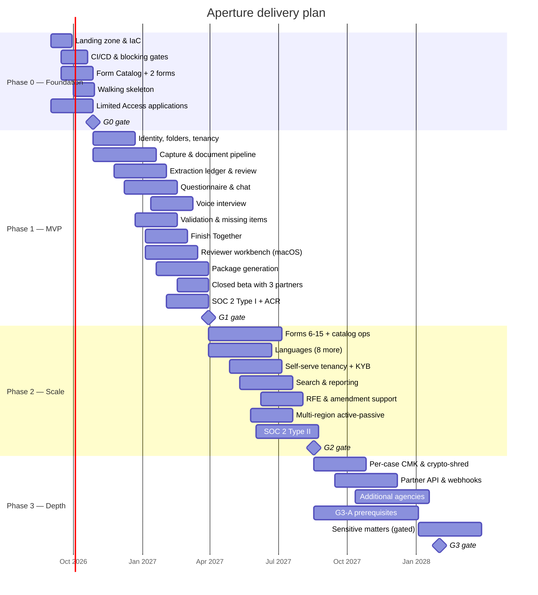

# 11 — Roadmap

**Owner:** Chief Product Officer · **Contributors:** CTO, CISO, PMO, Finance · **Status:** For
executive approval

---

## 11.1 Shape of the plan

**Total: ~78 weeks from start to Phase 3 exit.** The critical path runs through the document
pipeline and package generation, not through the AI — a useful corrective to the instinct to
sequence this program around model work.

---

## 11.2 Phase 0 — Foundation (8 weeks, ~9 FTE)

**Objective.** Prove the riskiest technical assumption end to end, and put the guardrails in place
before there is any pressure to skip them.

| Workstream | Deliverables |
|---|---|
| Platform | Azure landing zone, three environments, hub-spoke network, policy-as-code, managed identities, Key Vault + Managed HSM, observability baseline |
| Pipeline | Full CI/CD with **every blocking gate wired from day one** — invariant, UPL, A11Y, security, eval. Gates are cheap to add now and politically expensive to add later |
| Catalog | Form Catalog service; two forms ingested (I-130, I-130A) with approved field maps; drift monitor running |
| **Walking skeleton** | Photograph a passport on an iPhone → sanitize → OCR → extract → human confirms → fill the real I-130 AcroForm → round-trip verify → export. Thin but complete |
| Design | Design system, accessibility foundations, first 12 screens, Spanish translation pipeline |
| Vendor | Azure OpenAI Limited Access and modified abuse monitoring applications submitted; capacity discussion opened |
| Legal | Outside-counsel UPL opinion for the first three target states; the nine prohibited speech acts finalized and the initial adversarial corpus built |

### G0 exit criteria
- [ ] Walking skeleton demonstrated end to end on a physical device, producing a verifiably correct filled I-130
- [ ] Round-trip verification catching an intentionally seeded error
- [ ] All five blocking gates operational and demonstrably failing a bad build
- [ ] Drift monitor detecting a simulated edition change and quarantining a case
- [ ] Processing zone verified to have no egress and no database route (tested, not asserted)
- [ ] UPL corpus v1 with 300+ prompts; classifier v1 at 0 escapes
- [ ] Security architecture review passed by the SRB
- [ ] Outside-counsel opinion received for the first three states

**Go/no-go authority:** CTO and CISO jointly. A failure of the walking skeleton or of round-trip
verification is a **no-go**, because it invalidates [ADR-003](adr/ADR-003-form-fidelity.md), on
which the whole product rests.

---

## 11.3 Phase 1 — MVP (24 weeks, ~17 FTE)

**Objective.** A complete, defensible product for four form packages, proven with real users in a
supervised setting.

> **Rebaselined.** Rev A planned 20 weeks for 1,478 points and described 4 streams × 45 pts ×
> 10 sprints as "~18 % buffer." It was not. Beta runs in the final three sprints, during which those
> streams support beta, remediate penetration-test findings, produce SOC 2 evidence and run the
> accessibility panel — so real build capacity was ~7 sprints, or **1,260 points against 1,478
> required: a 17 % shortfall, not an 18 % buffer.**
> ([14 B-09](14-sme-review-and-signoff.md#b-09--phase-1-does-not-fit-in-phase-1))
>
> | Change | Effect |
> |---|---|
> | Extend to 24 weeks (12 sprints, 9 building) | capacity → **1,620 pts** |
> | Drop I-131 from MVP (four packages, not five) | −90 pts |
> | Move Helper role and RFE-adjacent polish to Phase 2 | −60 pts |
> | Add a fifth stream | **Rejected** — coordination cost exceeds throughput at this size |
> | Lower gate thresholds | **Rejected outright** |
>
> Revised: **1,328 points against ~1,620 capacity — 18 % genuine buffer.** Program moves ~74 → ~78
> weeks; Phase 1 cost rises ~$0.4 M. Recorded as a schedule change, not absorbed silently.

**Scope:** E-01…E-20 from [02 §2.6](02-product-requirements.md#26-epics) — 1,328 story points.

| Stream | Sprints | Content |
|---|---|---|
| A — Identity & tenancy | 1–8 | Passkeys, recovery, folders, persons, relationships, **per-person trust boundary and Quiet Exit**, roles, manual KYB |
| B — Capture & documents | 1–12 | Camera scan with on-device quality gate, imports, resumable upload, sanitization pipeline, classification, sealed-medical handling |
| C — Extraction & ledger | 5–14 | OCR routing, custom neural extractors for 8 classes, provenance, confidence banding, discrepancy detection, review ledger |
| D — Interview | 7–18 | Questionnaire engine, chat interview, **voice interview (EN/ES)**, translation, guardrail chain |
| E — Validation & output | 9–18 | Deterministic rule engine, missing items, Guided Finish, Proof Map, Private Relay, reviewer workbench, approval, package generation, export, secure delivery |
| F — Cross-cutting | 1–24 | Accessibility, localization, audit, consent, data rights, observability, cost telemetry |

**Beta (weeks 19–24).** Three partner organizations, ~40 supervised real cases. Every case reviewed
by a licensed human before anything leaves the platform. Explicit instrumentation of: extraction
accuracy against reviewer corrections, reviewer minutes per package, time to ready-to-file, and
every UPL deflection.

### G1 exit criteria
- [ ] Four packages generating verified, correct output
- [ ] Guided Finish reconciles against live missing items, Proof Map preserves person/document boundaries, and Private Relay passes independent capability-boundary and abuse testing
- [ ] **CON-1**: voice interrupt latency ≤ 600 ms p95, or voice is cut from MVP
- [ ] **CON-3**: consented real-document corpus ≥ 300 docs before any absolute accuracy claim
- [ ] Extraction field accuracy ≥ 96 % on the gold set
- [ ] Reviewer edit rate on `VERIFIED` ≤ 3 %
- [ ] **Zero UPL escapes** across the corpus and beta sampling
- [ ] **Zero Sev-1 privacy incidents**
- [ ] Median applicant time to ready-to-file ≤ 3.5 h (I-130)
- [ ] Reviewer minutes per package ≤ 25
- [ ] SOC 2 Type I achieved
- [ ] ACR published; disabled-user panel testing passed
- [ ] Penetration test complete, all highs closed
- [ ] AI cost per completed case ≤ $12
- [ ] ≥ 30 of 40 beta cases reaching ready-to-file
- [ ] Partner organizations willing to continue — measured by signed continuation, not by sentiment

**Go/no-go authority:** CPO, CTO, CISO, Compliance Officer — **unanimous**. Any single veto holds.

---

## 11.4 Phase 2 — Scale (20 weeks, ~22 FTE)

**Objective.** Reach the volume and language coverage that makes the business viable, without
loosening any control.

| Theme | Content |
|---|---|
| Forms | 11 more packages (I-131, N-565, I-751, I-90, I-539, I-824, N-600, I-129F, I-864 standalone, DS-260 support, I-134). Catalog operations becomes a staffed function |
| Languages | Haitian Creole, Simplified Chinese, Vietnamese, Tagalog, Arabic (full RTL), Portuguese, Russian, French. Voice in 6 |
| Tenancy | Self-serve organization onboarding with **automated KYB** and bar/EOIR verification; billing; per-tenant budgets |
| Capability | Search, reporting and analytics, **RFE and amendment support** (respond to an agency request against an existing case) |
| Platform | Multi-region active-passive, RTO ≤ 1 h; performance work to hit the tightened SLOs |
| Trust | SOC 2 Type II; bug bounty; first transparency report; staffed trust & safety |
| Client | Apple Watch reminders, Shortcuts/Siri intents for case status, iPad reviewer-lite |

**RFE support deserves a note.** A Request for Evidence is the moment an applicant is most
frightened and most vulnerable to bad actors, and it is where the temptation to give advice is
strongest. The feature is scoped strictly to: transcribe what the RFE asks for, map it to
collectible items, and help assemble a response package. It does not interpret the RFE, and the
guardrail profile on this surface is the strictest in the product.

### G2 exit criteria
- [ ] 15 packages live with maintained field maps
- [ ] 10 UI languages at parity — **non-English completion ≥ 90 % of the English rate**
- [ ] 60 organizational tenants, 12,000 paying consumer subscriptions
- [ ] Extraction accuracy ≥ 98 %; ECE ≤ 0.05
- [ ] Reviewer minutes per package ≤ 12
- [ ] AI cost per completed case ≤ $6
- [ ] SOC 2 Type II clean
- [ ] Regional failover exercised successfully
- [ ] Zero UPL escapes maintained
- [ ] Bias disparity within threshold across every stratum, or disclosed in-product

---

## 11.5 Phase 3 — Depth (24 weeks, ~26 FTE)

**Objective.** Serve the population with the greatest need, safely — and only if we have earned it.

| Theme | Content |
|---|---|
| Privacy engineering | **Per-case customer-managed keys** and crypto-shred; panic delete and duress PIN; on-device extraction pilot for the highest-sensitivity document classes |
| Integration | Partner API and webhooks for case-management systems; signed, replay-protected, rate-limited |
| Breadth | Additional agencies: DOL, SSA, and selected state benefit programs |
| **Sensitive matters** | I-589, I-360 (VAWA), U/T visas — **behind gate G3-A** |

### Gate G3-A — prerequisites for sensitive matters

Every one of these must be **complete**, not planned
([C-04](00-design-authority-record.md#c-04--asylum-and-removal-defense-cases-must-be-out-of-scope-for-v1)):

- [ ] Per-case CMK in Managed HSM with a documented, tested crypto-shred procedure
- [ ] A DPIA specific to the sensitive-matter use case, externally reviewed
- [ ] Published government-request policy with at least two transparency reports issued
- [ ] Panic-delete and duress-PIN capability shipped and tested
- [ ] SOC 2 Type II clean plus an independent penetration test with all highs closed
- [ ] A partnership with at least one accredited nonprofit legal services organization providing
      human review for every case in this segment
- [ ] Consultation completed with community advocates and civil liberties organizations
- [ ] CISO, Compliance Officer, and Risk Officer sign-off — **any one may withhold**

If G3-A is not met, Phase 3 ships without the sensitive-matter segment. That is an acceptable
outcome. Shipping it unready is not.

---

## 11.6 Unit economics

The single most important number in the business model, and the reason for
[C-11](00-design-authority-record.md#c-11--cost-model-for-real-time-voice-is-not-viable-as-specified).

### Cost per completed case (I-130 package, indicative)

| Component | Volume | MVP cost | P2 target | How the reduction is achieved |
|---|---|---|---|---|
| Document Intelligence | 11 docs, ~26 pages | $0.55 | $0.50 | Volume tier |
| Extraction structuring (frontier model) | ~180 K tokens in, 12 K out | $2.10 | $0.95 | Prompt caching ≥ 60 %, small-model routing for simple classes |
| Classification & routing (small model) | ~40 calls | $0.08 | $0.05 | — |
| Chat interview | ~55 turns | $1.85 | $0.90 | Cascade routing, caching, shorter contexts |
| **Voice interview** | ~18 min | **$4.60** | **$1.90** | Task-scoped sessions, budgets, cascade, and voice being opt-in rather than default |
| Guardrail chain | ~300 evaluations | $0.65 | $0.30 | Stage-1 deterministic screen catches most; stage-3 LLM rarely invoked |
| Translation | ~90 segments | $0.12 | $0.10 | — |
| Compute, storage, egress | — | $0.35 | $0.25 | Reserved capacity |
| Questionnaire generation | ~30 calls | $0.95 | $0.45 | Caching; small-model routing |
| PII minimization proxy | ~120 round-trips | $0.65 | $0.30 | Batching; local tokenizer for common patterns |
| **Total** | | **$11.90** | **$5.70** | |

> **Rev A understated this by $1.60.** It omitted questionnaire generation and the PII proxy
> entirely ([14 m-12](14-sme-review-and-signoff.md#145-minor-findings)). Corrected, MVP cost per case
> **exceeds** the original ≤ $11 target. The target is restated as **≤ $12 (P1)** and ≤ $6 (P2)
> rather than the number being adjusted to fit — the gap is named, not hidden. Cost telemetry is a
> Day-1 requirement precisely because this estimate has already been wrong once.

### Sensitivity

| Scenario | Cost/case | Response |
|---|---|---|
| Voice usage doubles | $14.90 | Budgets bind; cost is capped by design, not by hope |
| Prompt cache hit rate falls to 20 % | $12.80 | Prompt restructuring; this is the most fragile assumption in the model |
| Frontier model price rises 30 % | $12.10 | Increase small-model routing share; the abstraction layer makes a model swap an evaluated change, not a rewrite |
| Extraction requires 2× retries | $12.40 | Root-cause on capture quality — cheaper to fix at the camera than at the model |
| All four simultaneously | $19.60 | Requires a price change or a feature reduction; the trigger threshold is $15 and is monitored weekly |

### Revenue model

| Plan | Price | Notes |
|---|---|---|
| Consumer, per case | $89 one-time | Covers one package through to export |
| Consumer, subscription | $24/month | Unlimited cases; voice budget 60 min/month |
| Organization, per seat | $79/seat/month | Reviewer workbench, reporting, budgets |
| Organization, per case | $35/case | For high-volume nonprofits |
| **Nonprofit tier** | **Discounted to cost** | A deliberate margin sacrifice: nonprofit partners are the credibility base and the human-review capacity the model depends on |

Contribution margin at the P2 cost target is roughly 79 % on the consumer subscription and 86 % on
organizational seats. The nonprofit tier is run at or near cost and is accounted for as
distribution and trust investment, not as charity — it is what makes the "we are not the notario"
positioning credible.

### Cost controls in force

Per-invocation, per-case, per-tenant, and platform budgets · a platform circuit breaker at 3× the
daily forecast · model-tier cascade with per-turn logging of tier and reason · prompt caching with a
≥ 60 % hit-rate target · voice as opt-in with a visible budget · **cost attributed to agent, model,
case, and tenant on every single call** ([04 §4.10](04-ai-agent-architecture.md#410-observability-budgets-and-cost)).

---

## 11.7 Investment summary

| Phase | Duration | FTE | People cost | Azure | Other | Total |
|---|---|---|---|---|---|---|
| Phase 0 | 8 wk | 9 | $0.42 M | $0.03 M | $0.09 M | **$0.54 M** |
| Phase 1 | 24 wk | 17 | $2.46 M | $0.19 M | $0.35 M | **$3.00 M** |
| Phase 2 | 20 wk | 22 | $2.65 M | $0.58 M | $0.34 M | **$3.57 M** |
| Phase 3 | 24 wk | 26 | $3.76 M | $1.05 M | $0.38 M | **$5.19 M** |
| | | | | | **Total** | **$12.30 M** |

"Other" covers outside counsel (material here — per-jurisdiction UPL opinions are not cheap),
SOC 2 audit, penetration testing, the disabled-user testing panel, translation, and device farm.

**First-year run cost at 25,000 active cases: $0.9–1.3 M of Azure spend**, dominated by generative
inference and document intelligence.

---

## 11.8 Sequencing rationale

Why this order, and not the obvious alternatives.

| Decision | Reasoning |
|---|---|
| **Blocking gates in Phase 0, before any feature** | Gates added later get negotiated away under delivery pressure. Building the UPL corpus before there is a product to ship makes it a constraint rather than an obstacle |
| **Walking skeleton before breadth** | [ADR-003](adr/ADR-003-form-fidelity.md) is the load-bearing assumption. If we cannot reliably fill and verify a real government AcroForm, nothing else matters and we should know in week 8, not week 40 |
| **Capture quality before extraction sophistication** | A better photo beats a better model, costs nothing at inference time, and fixes the problem where the user still holds the document |
| **Chat before voice** | Chat is cheaper, more accessible, easier to guardrail, and provides the transcript that makes voice's design tractable |
| **macOS reviewer in Phase 1, not Phase 2** | Without human review capacity, the beta cannot run at all. The reviewer is not an admin convenience; it is the control that makes the product lawful |
| **Languages in Phase 2, not Phase 1** | Adding a language is not translation — it is voice, glossary, bias measurement, and a support path. Doing two properly beats ten poorly |
| **Self-serve tenancy in Phase 2** | Manual KYB in MVP is slow and correct. Automating the gate before we understand the abuse patterns would build the notario's on-ramp |
| **Sensitive matters last, and gated** | The population with the most to lose gets served when we are demonstrably good enough, not when the market is attractive |
| **Multi-region in Phase 2** | Single-region zone-redundant genuinely meets the MVP SLO. Building multi-region first would trade real feature progress for a scenario the beta cohort will not encounter |

---

## 11.9 Phase gates summary

| Gate | Authority | Blocking criteria |
|---|---|---|
| **G0** | CTO + CISO | Walking skeleton; round-trip verification; all gates operational; processing-zone isolation verified; UPL v1 at zero escapes; outside-counsel opinions |
| **G1** | CPO + CTO + CISO + Compliance (**unanimous**) | Five packages; accuracy ≥ 96 %; zero UPL escapes; zero Sev-1 privacy incidents; SOC 2 Type I; ACR; pen test clean; beta outcomes |
| **G2** | CPO + CTO + CISO | 15 packages; 10 languages at parity; SOC 2 Type II; cost ≤ $6; bias within threshold or disclosed; failover exercised |
| **G3-A** | CISO + Compliance + Risk (**any may withhold**) | The eight sensitive-matter prerequisites, all complete |
| **G3** | Executive team | Phase 3 scope delivered; sensitive matters live or explicitly deferred |
