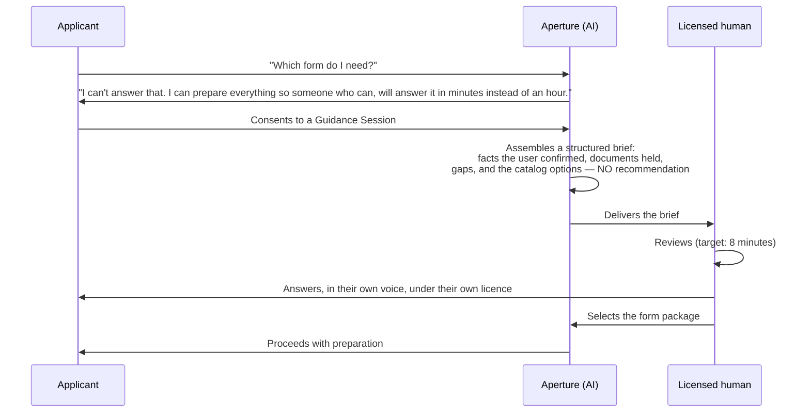

# 13 — Version 2 Recommendations

**Owner:** Chief Technology Officer · **Contributors:** CPO, CAIO, CISO, Principal Enterprise
Architect · **Status:** Strategic direction, not committed scope

Version 1 is defined by what it refuses to do. Version 2 should be defined by making those refusals
*cheaper* — by removing the underlying reason for the constraint rather than by relaxing the
constraint itself.

Four of these recommendations do exactly that. The rest are ordinary product and platform maturity.

---

## 13.1 The organizing idea

V1 says "we cannot tell you whether you qualify," "we hold your data and a government could compel
it," and "we can only do this on an iPhone." Each of those is a real limitation with a real cause.

| V1 limitation | Underlying cause | V2 move |
|---|---|---|
| Cannot advise | We are not licensed, and software cannot be | **Put a licensed human in the loop cheaply** — [§13.2](#132-supervised-guidance--a-human-in-the-loop-not-a-model-in-the-loop) |
| Data is compellable | We hold plaintext | **Stop holding it** — [§13.3](#133-on-device-extraction-and-client-held-keys) |
| iOS only | Focus and capture quality | **Rebuild the capture advantage on the web** — [§13.6](#136-platform-expansion) |
| Trust us about provenance | Our word | **Make it verifiable** — [§13.4](#134-verifiable-provenance) |

---

## 13.2 Supervised guidance — a human in the loop, not a model in the loop

**The problem.** Every user asks "which form do I need?" V1's answer is a warm refusal and a
directory. That is correct and it is also the largest source of user frustration
([UR-01](12-risks-and-gap-analysis.md#usability-risks)), and the reason a less scrupulous competitor
can out-feature us.

**The wrong solution.** Loosen the classifier and let the model answer. This is the failure mode of
the entire product category and it is prohibited permanently
([09 §9.13](09-responsible-ai.md#913-what-we-will-not-build)).

**The V2 solution.** Change *who* answers, not *whether* the product answers.

Build a **Guidance Session**: a short, structured, asynchronous consultation with a licensed
attorney or an EOIR-accredited representative, conducted inside the product, where the AI's role is
strictly to prepare the human's work.

**Why this is defensible.** The advice is given by a licensed human, under their licence, in their
own words. The AI's contribution is preparation — assembling facts and documents — which is exactly
what V1 already does lawfully. The classifier remains unchanged and still blocks the AI from
answering. What changes is that the refusal now has somewhere to go.

**Why it is commercially interesting.** The bottleneck in legal services is attorney time spent on
intake, not on judgment. A structured brief that turns a 45-minute consultation into an 8-minute
review is a genuine capacity multiplier, and it is the thing partner organizations have asked for
most.

**Design constraints.**
- The brief contains **no recommendation, no ranking, and no eligibility characterization** — it is
  facts, documents, gaps, and the catalog, formatted for a professional.
- The human must be verified (bar admission or EOIR accreditation) and the verification shown.
- The relationship is between the applicant and that professional or their organization. **We take
  no per-referral fee** — the [C-24](00-design-authority-record.md#c-24--rejected-add-a-lawyer-marketplace-to-monetize)
  prohibition stands. Revenue is a platform subscription paid by the organization.
- Every session is recorded as a consultation with its own consent and its own retention.

**Effort:** ~180 story points plus a substantive legal review per jurisdiction.

---

## 13.3 On-device extraction and client-held keys

**The problem.** RISK-001 — compelled disclosure — is the top of the register and cannot be
eliminated while we hold plaintext. V1 mitigates by minimizing, expiring, and crypto-shredding. All
of that reduces the window. None of it removes the capability.

**The V2 move.** For the highest-sensitivity document classes, **never let the plaintext leave the
device.**

Apple silicon in current devices is genuinely capable of running document understanding locally.
The Vision framework already provides text recognition, and on-device models are adequate for the
structured, high-value extractions that matter most: passports, identity cards, and other MRZ- or
template-bearing documents.

**Architecture.**

| Class | V1 | V2 |
|---|---|---|
| Identity documents (passport, green card, ID) | Server extraction | **On-device extraction.** Only the typed field values, encrypted under a client-held key, reach the server. The image never leaves unless the user explicitly chooses to store it |
| Civil documents (birth, marriage certificates) | Server extraction | Server extraction (variability too high for on-device today), with an option to keep images local |
| Financial, employment | Server extraction | Server extraction |
| Sealed medical | Never processed | Never processed, never uploaded at all — possession is attested locally |

**Client-held keys.** A per-case key derived in the Secure Enclave, escrowed only if the user
chooses (with an explicit, plain-language explanation of the trade-off: escrow means we can help you
recover; no escrow means we genuinely cannot read it and neither can anyone who compels us).

**What this buys.** The honest answer to lawful process becomes, for a meaningful share of the most
sensitive data, *"we do not have it."* That is a categorically stronger position than "we deleted
it within 90 days," and it is the prerequisite that makes the sensitive-matter segment
([G3-A](11-roadmap.md#gate-g3-a--prerequisites-for-sensitive-matters)) genuinely safe rather than
merely gated.

**What it costs.** Recovery becomes harder and must be designed with great care — a user who loses
their device and their key loses their work. Cross-device sync becomes a key-distribution problem.
Server-side reviewer access requires the user to grant a wrapped key to a specific reviewer, which
is a new interaction to design. And on-device extraction quality must be measured against the
server baseline before it is trusted, per class.

**Effort:** ~220 story points. Sequence after G2, before the sensitive-matter gate.

---

## 13.4 Verifiable provenance

**The problem.** V1's provenance chain is excellent and entirely dependent on trusting us. A
reviewer, an attorney, or an adjudicator has our word that a value came from page 2 of a passport.

**The V2 move.** Make the chain **cryptographically verifiable by someone who does not trust us.**

- Sign every extraction event: `(document_hash, page, polygon, engine, engine_version, value_hash,
  timestamp)` signed by the extraction service key.
- Sign every confirmation: `(value_hash, confirming_identity, timestamp)`.
- Sign the package manifest, binding the approval record, the value-set hash, and every form edition
  hash.
- Publish a verification tool that takes a generated package plus its manifest and confirms, offline,
  that every value traces to a signed extraction or a signed human entry, and that the form editions
  used were the ones claimed.
- Explore C2PA-style content credentials on generated PDFs so the provenance travels with the
  document.

**Why it matters.** For an attorney signing a G-28 and bearing professional responsibility, "I can
verify this myself" is a materially different proposition from "the vendor says so." It is also the
foundation for any future scenario in which an agency or a court wants assurance about how a
prepared package was produced.

**Effort:** ~120 story points.

---

## 13.5 Architecture evolution

| Area | V1 | V2 recommendation | Trigger |
|---|---|---|---|
| **Compute** | Container Apps, three environments | Stay. Move to AKS **only** if we need multiple hard security boundaries within a zone, custom admission control, or a service mesh configuration Container Apps cannot express. Not before | [ADR-005 revisit triggers](adr/ADR-005-compute-platform.md#revisit-triggers) |
| **Data** | Single SQL Hyperscale + Cosmos | Introduce **per-tenant sharding** for the largest tenants when any single tenant exceeds ~10,000 active cases. Shard by tenant, not by hash, so a tenant can be moved, restored, or crypto-shredded independently | Largest tenant > 10 K cases |
| **Extraction** | Cloud document AI | **Hybrid**: on-device for identity classes, cloud for the rest, with per-class quality gates and a documented fallback | [§13.3](#133-on-device-extraction-and-client-held-keys) |
| **Agent runtime** | 23 roles, 3 truly agentic | Keep the ratio. Resist the pressure to make more components agentic — the ratio is the reason the system is certifiable ([C-17](00-design-authority-record.md#c-17--twenty-three-agents-is-an-orchestration-liability-not-an-achievement)) | — |
| **Model strategy** | Pinned Azure OpenAI deployments | Add a **second provider behind the same abstraction** for the classification and small-model tiers, to remove single-vendor dependency for the cheapest, highest-volume calls. Keep frontier extraction single-provider until the eval suite proves parity | P2 |
| **Guardrails** | Classifier + rules | Move stage-2 to a **distilled, self-hosted classifier** — lower latency, lower cost, no external dependency on the most safety-critical path, and full control over its training data | P2 |
| **Search** | AI Search | Stay. Add per-person index isolation for the Private Annex as a first-class construct rather than a filter | P2 |
| **Orchestration** | Durable Task | Stay. Add **workflow versioning with in-flight migration** so a long-running case is not pinned to an old workflow definition for months | P2 |
| **Client** | SwiftUI, zero third-party deps | Stay. Extract `ApertureKit` further so a future non-Apple client shares domain and validation logic rather than reimplementing it | P3 |

---

## 13.6 Platform expansion

**Android.** RISK-016 — iOS-only excludes roughly 22 % of the target population, and that exclusion
is not randomly distributed; it correlates with income. This is the most defensible reason to
expand, and the least defensible thing to keep deferring.

Recommendation: **Kotlin Multiplatform for the domain layer, native Jetpack Compose UI.** Do not use
a cross-platform UI framework — the capture experience and the accessibility integration are the
product's differentiators, and both are native-quality or they are nothing. Budget the same
accessibility rigor: TalkBack, font scaling, Switch Access.

**Web.** A reviewer-focused web client is genuinely useful for organizations on Windows and
ChromeOS, and it is a much smaller undertaking than an applicant web client, because it does not
need the capture pipeline. Recommendation: **web for the reviewer workbench only**, in Phase 3.

An applicant web client is a trap: it inherits none of the on-device capture quality gate, none of
the Secure Enclave key storage, and none of the platform accessibility integration, while adding a
browser attack surface and a much harder story on document handling.

---

## 13.7 Product depth

| Capability | Value | Constraint |
|---|---|---|
| **Lifecycle awareness** | Most immigration journeys are multi-step. A case that knows a document expires in 2029 can remind — with consent, without predicting | Reminders must be factual ("your card shows an expiry of 12 March 2029") and never advisory ("you should renew now") |
| **Evidence inventory without judgment** | Show the user that the instructions list six kinds of relationship evidence and they have attached two — a **count**, not an assessment | The line between "you have 2 of the 6 listed kinds" and "that's probably not enough" is exactly the line the classifier defends. Design and test this feature adversarially |
| **Clinic mode** | Community organizations run high-volume clinic days: offline-first group intake, volunteer supervision, batch review, shared device handling with per-applicant session isolation | Shared-device handling is a privacy design problem, not a UI one |
| **Renewals as first-class** | An N-400 built from a prior I-485 case should not re-collect everything | Requires explicit consent to carry data forward, and a re-confirmation of every carried value (data ages) |
| **Document request letters** | Generate a letter to a foreign civil registry requesting a birth certificate | Template + transcription only; no advice about how to obtain status |
| **Translation certification workflow** | Connect a certified human translator to a document in-product | We are the workflow, not the certifier |
| **Multi-jurisdiction** | Canada (IRCC) and the UK (Home Office) share the structural problem | Materially different regulatory boundaries; each needs its own UPL-equivalent analysis before a line of code |

---

## 13.8 Operational maturity

| Area | V2 |
|---|---|
| Catalog operations | Move from daily polling to change-feed detection where an agency publishes one. Build a field-map diffing tool that visualizes edition-to-edition change so a two-person approval takes minutes, not an afternoon |
| Trust & safety | A staffed function with tooling: tenant risk scoring on behavioral signals (never on applicant characteristics), content-similarity detection across unrelated cases, and a formal appeals process for suspended tenants |
| Support | Guided troubleshooting that reduces break-glass volume; a "share this screen state" mechanism that transmits UI state without case content |
| Quality | Continuous shadow evaluation: run the new extractor alongside the current one on live traffic, compare, and promote on evidence rather than on a release date |
| Cost | Per-tenant unit economics visible to tenant admins — organizations that can see their own cost per case will help optimize it |
| Reliability | Active-active only if measured need justifies the residency and conflict complexity. Do not adopt it as a maturity signal |

---

## 13.9 What must not change in V2

Recorded so that a future team, under different pressure, understands these were positions rather
than defaults.

| Invariant | Why it must survive |
|---|---|
| **No legal advice from software** | The product's licence to operate. Every commercial argument for relaxing it is an argument for becoming the thing we exist to replace |
| **No automated approval** | The human is the control that makes everything else defensible |
| **No automated filing** | No lawful mechanism; automating a user's government credentials is unacceptable at any convenience benefit |
| **No outcome prediction** | It would be believed, it would be wrong, and the people it misleads cannot afford to be misled |
| **No biometric identifiers** | Structural, not procedural. There is no store; keep it that way |
| **No third-party analytics in the client** | An event stream from this population to a data broker is unacceptable at any product benefit |
| **No sale or sharing of personal data** | Unconditional |
| **Untrusted content never meets privilege** | The single control that makes the AI architecture safe |
| **Provenance on every value** | Without it, the product is a guess with a nice interface |
| **Accessibility as acceptance criteria** | Our users are older, less literate, and on worse devices than the median. This is not a compliance exercise |
| **The Compliance and CISO vetoes** | Two people must be able to stop a release. Removing that removes the mechanism by which everything above stays true |

---

## 13.10 Recommended V2 sequence

| Priority | Initiative | Rationale |
|---|---|---|
| 1 | **Android client** | Largest addressable gap, and the exclusion correlates with income (RISK-016) |
| 2 | **On-device extraction + client-held keys** | Directly attacks the top risk; prerequisite for serving the highest-need segment safely |
| 3 | **Supervised guidance** | Converts the product's largest frustration into its largest differentiator, without touching the boundary |
| 4 | **Verifiable provenance** | Trust infrastructure; unlocks professional and institutional adoption |
| 5 | **Self-hosted guardrail classifier** | Removes an external dependency from the most safety-critical path |
| 6 | **Clinic mode** | Deepens the relationship with the partner organizations the model depends on |
| 7 | **Web reviewer workbench** | Removes a real platform barrier for organizational customers |
| 8 | **Lifecycle and renewals** | Retention and lifetime value |
| 9 | **Second model provider for cheap tiers** | Cost and resilience |
| 10 | **Multi-jurisdiction evaluation** | Only after 1–9; each jurisdiction is a new regulatory analysis, not a localization project |

**The through-line:** items 2, 3, and 4 all make V1's principled refusals *less costly to the user*
without weakening them. That is the right shape for a V2 in this domain. A V2 that instead relaxed
the refusals would be a different, worse product wearing this one's name.
